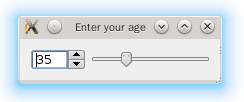
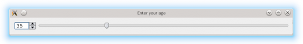

.. _layout:

`11. 布局管理器 <http://www.devbean.net/2012/09/qt-study-road-2-layout/>`_
==========================================================================

:作者: 豆子

:日期: 2012年09月04日

所谓 GUI 界面，归根结底，就是一堆组件的叠加。我们创建一个窗口，把按钮放上面，把图标放上面，这样就成了一个界面。在放置时，组件的位置尤其重要。我们必须要指定组件放在哪里，以便窗口能够按照我们需要的方式进行渲染。这就涉及到组件定位的机制。Qt 提供了两种组件定位机制：绝对定位和布局定位。

顾名思义，绝对定位就是一种最原始的定位方法：给出这个组件的坐标和长宽值。这样，Qt 就知道该把组件放在哪里以及如何设置组件的大小。但是这样做带来的一个问题是，如果用户改变了窗口大小，比如点击最大化按钮或者使用鼠标拖动窗口边缘，采用绝对定位的组件是不会有任何响应的。这也很自然，因为你并没有告诉 Qt，在窗口变化时，组件是否要更新自己以及如何更新。如果你需要让组件自动更新——这是很常见的需求，比如在最大化时，Word 总会把稿纸区放大，把工具栏拉长——就要自己编写相应的函数来响应这些变化。或者，还有更简单的方法：禁止用户改变窗口大小。但这总不是长远之计。

针对这种变化的需求，Qt 提供了另外的一种机制——布局——来解决这个问题。你只要把组件放入某一种布局，布局由专门的布局管理器进行管理。当需要调整大小或者位置的时候，Qt 使用对应的布局管理器进行调整。下面来看一个例子：

.. code-block:: c++

	// !!! Qt 5
	 
	int main(int argc, char *argv[])
	{
	    QApplication app(argc, argv);
	 
	    QWidget window;
	    window.setWindowTitle("Enter your age");
	 
	    QSpinBox *spinBox = new QSpinBox(&window);
	    QSlider *slider = new QSlider(Qt::Horizontal, &window);
	    spinBox->setRange(0, 130);
	    slider->setRange(0, 130);
	 
	    QObject::connect(slider, &QSlider::valueChanged, spinBox, &QSpinBox::setValue);
	    void (QSpinBox:: *spinBoxSignal)(int) = &QSpinBox::valueChanged;
	    QObject::connect(spinBox, spinBoxSignal, slider, &QSlider::setValue);
	    spinBox->setValue(35);
	 
	    QHBoxLayout *layout = new QHBoxLayout;
	    layout->addWidget(spinBox);
	    layout->addWidget(slider);
	    window.setLayout(layout);
	 
	    window.show();
	 
	    return app.exec();
	}

这段例子还是有些东西值得解释的。我们可以先来看看运行结果：

当我们拖动窗口时，可以看到组件自动有了变化：

我们在这段代码中引入了两个新的组件：QSpinBox 和 QSlider。QSpinBox 就是只能输入数字的输入框，并且带有上下箭头的步进按钮。QSlider 则是带有滑块的滑竿。我们可以从上面的截图中清楚地辨别出这两个组件。当我们创建了这两个组件的实例之后，我们使用 setRange() 函数设置其范围。既然我们的窗口标题是“Enter your age（输入你的年龄）”，那么把 range（范围）设置为 0 到 130 应该足够了。

有趣的部分在下面的 connect() 函数。我们已经清楚 connect() 函数的使用，因此我们写出

.. code-block:: c++

	QObject::connect(slider, &QSlider::valueChanged, spinBox, &QSpinBox::setValue);

将 slider 的 valueChanged() 信号同 spinBox 的 setValue() 函数相连。这是我们熟悉的。但是，当我们直接写

.. code-block:: c++

	QObject::connect(spinBox, &QSpinBox::valueChanged, slider, &QSlider::setValue);

的时候，编译器却会报错：

.. code-block:: none

	no matching function for call to 'QObject::connect(QSpinBox*&, <unresolved overloaded function type>, QSlider*&, void (QAbstractSlider::*)(int))'

这是怎么回事呢？从出错信息可以看出，编译器认为 QSpinBox::valueChanged 是一个 overloaded 的函数。我们看一下 QSpinBox 的文档发现，QSpinBox 的确有两个信号：

* void valueChanged(int)
* void valueChanged(const QString &)

当我们使用 &QSpinBox::valueChanged 取函数指针时，编译器不知道应该取哪一个函数（记住前面我们介绍过的，经过 moc 预处理后，signal 也是一个普通的函数。）的地址，因此报错。解决的方法很简单，编译器不是不能确定哪一个函数吗？那么我们就显式指定一个函数。方法就是，我们创建一个函数指针，这个函数指针参数指定为 int：

.. code-block:: c++

	void (QSpinBox:: *spinBoxSignal)(int) = &QSpinBox::valueChanged;

然后我们将这个函数指针作为 signal，与 QSlider 的函数连接：

.. code-block:: c++

	QObject::connect(spinBox, spinBoxSignal, slider, &QSlider::setValue);

这样便避免了编译错误。

仔细观察这两个 connect() 的作用，它们实际完成了一个双向的数据绑定。当然，对于 Qt 自己的信号函数，我们可以比较放心地使用。但是，如果是我们自己的信号，应当注意避免发生无限循环！

下面的代码，我们创建了一个 QHBoxLayout 对象。显然，这就是一个布局管理器。然后将这两个组件都添加到这个布局管理器，并且把该布局管理器设置为窗口的布局管理器。这些代码看起来都是顺理成章的，应该很容易明白。并且，布局管理器很聪明地做出了正确的行为：保持 QSpinBox 宽度不变，自动拉伸 QSlider 的宽度。

Qt 提供了几种布局管理器供我们选择：

* QHBoxLayout：按照水平方向从左到右布局；
* QVBoxLayout：按照竖直方向从上到下布局；
* QGridLayout：在一个网格中进行布局，类似于 HTML 的 table；
* QFormLayout：按照表格布局，每一行前面是一段文本，文本后面跟随一个组件（通常是输入框），类似 HTML 的 form；
* QStackedLayout：层叠的布局，允许我们将几个组件按照 Z 轴方向堆叠，可以形成向导那种一页一页的效果。

当然，我们也可以使用 Qt 4 来编译上面的代码，不过，正如大家应该想到的一样，我们必须把 connect() 函数修改一下：

.. code-block:: c++

	// !!! Qt 4
	 
	int main(int argc, char *argv[])
	{
	    QApplication app(argc, argv);
	 
	    QWidget window;
	    window.setWindowTitle("Enter your age");
	 
	    QSpinBox *spinBox = new QSpinBox(&window);
	    QSlider *slider = new QSlider(Qt::Horizontal, &window);
	    spinBox->setRange(0, 130);
	    slider->setRange(0, 130);
	 
	    QObject::connect(slider,  SIGNAL(valueChanged(int)),
	                     spinBox, SLOT(setValue(int)));
	    QObject::connect(spinBox, SIGNAL(valueChanged(int)),
	                     slider,  SLOT(setValue(int)));
	    spinBox->setValue(35);
	 
	    QHBoxLayout *layout = new QHBoxLayout;
	    layout->addWidget(spinBox);
	    layout->addWidget(slider);
	    window.setLayout(layout);
	 
	    window.show();
	 
	    return app.exec();
	}

这里我们强调一下，上面的代码在 Qt 5 中同样可以编译通过。不过，我们减少了使用函数指针指定信号的步骤。也就是说，在 Qt 5 中，如果你想使用 overloaded 的 signal，有两种方式可供选择：

1. 使用 Qt 4 的 SIGNAL 和 SLOT 宏，因为这两个宏已经指定了参数信息，所以不存在这个问题；
2. 使用函数指针显式指定使用哪一个信号。

有时候，使用 Qt 4 的语法更简洁。但是需要注意的是，Qt 4 的语法是没有编译期错误检查的。这也是同 Qt 5 的信号槽新语法不同之处之一。
