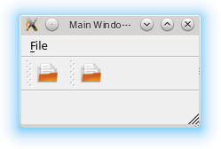
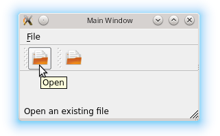

.. _menubar_toolbar_statusbar:

`12. 菜单栏、工具栏和状态栏 <http://www.devbean.net/2012/09/qt-study-road-2-menubar-toolbar-statusbar/>`_
=========================================================================================================

:作者: 豆子

:日期: 2012年09月10日

在之前的《:ref:`添加动作 <action>`》一文中，我们已经了解了，Qt 将用户与界面进行交互的元素抽象为一种“动作”，使用 QAction 类表示。QAction 可以添加到菜单上、工具栏上。期间，我们还详细介绍了一些细节问题，比如资源文件的使用、对象模型以及布局管理器。这一节则是详细介绍关于菜单栏、工具栏以及状态栏的相关内容。

我们假设窗口还是建立在 QMainWindow 类之上，这会让我们的开发简单许多。当然，在实际开发过程中，QMainWindow 通常只作为“主窗口”，对话框窗口则更多地使用 QDialog 类。我们会在后面看到，QDialog 类会缺少一些 QMainWindow 类提供方便的函数，比如 menuBar() 以及 toolBar()。

下面还是回到《添加动作》一文中的代码片段：

.. code-block:: c++

	openAction = new QAction(QIcon(":/images/doc-open"), tr("&Open..."), this);
	openAction->setShortcuts(QKeySequence::Open);
	openAction->setStatusTip(tr("Open an existing file"));
	connect(openAction, &QAction::triggered, this, MainWindow::open);
	 
	QMenu *file = menuBar()->addMenu(tr("&File"));
	file->addAction(openAction);
	 
	QToolBar *toolBar = addToolBar(tr("&File"));
	toolBar->addAction(openAction);

我们看到，使用 menuBar() 函数，Qt 为我们创建了一个菜单栏。menuBar() 是 QMainWindow 提供的函数，因此你是不会在 QWidget 或者 QDialog 中找到它的。这个函数会返回窗口的菜单栏，如果没有菜单栏则会新创建一个。这也就解释了，为什么我们可以直接使用 menuBar() 函数的返回值，毕竟我们并没有创建一个菜单栏对象啊！原来，这就是 menuBar() 为我们创建好并且返回了的。

Qt 中，表示菜单的类是 QMenuBar（你应该已经想到这个名字了）。QMenuBar 代表的是窗口最上方的一条菜单栏。我们使用其 addMenu() 函数为其添加菜单。尽管我们只是提供了一个字符串作为参数，但是 Qt 为将其作为新创建的菜单的文本显示出来。至于 & 符号，我们已经解释过，这可以为菜单创建一个快捷键。当我们创建出来了菜单对象时，就可以把 QAction 添加到这个菜单上面，也就是 addAction() 函数的作用。

下面的 QToolBar 部分非常类似。顾名思义，QToolBar 就是工具栏。我们使用的是 addToolBar() 函数添加新的工具栏。为什么前面一个是 menuBar() 而现在的是 addToolBar() 呢？因为一个窗口只有一个菜单栏，但是却可能有多个工具栏。如果我们将代码修改一下：

.. code-block:: c++

	QToolBar *toolBar = addToolBar(tr("&File"));
	toolBar->addAction(openAction);
	 
	QToolBar *toolBar2 = addToolBar(tr("Tool Bar 2"));
	toolBar2->addAction(openAction);

我们看到，现在有两个工具栏了：

工具栏可以设置成固定的、浮动的等等，具体设置可以参考 Qt 文档。

前面我们说过，使用 QAction::setStatusTip() 可以设置该动作在状态栏上的提示文本。但我们现在把鼠标放在按钮上，是看不到这个提示文本的。原因很简单，我们没有添加一个状态栏。怎么添加呢？类似前面的 QMainWindow::menuBar()，QMainWindow 有一个 statusBar() 函数。让我们把这个函数添加上去：

.. code-block:: c++

	QToolBar *toolBar2 = addToolBar(tr("Tool Bar 2"));
	toolBar2->addAction(openAction);
 
	statusBar();

然后编译运行一下：

我们添加了一个孤零零的 statuBar() 显得不伦不类，但是，同前面的 menuBar() 的实现类似，这个函数会返回一个 QStatusBar 对象，如果没有则先创建再返回。

QStatusBar 继承了 QWidget，因此，我们可以将其它任意 QWidget 子类添加到状态栏，从而实现类似 Photoshop 窗口底部那种有比例显示、有网格开关的复杂状态栏。有关 QStatusBar 的更多信息，请参考 Qt 文档。

对于没有这些函数的 QDialog 或者 QWidget 怎么做呢？要记得，QToolBar 以及 QStatusBar 都是 QWidget 的子类，因此我们就可以将其结合布局管理器添加到另外的 QWidget 上面。QLayout 布局提供了 setMenuBar() 函数，可以方便的添加菜单栏。具体细节还是详见文档。

至此，我们已经将组成窗口元素介绍过一遍。结合这些元素以及布局管理，我们就应该可以实现一个简单的通用的窗口。当我们完成窗口布局之后，我们就可以考虑向其中添加功能。这就是我们后面章节的内容。
