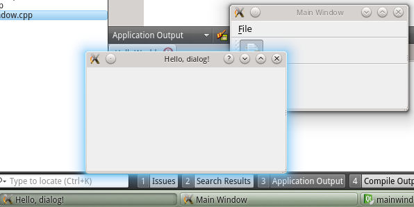
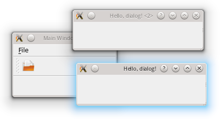

.. _dialogs_intro:

`13. 对话框简介 <http://www.devbean.net/2012/09/qt-study-road-2-dialogs-intro/>`_
=================================================================================

:作者: 豆子

:日期: 2012年09月14日

对话框是 GUI 程序中不可或缺的组成部分。很多不能或者不适合放入主窗口的功能组件都必须放在对话框中设置。对话框通常会是一个顶层窗口，出现在程序最上层，用于实现短期任务或者简洁的用户交互。尽管 Ribbon 界面的出现在一定程度上减少了对话框的使用几率，但是，我们依然可以在最新版本的 Office 中发现不少对话框。因此，在可预见的未来，对话框会一直存在于我们的程序之中。

Qt 中使用 QDialog 类实现对话框。就像主窗口一样，我们通常会设计一个类继承 QDialog。QDialog（及其子类，以及所有 Qt::Dialog 类型的类）的对于其 parent 指针都有额外的解释：如果 parent 为 NULL，则该对话框会作为一个顶层窗口，否则则作为其父组件的子对话框（此时，其默认出现的位置是 parent 的中心）。顶层窗口与非顶层窗口的区别在于，顶层窗口在任务栏会有自己的位置，而非顶层窗口则会共享其父组件的位置。

.. code-block:: c++

	MainWindow::MainWindow(QWidget *parent)
	    : QMainWindow(parent)
	{
	    setWindowTitle(tr("Main Window"));
	 
	    openAction = new QAction(QIcon(":/images/doc-open"), tr("&Open..."), this);
	    openAction->setShortcuts(QKeySequence::Open);
	    openAction->setStatusTip(tr("Open an existing file"));
	    connect(openAction, &QAction::triggered, this, &MainWindow::open);
	 
	    QMenu *file = menuBar()->addMenu(tr("&File"));
	    file->addAction(openAction);
	 
	    QToolBar *toolBar = addToolBar(tr("&File"));
	    toolBar->addAction(openAction);
	}
	 
	MainWindow::~MainWindow()
	{
	}
	 
	void MainWindow::open()
	{
	    QDialog dialog;
	    dialog.setWindowTitle(tr("Hello, dialog!"));
	    dialog.exec();
	}

上面我们使用了前面的示例代码。注意看的是 open() 函数里面的内容。我们使用 QDialog 创建了一个对话框，设置其标题为“Hello, dialog!”，然后调用 exec() 将其显示出来。注意看的是任务栏的图标，由于我们没有设置对话框的 parent 指针，我们会看到在任务栏出现了对话框的位置：

我们修改一下 open() 函数的内容：

.. code-block:: c++

	void MainWindow::open()
	{
	    QDialog dialog(this);
	    dialog.setWindowTitle(tr("Hello, dialog!"));
	    dialog.exec();
	}

重新运行一下，对比一下就会看到 parent 指针的有无对 QDialog 实例的影响。

对话框分为模态对话框和非模态对话框。所谓模态对话框，就是会阻塞同一应用程序中其它窗口的输入。模态对话框很常见，比如“打开文件”功能。你可以尝试一下记事本的打开文件，当打开文件对话框出现时，我们是不能对除此对话框之外的窗口部分进行操作的。与此相反的是非模态对话框，例如查找对话框，我们可以在显示着查找对话框的同时，继续对记事本的内容进行编辑。

Qt 支持模态对话框和非模态对话框。其中，Qt 有两种级别的模态对话框：应用程序级别的模态和窗口级别的模态，默认是应用程序级别的模态。应用程序级别的模态是指，当该种模态的对话框出现时，用户必须首先对对话框进行交互，直到关闭对话框，然后才能访问程序中其他的窗口。窗口级别的模态是指，该模态仅仅阻塞与对话框关联的窗口，但是依然允许用户与程序中其它窗口交互。窗口级别的模态尤其适用于多窗口模式，更详细的讨论可以看 `以前发表过的文章 <http://www.devbean.net/2011/03/qdialog_window_modal/>`_ 。

Qt 使用 QDialog::exec() 实现应用程序级别的模态对话框，使用 QDialog::open() 实现窗口级别的模态对话框，使用 QDialog::show() 实现非模态对话框。回顾一下我们的代码，在上面的示例中，我们调用了 exec() 将对话框显示出来，因此这就是一个模态对话框。当对话框出现时，我们不能与主窗口进行任何交互，直到我们关闭了该对话框。

下面我们试着将 exec() 修改为 show()，看看非模态对话框：

.. code-block:: c++

	void MainWindow::open()
	{
	    QDialog dialog(this);
	    dialog.setWindowTitle(tr("Hello, dialog!"));
	    dialog.show();
	}

是不是事与愿违？对话框竟然一闪而过！这是因为，show() 函数不会阻塞当前线程，对话框会显示出来，然后函数立即返回，代码继续执行。注意，dialog 是建立在栈上的，show() 函数返回，MainWindow::open() 函数结束，dialog 超出作用域被析构，因此对话框消失了。知道了原因就好改了，我们将 dialog 改成堆上建立，当然就没有这个问题了：

.. code-block:: c++

	void MainWindow::open()
	{
	    QDialog *dialog = new QDialog;
	    dialog->setWindowTitle(tr("Hello, dialog!"));
	    dialog->show();
	}

对于一下这个非模态对话框和之前的模态对话框。我们在对话框出现的时候可以与主窗口交互，因此我们可以建立多个相同的对话框：

如果你足够细心，应该发现上面的代码是有问题的：dialog 存在内存泄露！dialog 使用 new 在堆上分配空间，却一直没有 delete。解决方案也很简单：将 MainWindow 的指针赋给 dialog 即可。还记得我们前面说过的 Qt 的对象系统吗？

不过，这样做有一个问题：如果我们的对话框不是在一个界面类中出现呢？由于 QWidget 的 parent 必须是 QWidget 指针，那就限制了我们不能将一个普通的 C++ 类指针传给 Qt 对话框。另外，如果对内存占用有严格限制的话，当我们将主窗口作为 parent 时，主窗口不关闭，对话框就不会被销毁，所以会一直占用内存。在这种情景下，我们可以调用 deleteLater() 函数，或者是设置 dialog 的 WindowAttribute：

.. code-block:: c++

	void MainWindow::open()
	{
	    QDialog *dialog = new QDialog;
	    dialog->setAttribute(Qt::WA_DeleteOnClose); // 或者 dialog->deleteLater();
	    dialog->setWindowTitle(tr("Hello, dialog!"));
	    dialog->show();
	}

setAttribute() 函数设置对话框关闭时，自动销毁对话框。deleteLater() 函数则会在当前事件循环结束时销毁该对话框。关于事件循环，我们会在后面的文章中详细说明。
