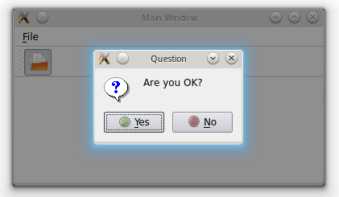
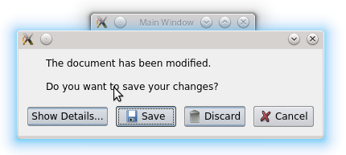
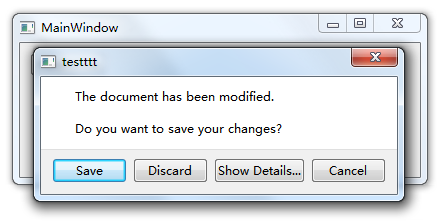

.. _standard_dialogs_qmessagebox:

`15. 标准对话框 QMessageBox <http://www.devbean.net/2012/09/qt-study-road-2-standard-dialogs-qmessagebox/>`_
============================================================================================================

:作者: 豆子

:日期: 2012年09月18日

所谓标准对话框，是 Qt 内置的一系列对话框，用于简化开发。事实上，有很多对话框都是通用的，比如打开文件、设置颜色、打印设置等。这些对话框在所有程序中几乎相同，因此没有必要在每一个程序中都自己实现这么一个对话框。

Qt 的内置对话框大致分为以下几类：

* QColorDialog：选择颜色；
* QFileDialog：选择文件或者目录；
* QFontDialog：选择字体；
* QInputDialog：允许用户输入一个值，并将其值返回；
* QMessageBox：模态对话框，用于显示信息、询问问题等；
* QPageSetupDialog：为打印机提供纸张相关的选项；
* QPrintDialog：打印机配置；
* QPrintPreviewDialog：打印预览；
* QProgressDialog：显示操作过程。

这里我们简单地介绍一下标准对话框 QMessageBox 的使用。在前面有了关于对话框的基础之上，应该可以结合文档很轻松地学习如何使用 Qt 的标准对话框。其它种类的标准对话框，我们将在后面的章节中再一一介绍。

QMessageBox 用于显示消息提示。我们一般会使用其提供的几个 static 函数：

* void about(QWidget * parent, const QString & title, const QString & text)：显示关于对话框。这是一个最简单的对话框，其标题是 title，内容是 text，父窗口是 parent。对话框只有一个 OK 按钮。
* void aboutQt(QWidget * parent, const QString & title = QString())：显示关于 Qt 对话框。该对话框用于显示有关 Qt 的信息。
* StandardButton critical(QWidget * parent, const QString & title, const QString & text, StandardButtons buttons = Ok, StandardButton defaultButton = NoButton)：显示严重错误对话框。这个对话框将显示一个红色的错误符号。我们可以通过 buttons 参数指明其显示的按钮。默认情况下只有一个 Ok 按钮，我们可以使用 StandardButtons 类型指定多种按钮。
* StandardButton information(QWidget * parent, const QString & title, const QString & text, StandardButtons buttons = Ok, StandardButton defaultButton = NoButton)：QMessageBox::information() 函数与 QMessageBox::critical() 类似，不同之处在于这个对话框提供一个普通信息图标。
* StandardButton question(QWidget * parent, const QString & title, const QString & text, StandardButtons buttons = StandardButtons( Yes | No ), StandardButton defaultButton = NoButton)：QMessageBox::question() 函数与 QMessageBox::critical() 类似，不同之处在于这个对话框提供一个问号图标，并且其显示的按钮是“是”和“否”两个。
* StandardButton warning(QWidget * parent, const QString & title, const QString & text, StandardButtons buttons = Ok, StandardButton defaultButton = NoButton)：QMessageBox::warning() 函数与 QMessageBox::critical() 类似，不同之处在于这个对话框提供一个黄色叹号图标。

我们可以通过下面的代码来演示下如何使用 QMessageBox。

.. code-block:: c++

	if (QMessageBox::Yes == QMessageBox::question(this,
	                                              tr("Question"),
	                                              tr("Are you OK?"),
	                                              QMessageBox::Yes | QMessageBox::No,
	                                              QMessageBox::Yes)) {
	    QMessageBox::information(this, tr("Hmmm..."), tr("I'm glad to hear that!"));
	} else {
	    QMessageBox::information(this, tr("Hmmm..."), tr("I'm sorry!"));
	}

我们使用 QMessageBox::question() 来询问一个问题。这个对话框的父窗口是 this，也就是我们的 MainWindow（或者其他 QWidget 指针）。QMessageBox 是 QDialog 的子类，这意味着它的初始显示位置将会是在 parent 窗口的中央（我们在前面的章节中提到过这一点）。第二个参数是对话框的标题。第三个参数是我们想要显示的内容。这里就是我们需要询问的文字。下面，我们使用或运算符（|）指定对话框应该出现的按钮。这里我们希望是一个 Yes 和一个 No。最后一个参数指定默认选择的按钮。这个函数有一个返回值，用于确定用户点击的是哪一个按钮。按照我们的写法，应该很容易的看出，这是一个模态对话框，因此我们可以直接获取其返回值。如果返回值是 Yes，也就是说用户点击了 Yes 按钮，我们显示一个普通消息对话框，显示“I’m glad to hear that!”，否则则显示“I’m sorry!”。运行一下我们的程序片段，就可以看到其中的不同：

QMessageBox 类的 static 函数优点是方便使用，缺点也很明显：非常不灵活。我们只能使用简单的几种形式。为了能够定制 QMessageBox 细节，我们必须使用 QMessageBox 的属性设置 API。如果我们希望制作一个询问是否保存的对话框，我们可以使用如下的代码：

.. code-block:: c++

	QMessageBox msgBox;
	msgBox.setText(tr("The document has been modified."));
	msgBox.setInformativeText(tr("Do you want to save your changes?"));
	msgBox.setDetailedText(tr("Differences here..."));
	msgBox.setStandardButtons(QMessageBox::Save
	                          | QMessageBox::Discard
	                          | QMessageBox::Cancel);
	msgBox.setDefaultButton(QMessageBox::Save);
	int ret = msgBox.exec();
	switch (ret) {
	case QMessageBox::Save:
	    qDebug() << "Save document!";
	    break;
	case QMessageBox::Discard:
	    qDebug() << "Discard changes!";
	    break;
	case QMessageBox::Cancel:
	    qDebug() << "Close document!";
	    break;
	}

msgBox 是一个建立在栈上的 QMessageBox 实例。我们设置其标题为“The document has been modified.”，informationText 则是会在对话框中显示的文字。下面我们使用了一个 detailedText，也就是详细信息，当我们点击了详细信息按钮时，对话框可以自动显示更多信息。我们自己定义的对话框的按钮有三个：保存、丢弃和取消。然后我们使用了 exec() 是其成为一个模态对话框，根据其返回值进行相应的操作。

同时在 KDE 和 Windows 7 上编译运行一下上面的代码，我们可以看到一些区别：

除去对话框样式，我们值得注意的是 QMessageBox 下方按钮的排列顺序。KDE 上是 Show Details…、Save、Discard 和 Cancel；而 Windows 7 上则是 Save、Discard、Show Details… 和 Cancel。我们并没有指定按钮的顺序，Qt 已经帮我们按照不同平台的使用习惯对其进行了调整。这一点在 Mac OS 上也会有相应的体现。对于一个普通的 QDialog 而言，Qt 使用的是 QDialogButtonBox 这个类来实现不同平台的对话框按钮顺序的显示的。更多细节请参考这个类的文档。
