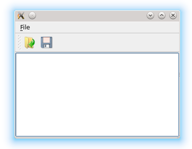

.. _file_dialog:

`17. 文件对话框 <http://www.devbean.net/2012/09/qt-study-road-2-file-dialog/>`_
===============================================================================

:作者: 豆子

:日期: 2012年09月24日

在前面的章节中，我们讨论了 Qt 标准对话框 QMessageBox 的使用。所谓标准对话框，其实也就是一个普通的对话框。因此，我们同样可以将 QDialog 所提供的其它特性应用到这种标准对话框上面。今天，我们继续讨论另外一个标准对话框：QFileDialog，也就是文件对话框。在本节中，我们将尝试编写一个简单的文本文件编辑器，我们将使用 QFileDialog 来打开一个文本文件，并将修改过的文件保存到硬盘。这或许是我们在本系列中所提供的第一个带有实际功能的实例。

首先，我们需要创建一个带有文本编辑功能的窗口。借用我们前面的程序代码，应该可以很方便地完成：

.. code-block:: c++

	openAction = new QAction(QIcon(":/images/file-open"), tr("&Open..."), this);
	openAction->setShortcuts(QKeySequence::Open);
	openAction->setStatusTip(tr("Open an existing file"));
	 
	saveAction = new QAction(QIcon(":/images/file-save"), tr("&Save..."), this);
	saveAction->setShortcuts(QKeySequence::Save);
	saveAction->setStatusTip(tr("Save a new file"));
	 
	QMenu *file = menuBar()->addMenu(tr("&File"));
	file->addAction(openAction);
	file->addAction(saveAction);
	 
	QToolBar *toolBar = addToolBar(tr("&File"));
	toolBar->addAction(openAction);
	toolBar->addAction(saveAction);
	 
	textEdit = new QTextEdit(this);
	setCentralWidget(textEdit);

我们在菜单和工具栏添加了两个动作：打开和保存。接下来是一个 **QTextEdit** 类，这个类用于显示富文本文件。也就是说，它不仅仅用于显示文本，还可以显示图片、表格等等。不过，我们现在只用它显示纯文本文件。QMainWindow 有一个 setCentralWidget() 函数，可以将一个组件作为窗口的中心组件，放在窗口中央显示区。显然，在一个文本编辑器中，文本编辑区就是这个中心组件，因此我们将 QTextEdit 作为这种组件。

我们使用 connect() 函数，为这两个 QAction 对象添加响应的动作：

.. code-block:: c++

	/// !!!Qt5
	connect(openAction, &QAction::triggered, this, &MainWindow::openFile);
	connect(saveAction, &QAction::triggered, this, &MainWindow::saveFile);
	 
	/// !!!Qt4
	connect(openAction, SIGNAL(triggered()), this, SLOT(openFile()));
	connect(saveAction, SIGNAL(triggered()), this, SLOT(saveFile()));

这些应该都不是问题。我们应该能够很清楚这些代码的含义。下面是最主要的 openFile() 和 saveFile() 这两个函数的代码：

.. code-block:: c++

	void MainWindow::openFile()
	{
	    QString path = QFileDialog::getOpenFileName(this,
	                                                tr("Open File"),
	                                                ".",
	                                                tr("Text Files(*.txt)"));
	    if(!path.isEmpty()) {
	        QFile file(path);
	        if (!file.open(QIODevice::ReadOnly | QIODevice::Text)) {
	            QMessageBox::warning(this, tr("Read File"),
	                                 tr("Cannot open file:\n%1").arg(path));
	            return;
	        }
	        QTextStream in(&file);
	        textEdit->setText(in.readAll());
	        file.close();
	    } else {
	        QMessageBox::warning(this, tr("Path"),
	                             tr("You did not select any file."));
	    }
	}
	 
	void MainWindow::saveFile()
	{
	    QString path = QFileDialog::getSaveFileName(this,
	                                                tr("Open File"),
	                                                ".",
	                                                tr("Text Files(*.txt)"));
	    if(!path.isEmpty()) {
	        QFile file(path);
	        if (!file.open(QIODevice::WriteOnly | QIODevice::Text)) {
	            QMessageBox::warning(this, tr("Write File"),
	                                       tr("Cannot open file:\n%1").arg(path));
	            return;
	        }
	        QTextStream out(&file);
	        out << textEdit->toPlainText();
	        file.close();
	    } else {
	        QMessageBox::warning(this, tr("Path"),
	                             tr("You did not select any file."));
	    }
	}

在 openFile() 函数中，我们使用 QFileDialog::getOpenFileName() 来获取需要打开的文件的路径。这个函数具有一个长长的签名：

.. code-block:: c++

	QString getOpenFileName(QWidget * parent = 0,
	                        const QString & caption = QString(),
	                        const QString & dir = QString(),
	                        const QString & filter = QString(),
	                        QString * selectedFilter = 0,
	                        Options options = 0)

不过注意，它的所有参数都是可选的，因此在一定程度上说，这个函数也是简单的。这六个参数分别是：

* parent：父窗口。我们前面介绍过，Qt 的标准对话框提供静态函数，用于返回一个模态对话框（在一定程度上这就是外观模式的一种体现）；
* caption：对话框标题；
* dir：对话框打开时的默认目录，“.” 代表程序运行目录，“/” 代表当前盘符的根目录（特指 Windows 平台；Linux 平台当然就是根目录），这个参数也可以是平台相关的，比如“C:\\”等；
* filter：过滤器。我们使用文件对话框可以浏览很多类型的文件，但是，很多时候我们仅希望打开特定类型的文件。比如，文本编辑器希望打开文本文件，图片浏览器希望打开图片文件。过滤器就是用于过滤特定的后缀名。如果我们使用“Image Files(\*.jpg \*.png)”，则只能显示后缀名是 jpg 或者 png 的文件。如果需要多个过滤器，使用“;;”分割，比如“JPEG Files(\*.jpg);;PNG Files(\*.png)”；
* selectedFilter：默认选择的过滤器；
* options：对话框的一些参数设定，比如只显示文件夹等等，它的取值是 enum QFileDialog::Option，每个选项可以使用 | 运算组合起来。

QFileDialog::getOpenFileName() 返回值是选择的文件路径。我们将其赋值给 path。通过判断 path 是否为空，可以确定用户是否选择了某一文件。只有当用户选择了一个文件时，我们才执行下面的操作。在 saveFile() 中使用的 QFileDialog::getSaveFileName() 也是类似的。使用这种静态函数，在 Windows、Mac OS 上面都是直接调用本地对话框，但是 Linux 上则是 QFileDialog 自己的模拟。这暗示了，如果你不使用这些静态函数，而是直接使用 QFileDialog 进行设置，就像我们前面介绍的 QMessageBox 的设置一样，那么得到的对话框很可能与系统对话框的外观不一致。这一点是需要注意的。

首先，我们创建一个 QFile 对象，将用户选择的文件路径传递给这个对象。然后我们需要打开这个文件，使用的是 QFile::open()，其参数是指定的打开方式，这里我们使用只读方式和文本方式打开这个文件（因为我们选择的是后缀名 txt 的文件，可以认为是文本文件。当然，在实际应用中，可能需要进行进一步的判断）。QFile::open() 打开成功则返回 true，由此继续进行下面的操作：使用 QTextStream::readAll() 读取文件所有内容，然后将其赋值给 QTextEdit 显示出来。最后不要忘记关闭文件。另外，saveFile() 函数也是类似的，只不过最后一步，我们使用 << 重定向，将 QTextEdit 的内容输出到一个文件中。关于文件操作，我们会在后面的章节中进一步介绍。

这里需要注意一点：我们的代码仅仅是用于演示，很多必须的操作并没有进行。比如，我们没有检查这个文件的实际类型是不是一个文本文件。并且，我们使用了 QTextStream::readAll() 直接读取文件所有内容，如果这个文件有 100M，程序会立刻死掉，这些都是实际程序必须考虑的问题。不过这些内容已经超出我们本章的介绍，也就不再详细说明。

至此，我们的代码已经介绍完毕，马上可以编译运行一下了：

本章的代码可以在这里下载：

* :download:`ch17-qt4.zip <res/ch17-qt4.zip>`
* :download:`ch17-qt5.zip <res/ch17-qt5.zip>`
