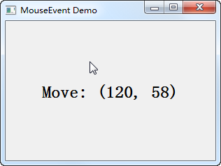

.. _events:

`18. 事件 <http://www.devbean.net/2012/09/qt-study-road-2-events/>`_
====================================================================

:作者: 豆子

:日期: 2012年09月27日

事件（event）是由系统或者 Qt 本身在不同的时刻发出的。当用户按下鼠标、敲下键盘，或者是窗口需要重新绘制的时候，都会发出一个相应的事件。一些事件在对用户操作做出响应时发出，如键盘事件等；另一些事件则是由系统自动发出，如计时器事件。

事件也就是我们通常说的“事件驱动（event drive）”程序设计的基础概念。事件的出现，使得程序代码不会按照原始的线性顺序执行。想想看，从最初的 C 语言开始，我们的程序就是以一种线性的顺序执行代码：这一条语句执行之后，开始执行下一条语句；这一个函数执行过后，开始执行下一个函数。这种类似“批处理”的程序设计风格显然不适合于处理复杂的用户交互。我们来想象一下用户交互的情景：我们设计了一堆功能放在界面上，用户点击了“打开文件”，于是开始执行打开文件的操作；用户点击了“保存文件”，于是开始执行保存文件的操作。我们不知道用户究竟想进行什么操作，因此也就不能预测接下来将会调用哪一个函数。如果我们设计了一个“文件另存为”的操作，如果用户不点击，这个操作将永远不会被调用。这就是所谓的“事件驱动”，我们的程序的执行顺序不再是线性的，而是由一个个事件驱动着程序继续执行。没有事件，程序将阻塞在那里，不执行任何代码。

在 Qt 中，事件的概念似乎同信号槽类似。的确如此，一般来说，使用 Qt 组件时，我们并不会把主要精力放在事件上。因为在 Qt 中，我们关心的更多的是事件关联的一个信号。比如，对于 QPushButton 的鼠标点击，我们不需要关心这个鼠标点击事件，而是关心它的 clicked() 信号的发出。这与其他的一些 GUI 框架不同：在 Swing 中，你所要关心的是 JButton 的 ActionListener 这个点击事件。由此看出，相比于其他 GUI 框架，Qt 给了我们额外的选择：信号槽。

但是，Qt 中的事件和信号槽却并不是可以相互替代的。信号由具体的对象发出，然后会马上交给由 connect() 函数连接的槽进行处理；而对于事件，Qt 使用一个事件队列对所有发出的事件进行维护，当新的事件产生时，会被追加到事件队列的尾部。前一个事件完成后，取出后面的事件进行处理。但是，必要的时候，Qt 的事件也可以不进入事件队列，而是直接处理。信号一旦发出，对应的槽函数一定会被执行。但是，事件则可以使用“事件过滤器”进行过滤，对于有些事件进行额外的处理，另外的事件则不关心。总的来说，如果我们 **使用** 组件，我们关心的是信号槽；如果我们 **自定义** 组件，我们关心的是事件。因为我们可以通过事件来改变组件的默认操作。比如，如果我们要自定义一个能够响应鼠标事件的 EventLabel，我们就需要重写 QLabel 的鼠标事件，做出我们希望的操作，有可能还得在恰当的时候发出一个类似按钮的 clicked() 信号（如果我们希望让这个 EventLabel 能够被其它组件使用）或者其它的信号。

在前面我们也曾经简单提到，Qt 程序需要在 main() 函数创建一个 QCoreApplication 对象，然后调用它的 exec() 函数。这个函数就是开始 Qt 的事件循环。在执行 exec() 函数之后，程序将进入事件循环来监听应用程序的事件。当事件发生时，Qt 将创建一个事件对象。Qt 中所有事件类都继承于 QEvent。在事件对象创建完毕后，Qt 将这个事件对象传递给 QObject 的 event() 函数。event() 函数并不直接处理事件，而是按照事件对象的类型分派给特定的事件处理函数（event handler）。关于这一点，我们会在以后的章节中详细说明。

在所有组件的父类 QWidget 中，定义了很多事件处理的回调函数，如 keyPressEvent()、keyReleaseEvent()、mouseDoubleClickEvent()、mouseMoveEvent ()、mousePressEvent()、mouseReleaseEvent() 等。这些函数都是 protected virtual 的，也就是说，我们可以在子类中重新实现这些函数。下面来看一个例子：

.. code-block:: c++

	class EventLabel : public QLabel
	{
	protected:
	    void mouseMoveEvent(QMouseEvent *event);
	    void mousePressEvent(QMouseEvent *event);
	    void mouseReleaseEvent(QMouseEvent *event);
	};
	 
	void EventLabel::mouseMoveEvent(QMouseEvent *event)
	{
	    this->setText(QString("
<h1>Move: (%1, %2)</h1>
")
	                  .arg(QString::number(event->x()), QString::number(event->y())));
	}
	 
	void EventLabel::mousePressEvent(QMouseEvent *event)
	{
	    this->setText(QString("
<h1>Press: (%1, %2)</h1>
")
	                  .arg(QString::number(event->x()), QString::number(event->y())));
	}
	 
	void EventLabel::mouseReleaseEvent(QMouseEvent *event)
	{
	    QString msg;
	    msg.sprintf("
<h1>Release: (%d, %d)</h1>
",
	                event->x(), event->y());
	    this->setText(msg);
	}
	 
	int main(int argc, char *argv[])
	{
	    QApplication a(argc, argv);
	 
	    EventLabel *label = new EventLabel;
	    label->setWindowTitle("MouseEvent Demo");
	    label->resize(300, 200);
	    label->show();
	 
	    return a.exec();
	}

我们编译运行上面的代码，就可以理解到有关事件的使用方法。

EventLabel 继承了 QLabel，覆盖了 mousePressEvent()、mouseMoveEvent() 和 MouseReleaseEvent() 三个函数。我们并没有添加什么功能，只是在鼠标按下（press）、鼠标移动（move）和鼠标释放（release）的时候，把当前鼠标的坐标值显示在这个 Label 上面。由于 QLabel 是支持 HTML 代码的，因此我们直接使用了 HTML 代码来格式化文字。

QString 的 arg() 函数可以自动替换掉 QString 中出现的占位符。其占位符以 % 开始，后面是占位符的位置，例如 %1，%2 这种。

.. code-block:: c++

	QString("[%1, %2]").arg(x, y);

语句将会使用 x 替换 %1，y 替换 %2，因此，这个语句生成的 QString 为 [x, y]。

在 mouseReleaseEvent() 函数中，我们使用了另外一种 QString 的构造方法。我们使用类似 C 风格的格式化函数 sprintf() 来构造 QString。

运行上面的代码，当我们点击了一下鼠标之后，label 上将显示鼠标当前坐标值。

为什么要点击鼠标之后才能在 mouseMoveEvent() 函数中显示鼠标坐标值？这是因为 QWidget 中有一个 mouseTracking 属性，该属性用于设置是否追踪鼠标。只有鼠标被追踪时，mouseMoveEvent() 才会发出。如果 mouseTracking 是 false（默认即是），组件在至少一次鼠标点击之后，才能够被追踪，也就是能够发出 mouseMoveEvent() 事件。如果 mouseTracking 为 true，则 mouseMoveEvent() 直接可以被发出。知道了这一点，我们就可以在 main() 函数中直接设置下：

.. code-block:: c++

	EventLabel *label = new EventLabel;
	label->setWindowTitle("MouseEvent Demo");
	label->resize(300, 200);
	label->setMouseTracking(true);
	label->show();

这样子就没有这个问题了。
