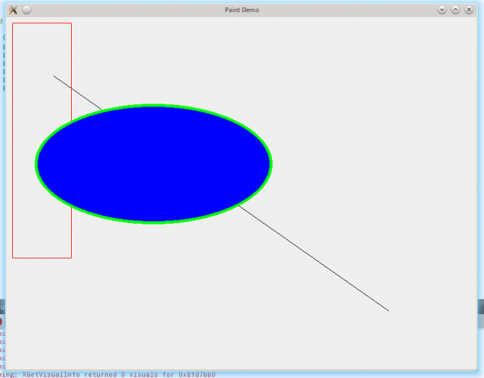

.. _paint_sys:

`24. Qt 绘制系统简介 <http://www.devbean.net/2012/10/qt-study-road-2-paint-sys/>`_
==================================================================================

:作者: 豆子

:日期: 2012年10月30日

Qt 的绘图系统允许使用相同的 API 在屏幕和其它打印设备上进行绘制。整个绘图系统基于 QPainter，QPainterDevice 和 QPaintEngine 三个类。

QPainter 用来执行绘制的操作；QPaintDevice 是一个二维空间的抽象，这个二维空间允许 QPainter 在其上面进行绘制，也就是 QPainter 工作的空间；QPaintEngine 提供了画笔（QPainter）在不同的设备上进行绘制的统一的接口。QPaintEngine 类应用于 QPainter 和 QPaintDevice 之间，通常对开发人员是透明的。除非你需要自定义一个设备，否则你是不需要关心 QPaintEngine 这个类的。我们可以把 QPainter 理解成画笔；把 QPaintDevice 理解成使用画笔的地方，比如纸张、屏幕等；而对于纸张、屏幕而言，肯定要使用不同的画笔绘制，为了统一使用一种画笔，我们设计了 QPaintEngine 类，这个类让不同的纸张、屏幕都能使用一种画笔。

下图给出了这三个类之间的层次结构（出自 Qt API 文档）：

上面的示意图告诉我们，Qt 的绘图系统实际上是，使用 QPainter 在 QPainterDevice 上进行绘制，它们之间使用 QPaintEngine 进行通讯（也就是翻译 QPainter 的指令）。

下面我们通过一个实例来介绍 QPainter 的使用：

.. code-block:: c++

	//!!! Qt4/Qt5
	 
	class PaintedWidget : public QWidget
	{
	    Q_OBJECT
	public:
	    PaintedWidget(QWidget *parent = 0);
	protected:
	    void paintEvent(QPaintEvent *);
	};

注意我们重写了 QWidget 的 paintEvent() 函数。这或许是我们在理解了 Qt 事件系统之后首次实际应用。接下来就是 PaintedWidget 的源代码：

.. code-block:: c++

	//!!! Qt4/Qt5
	 
	PaintedWidget::PaintedWidget(QWidget *parent) :
	    QWidget(parent)
	{
	    resize(800, 600);
	    setWindowTitle(tr("Paint Demo"));
	}
	 
	void PaintedWidget::paintEvent(QPaintEvent *)
	{
	    QPainter painter(this);
	    painter.drawLine(80, 100, 650, 500);
	    painter.setPen(Qt::red);
	    painter.drawRect(10, 10, 100, 400);
	    painter.setPen(QPen(Qt::green, 5));
	    painter.setBrush(Qt::blue);
	    painter.drawEllipse(50, 150, 400, 200);
	}

在构造函数中，我们仅仅设置了窗口的大小和标题。而 paintEvent() 函数则是绘制的代码。首先，我们在栈上创建了一个 QPainter 对象，也就是说，每次运行 paintEvent() 函数的时候，都会重建这个 QPainter 对象。注意，这一点可能会引发某些细节问题：由于我们每次重建 QPainter，因此第一次运行时所设置的画笔颜色、状态等，第二次再进入这个函数时就会全部丢失。有时候我们希望保存画笔状态，就必须自己保存数据，否则的话则需要将 QPainter 作为类的成员变量。

QPainter 接收一个 QPaintDevice 指针作为参数。QPaintDevice 有很多子类，比如 QImage，以及 QWidget。注意回忆一下，QPaintDevice 可以理解成要在哪里去绘制，而现在我们希望画在这个组件，因此传入的是 this 指针。

QPainter 有很多以 draw 开头的函数，用于各种图形的绘制，比如这里的 drawLine()，drawRect() 以及 drawEllipse() 等。当绘制轮廓线时，使用 QPainter 的 pen() 属性。比如，我们调用了 painter.setPen(Qt::red) 将 pen 设置为红色，则下面绘制的矩形具有红色的轮廓线。接下来，我们将 pen 修改为绿色，5 像素宽（painter.setPen(QPen(Qt::green, 5))），又设置了画刷为蓝色。这时候再调用 draw 函数，则是具有绿色 5 像素宽轮廓线、蓝色填充的椭圆。

运行一下我们的程序，可以看到最终效果：

我们会在后面的章节详细介绍画笔 QPen 和画刷 QBrush 的属性。

另外要说明一点，请注意我们的绘制顺序，首先是直线，然后是矩形，最后是椭圆。按照这样的绘制顺序，可以看到直线是第一个绘制，位于最下一层；矩形是第二个绘制，在中间一层；椭圆是最后绘制，在最上层。

如果了解 OpenGL，肯定听说过这么一句话：OpenGL 是一个状态机。所谓状态机，就是说，OpenGL 保存的只是各种状态。比如，将画笔颜色设置成红色，那么，除非你重新设置另外的颜色，它的颜色会一直是红色。QPainter 也是这样，它的状态不会自己恢复，除非你使用了各种设置函数。因此，如果在上面的代码中，我们在椭圆绘制之后再画一个矩形，它的样式还会是绿色 5 像素的轮廓线以及蓝色的填充，除非你显式地调用了设置函数进行状态的更新。这是大多数绘图系统的实现方式，包括 OpenGL、QPainter 以及 Java2D。正因为 QPainter 是一个状态机，才会引出我们前面曾经介绍过的一个细节问题：由于 paintEvent() 是需要重复进入的，因此，需要注意第二次进入时，QPainter 的状态是不是和第一次一致，否则的话可能会造成闪烁的现象。这个闪烁并不是由于双缓冲的问题，而是由于绘制状态的快速切换。
