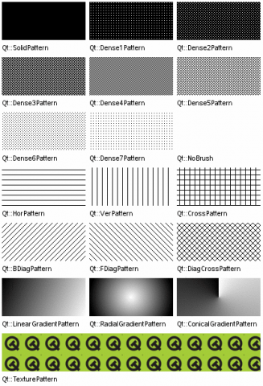
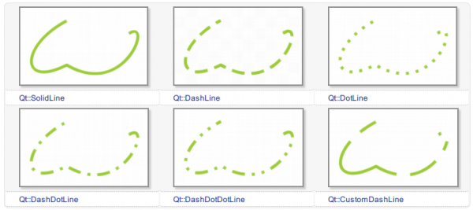
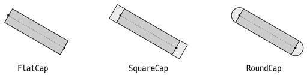
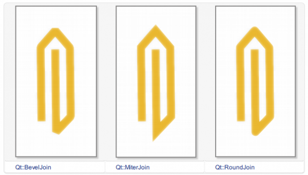
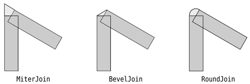

.. _brush_pen:

`25. 画刷和画笔 <http://www.devbean.net/2012/11/qt-study-road-2-brush-pen/>`_
=============================================================================

:作者: 豆子

:日期: 2012年11月05日

前面一章我们提到，Qt 绘图系统定义了两个绘制时使用的关键属性：画刷和画笔。前者使用 QBrush 描述，大多用于填充；后者使用 QPen 描述，大多用于绘制轮廓线。

QBrush 定义了 QPainter 的填充模式，具有样式、颜色、渐变以及纹理等属性。

画刷的 style() 定义了填充的样式，使用 Qt::BrushStyle 枚举，默认值是 Qt::NoBrush，也就是不进行任何填充。我们可以从下面的图示中看到各种填充样式的区别：

画刷的 color() 定义了填充模式的颜色。这个颜色可以是 Qt 预定义的颜色常量，也就是 Qt::GlobalColor，也可以是任意 QColor 对象。

画刷的 gradient() 定义了渐变填充。这个属性只有在样式是 Qt::LinearGradientPattern、Qt::RadialGradientPattern 或者 Qt::ConicalGradientPattern 之一时才有效。渐变可以由 QGradient 对象表示。Qt 提供了三种渐变：QLinearGradient、QConicalGradient 和 QRadialGradient，它们都是 QGradient 的子类。我们可以使用如下代码片段来定义一个渐变的画刷：

.. code-block:: c++

	QRadialGradient gradient(50, 50, 50, 50, 50);
	gradient.setColorAt(0, QColor::fromRgbF(0, 1, 0, 1));
	gradient.setColorAt(1, QColor::fromRgbF(0, 0, 0, 0));
	 
	QBrush brush(gradient);

当画刷样式是 Qt::TexturePattern 时，texture() 定义了用于填充的纹理。注意，即使你没有设置样式为 Qt::TexturePattern，当你调用 setTexture() 函数时，QBrush 会自动将 style() 设置为 Qt::TexturePattern。

QPen 定义了用于 QPainter 应该怎样画线或者轮廓线。画笔具有样式、宽度、画刷、笔帽样式和连接样式等属性。画笔的样式 style() 定义了线的样式。画刷 brush() 用于填充画笔所绘制的线条。笔帽样式 capStyle() 定义了使用 QPainter 绘制的线的末端；连接样式 joinStyle() 则定义了两条线如何连接起来。画笔宽度 width() 或 widthF() 定义了画笔的宽。注意，不存在宽度为 0 的线。假设你设置 width 为 0，QPainter 依然会绘制出一条线，而这个线的宽度为 1 像素。也就是说，画笔宽度通常至少是 1 像素。

这么多参数既可以在构造时指定，也可以使用 set 函数指定，完全取决于你的习惯，例如：

.. code-block:: c++

	QPainter painter(this);
	QPen pen(Qt::green, 3, Qt::DashDotLine, Qt::RoundCap, Qt::RoundJoin);
	painter.setPen(pen);

等价于

.. code-block:: c++

	QPainter painter(this);
	QPen pen;  // creates a default pen
	 
	pen.setStyle(Qt::DashDotLine);
	pen.setWidth(3);
	pen.setBrush(Qt::green);
	pen.setCapStyle(Qt::RoundCap);
	pen.setJoinStyle(Qt::RoundJoin);
	 
	painter.setPen(pen);

使用构造函数的优点是代码较短，但是参数含义不明确；使用 set 函数则正好反过来。

默认的画笔属性是纯黑色，0 像素，方形笔帽（Qt::SquareCap），斜面型连接（Qt::BevelJoin）。

下面是画笔样式的示例：

你也可以使用 setDashPattern() 函数自定义样式，例如如下代码片段：

.. code-block:: c++

	QPen pen;
	QVector dashes;
	qreal space = 4;

	dashes << 1 << space << 3 << space << 9 << space
	       << 27 << space << 9 << space;

	pen.setDashPattern(dashes);

笔帽定义了画笔末端的样式，例如：

.. image:: imgs/25/cap-style.png

他们之间的区别是，Qt::SquareCap 是一种包含了最后一个点的方形端点，使用半个线宽覆盖；Qt::FlatCap 不包含最后一个点；Qt::RoundCap 是包含最后一个点的圆形端点。具体可以参考下面的示例（出自《C++ GUI Programming with Qt 4, 2nd Edition》）：

连接样式定义了两条线连接时的样式，例如：

同样，可以参考下面图示来理解这几种连接样式的细节（出自《C++ GUI Programming with Qt 4, 2nd Edition》）：

注意，我们前面说了，QPainter 也是一个状态机，这里我们所说的这些属性都是处于这个状态机之中的，因此，我们应该记得是否要将其保存下来或者是重新构建。
