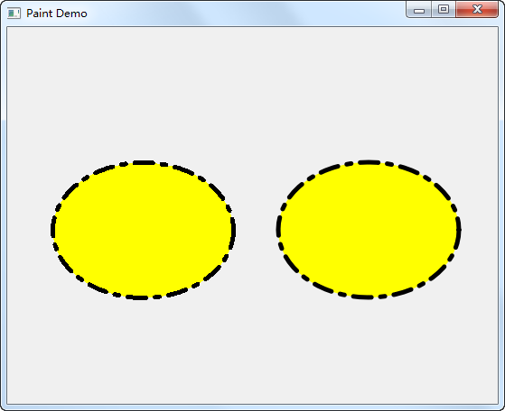
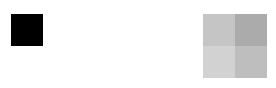

.. _antialiasing:

`26. 反走样 <http://www.devbean.net/2012/11/qt-study-road-2-antialiasing/>`_
============================================================================

:作者: 豆子

:日期: 2012年11月12日

我们在光栅图形显示器上绘制非水平、非垂直的直线或多边形边界时，或多或少会呈现锯齿状外观。这是因为直线和多边形的边界是连续的，而光栅则是由离散的点组成。在光栅显示设备上表现直线、多边形等，必须在离散位置采样。由于采样不充分重建后造成的信息失真，就叫走样；用于减少或消除这种效果的技术，就称为反走样。

反走样是图形学中的重要概念，用以防止通常所说的“锯齿”现象的出现。很多系统的绘图 API 里面都内置了有关反走样的算法，不过由于性能问题，默认一般是关闭的，Qt 也不例外。下面我们来看看代码：

.. code-block:: c++

	void paintEvent(QPaintEvent *)
	{
	    QPainter painter(this);
	    painter.setPen(QPen(Qt::black, 5, Qt::DashDotLine, Qt::RoundCap));
	    painter.setBrush(Qt::yellow);
	    painter.drawEllipse(50, 150, 200, 150);
	 
	    painter.setRenderHint(QPainter::Antialiasing, true);
	    painter.setPen(QPen(Qt::black, 5, Qt::DashDotLine, Qt::RoundCap));
	    painter.setBrush(Qt::yellow);
	    painter.drawEllipse(300, 150, 200, 150);
	}

看看运行后的结果：

注意看左侧椭圆与右侧椭圆在边界处的区别。左侧没有使用反锯齿，明细显示出锯齿的样子；右侧则增加了反锯齿代码。

在这段代码中，我们创建了一个黑色 5 像素宽的画笔，使用了点线的样式，圆形笔帽：

.. code-block:: c++

	painter.setPen(QPen(Qt::black, 5, Qt::DashDotLine, Qt::RoundCap));

然后我们使用一个黄色的画刷填充，绘制一个椭圆。

第二个椭圆的绘制与第一个十分相似，唯一的区别是多了一句

.. code-block:: c++

	painter.setRenderHint(QPainter::Antialiasing, true);

显然，我们通过这条语句，将 Antialiasing 属性（也就是反走样）设置为 true。经过这句设置，我们就打开了 QPainter 的反走样功能。还记得我们曾经说过，QPainter 是一个状态机，因此，只要这里我们打开了它，之后所有的代码都会是反走样绘制的了。由于反走样需要比较复杂的算法，在一些对图像质量要求不是很高的应用中，是不需要进行反走样的。为了提高效率，一般的图形绘制系统，如 Java2D、OpenGL 之类都是默认不进行反走样的。

虽然反走样比不反走样的图像质量高很多，但是，没有反走样的图形绘制还是有很大用处的。首先，就像前面说的一样，在一些对图像质量要求不高的环境下，或者说性能受限的环境下，比如嵌入式和手机环境，一般是不进行反走样的。另外，在一些必须精确操作像素的应用中，也是不能进行反走样的。这是由于反走样技术本身的限制的。请看下面的图片：

这是使用 Photoshop 的铅笔和画笔工具绘制的 1 像素的点，放大 3200% 的视图。在一定程度上，我们可以认为，Photoshop 的铅笔工具是不进行反走样，而画笔是要进行反走样的。在放大的情况下就会知道，有反走样的情况下是不能进行精确到 1 像素的操作的。因为反走样很难让你控制到 1 个像素。这不是 Photoshop 画笔工具的缺陷，而是反走样算法的问题。反走样之所以看起来比较模糊，就是因为它需要以一种近似色来替换原始的像素色，这样一来就会显得模糊而圆滑。
