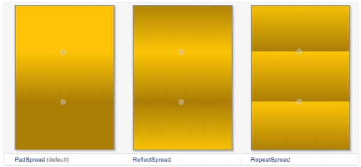
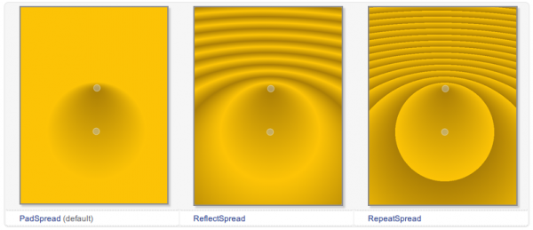
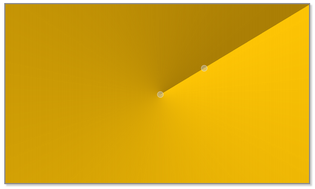

.. _gradient:

`27. 渐变 <http://www.devbean.net/2012/11/qt-study-road-2-gradient/>`_
======================================================================

:作者: 豆子

:日期: 2012年11月20日

渐变是绘图中很常见的一种功能，简单来说就是可以把几种颜色混合在一起，让它们能够自然地过渡，而不是一下子变成另一种颜色。渐变的算法比较复杂，写得不好的话效率会很低，好在很多绘图系统都内置了渐变的功能，Qt 也不例外。渐变一般是用在填充里面的，所以，设置渐变是在 QBrush 里面。

Qt 提供了三种渐变：线性渐变（QLinearGradient）、辐射渐变（QRadialGradient）和角度渐变（QConicalGradient）。我们可以在 Qt API 手册中看到这几种渐变的区别：

线性渐变：

辐射渐变：

角度渐变：

具体细节可以参考文档。下面我们通过一个示例看看如何使用渐变进行填充：

.. code-block:: c++

	void paintEvent(QPaintEvent *)
	{
	    QPainter painter(this);
	 
	    painter.setRenderHint(QPainter::Antialiasing, true);
	    QLinearGradient linearGradient(60, 50, 200, 200);
	    linearGradient.setColorAt(0.2, Qt::white);
	    linearGradient.setColorAt(0.6, Qt::green);
	    linearGradient.setColorAt(1.0, Qt::black);
	    painter.setBrush(QBrush(linearGradient));
	    painter.drawEllipse(50, 50, 200, 150);
	}

像以前一样，我们也只给出了 paintEvent() 的代码。这段代码看起来也相当清晰：首先我们打开了反走样，然后创建一个 QLinearGradient 对象实例。QLinearGradient 也就是线性渐变，其构造函数有四个参数，分别是 x1，y1，x2，y2，即渐变的起始点和终止点。在这里，我们从 (60, 50) 点开始渐变，到 (200, 200) 点止。关于坐标的具体细节，我们会在后面的章节中详细介绍。渐变的颜色是在 setColorAt() 函数中指定的。下面是这个函数的签名：

.. code-block:: c++

	void QGradient::setColorAt ( qreal position, const QColor & color )

这个函数的作用是，把 position 位置的颜色设置成 color。其中，position 是一个 [0, 1] 闭区间的数字。也就是说，position 是相对于我们建立渐变对象时做的那个起始点和终止点区间的一个比例。以这个线性渐变为例，在从 (60, 50) 到 (200, 200) 的线段上，在 0.2，也就五分之一处设置成白色，在 0.6 也就是五分之三处设置成绿色，在 1.0 也就是终点处设置成黑色。创建 QBrush 对象时，把这个渐变对象传递进去，然后就可以运行了：

.. image:: imgs/27/gradient-demo.png

下面我们开始一个更复杂，也更实用一些的例子：绘制一个色轮（color wheel）。所谓色轮，其实就是一个带有颜色的圆盘（或许你没听说过这个名字，但是你肯定见过这个东西），下面是色轮的运行结果：

.. image:: imgs/27/color-wheel.png

我们来看看它的代码：

.. code-block:: c++

	void ColorWheel::paintEvent(QPaintEvent *)
	{
	    QPainter painter(this);
	    painter.setRenderHint(QPainter::Antialiasing);
	 
	    const int r = 150;
	    QConicalGradient conicalGradient(0, 0, 0);
	 
	    conicalGradient.setColorAt(0.0, Qt::red);
	    conicalGradient.setColorAt(60.0/360.0, Qt::yellow);
	    conicalGradient.setColorAt(120.0/360.0, Qt::green);
	    conicalGradient.setColorAt(180.0/360.0, Qt::cyan);
	    conicalGradient.setColorAt(240.0/360.0, Qt::blue);
	    conicalGradient.setColorAt(300.0/360.0, Qt::magenta);
	    conicalGradient.setColorAt(1.0, Qt::red);
	 
	    painter.translate(r, r);
	 
	    QBrush brush(conicalGradient);
	    painter.setPen(Qt::NoPen);
	    painter.setBrush(brush);
	    painter.drawEllipse(QPoint(0, 0), r, r);
	}

首先还是新建 QPainter 对象，开启反走样。然后我们将圆盘半径定义为 150。下面创建一个角度渐变实例，其构造函数同样接受三个参数：

.. code-block:: c++

	QConicalGradient::QConicalGradient ( qreal cx, qreal cy, qreal angle )

前两个参数 cx 和 cy 组成角度渐变的中心点，第三个参数是渐变的起始角度。在我们的例子中，我们将渐变中心点设置为 (0, 0)，起始角度为 0。类似线性渐变，角度渐变的 setColorAt() 函数同样接受两个参数，第一个是角度比例，第二个是颜色。例如，

.. code-block:: c++

	conicalGradient.setColorAt(0.0, Qt::red);

将 0 度角设置为红色；

.. code-block:: c++

	conicalGradient.setColorAt(60.0/360.0, Qt::yellow);

将 60 度角设置为黄色。由于一个圆周是 360 度，所以 60.0/360.0 即是这个角度的比例。其余代码以此类推。最后一句，我们将 1.0 处设置为红色，也就是重新回到起始处。至于颜色的分布，这是由颜色空间定义的，有兴趣的朋友可以查阅有关颜色模型的理论。

.. code-block:: c++

	painter.translate(r, r);

这是我们唯一不熟悉的函数。QPainter::translate(x, y) 函数意思是，将坐标系的原点设置到 (x, y) 点。原本坐标系原点位于左上角，我们使用 translate(r, r)，将坐标原点设置为 (r, r)。这么一来，左上角的点的坐标就应该是 (-r, -r)。

最后，我们使用 drawEllipse() 函数绘制圆盘。注意，由于我们已经把坐标原点设置为 (r, r)，因此，在绘制时，圆心应该是新的坐标 (0, 0)，而不是原来的 (r, r)。

PS：为了理解 translate() 函数的作用，可以思考下，如果去掉 translate() 函数的调用，我们的程序应该如何修改。答案是：

.. code-block:: c++

	void ColorWheel::paintEvent(QPaintEvent *)
	{
	    QPainter painter(this);
	    painter.setRenderHint(QPainter::Antialiasing);
	 
	    const int r = 150;
	    QConicalGradient conicalGradient(r, r, 0);
	 
	    conicalGradient.setColorAt(0.0, Qt::red);
	    conicalGradient.setColorAt(60.0/360.0, Qt::yellow);
	    conicalGradient.setColorAt(120.0/360.0, Qt::green);
	    conicalGradient.setColorAt(180.0/360.0, Qt::cyan);
	    conicalGradient.setColorAt(240.0/360.0, Qt::blue);
	    conicalGradient.setColorAt(300.0/360.0, Qt::magenta);
	    conicalGradient.setColorAt(1.0, Qt::red);
	 
	    QBrush brush(conicalGradient);
	    painter.setPen(Qt::NoPen);
	    painter.setBrush(brush);
	    painter.drawEllipse(QPoint(r, r), r, r);
	}

不仅我们需要修改最后的绘制语句，还需要注意修改 QConicalGradient 定义时传入的中心点的坐标。
