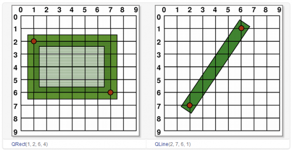
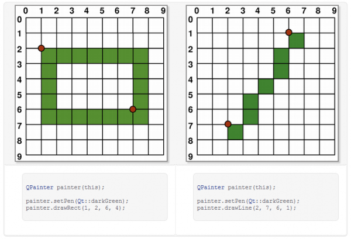
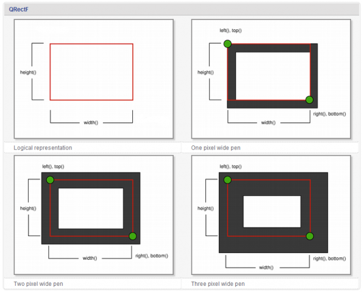
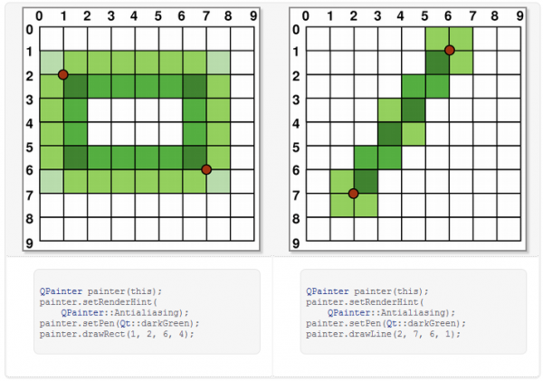
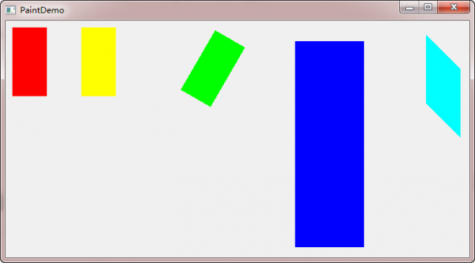
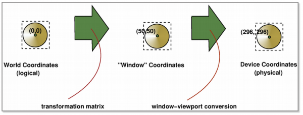

.. _coordinate_system:

`28. 坐标系统 <http://www.devbean.net/2012/11/qt-study-road-2-coordinate-system/>`_
===================================================================================

:作者: 豆子

:日期: 2012年11月25日

在经历过实际操作，以及前面一节中我们见到的那个 translate() 函数之后，我们可以详细了解下 Qt 的坐标系统了。泛泛而谈坐标系统，有时候会觉得枯燥无味，难以理解，好在现在我们已经有了基础。

坐标系统是由 QPainter 控制的。我们前面说过，QPaintDevice、QPaintEngine 和 QPainter 是 Qt 绘制系统的三个核心类。QPainter 用于进行绘制的实际操作；QPaintDevice 是那些能够让 QPainter 进行绘制的“东西”（准确的术语叫做，二维空间）的抽象层（其子类有 QWidget、QPixmap、QPicture、QImage 和 QPrinter 等）；QPaintEngine 提供供 QPainter 使用的用于在不同设备上绘制的统一的接口。

由于 QPaintDeice 是进行绘制的对象，因此，所谓坐标系统，也就是 QPaintDevice 上面的坐标。默认坐标系统位于设备的左上角，也就是坐标原点 (0, 0)。x 轴方向向右；y 轴方向向下。在基于像素的设备上（比如显示器），坐标的默认单位是像素，在打印机上则是点（1/72 英寸）。

将 QPainter 的逻辑坐标与 QPaintDevice 的物理坐标进行映射的工作，是由 QPainter 的变换矩阵（transformation matrix）、视口（viewport）和窗口（window）完成的。如果你不理解这些术语，可以简单了解下有关图形学的内容。实际上，对图形的操作，底层的数学都是进行的矩阵变换、相乘等运算。

在 Qt 的坐标系统中，每个像素占据 1×1 的空间。你可以把它想象成一张方格纸，每个小格都是1个像素。方格的焦点定义了坐标，也就是说，像素 (x, y) 的中心位置其实是在 (x + 0.5, y + 0.5) 的位置上。这个坐标系统实际上是一个“半像素坐标系”。我们可以通过下面的示意图来理解这种坐标系：

我们使用一个像素的画笔进行绘制，可以看到，每一个绘制像素都是以坐标点为中心的矩形。 **注意，这是坐标的逻辑表示，实际绘制则与此不同。** 因为在实际设备上，像素是最小单位，我们不能像上面一样，在两个像素之间进行绘制。所以在实际绘制时，Qt 的定义是，绘制点所在像素是逻辑定义点的右下方的像素。

我们前面已经介绍过，Qt 的绘制分为走样和反走样两种。对此，我们必须分别对待。

一个像素的绘制最简单，我们从这里开始：

从上图可以看出，当我们绘制矩形左上角 (1, 2) 时，实际绘制的像素是在右下方。

当绘制大于1个像素时，情况比较复杂：如果绘制像素是奇数，则实际绘制会包裹住逻辑坐标值；如果是偶数，则是包裹住逻辑坐标值，再加上右下角一个像素的便宜。具体请看下面的图示：

从上图可以看出，如果实际绘制是奇数像素，则会将逻辑坐标值夹在相等的两部分像素之间；如果是偶数，则会在右下方多出一个像素。

Qt 的这种处理，带来的一个问题是，我们可能获取不到真实的坐标值。由于历史原因，QRect::right() 和 QRect::bottom() 的返回值并不是矩形右下角点的真实坐标值：QRect::right() 返回的是 left() + width() – 1；QRect::bottom() 则返回 top() + height() – 1，上图的绿色点指出了这两个函数的返回点的坐标。

为避免这个问题，我们建议是使用 QRectF。QRectF 使用浮点值，而不是整数值，来描述坐标。这个类的两个函数 QRectF::right() 和 QRectF::bottom() 是正确的。如果你不得不使用 QRect，那么可以利用 x() + width() 和 y() + height() 来替代 right() 和 bottom() 函数。

对于反走样，实际绘制会包裹住逻辑坐标值：

这里我们不去解释为什么在反走样是，像素颜色不是一致的，这是由于反走样算法导致，已经超出本节的内容。

Qt 同样提供了坐标变换。前面说，图形学大部分算法依赖于矩形计算，坐标变换便是其中的代表：每一种变换都对应着一个矩阵乘法（如果你想知道学的线性代数有什么用处，这就是应用之一了 ;-P）。我们会以一个实际的例子来了解坐标变换。在此之前，我们需要了解两个函数：QPainter::save() 和 QPainter::restore()。

前面说过，QPainter 是一个状态机。那么，有时我想保存下当前的状态：当我临时绘制某些图像时，就可能想这么做。当然，我们有最原始的办法：将可能改变的状态，比如画笔颜色、粗细等，在临时绘制结束之后再全部恢复。对此，QPainter 提供了内置的函数：save() 和 restore()。save() 就是保存下当前状态；restore() 则恢复上一次保存的结果。这两个函数 **必须** 成对出现：QPainter 使用栈来保存数据，每一次 save()，将当前状态压入栈顶，restore() 则弹出栈顶进行恢复。

在了解了这两个函数之后，我们就可以进行示例代码了：

.. code-block:: c++

	void PaintDemo::paintEvent(QPaintEvent *)
	{
	    QPainter painter(this);
	    painter.fillRect(10, 10, 50, 100, Qt::red);
	    painter.save();
	    painter.translate(100, 0); // 向右平移 100px
	    painter.fillRect(10, 10, 50, 100, Qt::yellow);
	    painter.restore();
	    painter.save();
	    painter.translate(300, 0); // 向右平移 300px
	    painter.rotate(30); // 顺时针旋转 30 度
	    painter.fillRect(10, 10, 50, 100, Qt::green);
	    painter.restore();
	    painter.save();
	    painter.translate(400, 0); // 向右平移 400px
	    painter.scale(2, 3); // 横坐标单位放大 2 倍，纵坐标放大 3 倍
	    painter.fillRect(10, 10, 50, 100, Qt::blue);
	    painter.restore();
	    painter.save();
	    painter.translate(600, 0); // 向右平移 600px
	    painter.shear(0, 1); // 横向不变，纵向扭曲 1 倍
	    painter.fillRect(10, 10, 50, 100, Qt::cyan);
	    painter.restore();
	}

Qt 提供了四种坐标变换：平移 translate，旋转 rotate，缩放 scale 和扭曲 shear。在这段代码中，我们首先在 (10, 10) 点绘制一个红色的 50×100 矩形。保存当前状态，将坐标系平移到 (100, 0)，绘制一个黄色的矩形。注意，translate() 操作平移的是坐标系，不是矩形。因此，我们还是在 (10, 10) 点绘制一个 50×100 矩形，现在，它跑到了右侧的位置。然后恢复先前状态，也就是把坐标系重新设为默认坐标系（相当于进行 translate(-100, 0)），再进行下面的操作。之后也是类似的。由于我们只是保存了默认坐标系的状态，因此我们之后的 translate() 横坐标值必须增加，否则就会覆盖掉前面的图形。所有这些操作都是针对坐标系的，因此在绘制时，我们提供的矩形的坐标参数都是不变的。

运行结果如下：

Qt 的坐标分为逻辑坐标和物理坐标。在我们绘制时，提供给 QPainter 的都是逻辑坐标。之前我们看到的坐标变换，也是针对逻辑坐标的。所谓物理坐标，就是绘制底层 QPaintDevice 的坐标。单单只有逻辑坐标，我们是不能在设备上进行绘制的。要想在设备上绘制，必须提供设备认识的物理坐标。Qt 使用 viewport-window 机制将我们提供的逻辑坐标转换成绘制设备使用的物理坐标，方法是，在逻辑坐标和物理坐标之间提供一层“窗口”坐标。视口是由任意矩形指定的物理坐标；窗口则是该矩形的逻辑坐标表示。默认情况下，物理坐标和逻辑坐标是一致的，都等于设备矩形。

视口坐标（也就是物理坐标）和窗口坐标是一个简单的线性变换。比如一个 400×400 的窗口，我们添加如下代码：

.. code-block:: c++

	void PaintDemo::paintEvent(QPaintEvent *)
	{
	    QPainter painter(this);
	    painter.setWindow(0, 0, 200, 200);
	    painter.fillRect(0, 0, 200, 200, Qt::red);
	}

我们将窗口矩形设置为左上角坐标为 (0, 0)，长和宽都是 200px。此时，坐标原点不变，还是左上角，但是，对于原来的 (400, 400) 点，新的窗口坐标是 (200, 200)。我们可以理解成，逻辑坐标被“重新分配”。这有点类似于 translate()，但是，translate() 函数只是简单地将坐标原点重新设置，而 setWindow() 则是将整个坐标系进行了修改。这段代码的运行结果是将整个窗口进行了填充。

试比较下面两行代码的区别（还是 400×400 的窗口）：

.. code-block:: c++

	painter.translate(200, 200);
	painter.setWindow(-160, -320, 320, 640);

第一行代码，我们将坐标原点设置到 (200, 200) 处，横坐标范围是 [-200, 200]，纵坐标范围是 [-200, 200]。第二行代码，坐标原点也是在窗口正中心，但是，我们将物理宽 400px 映射成窗口宽 320px，物理高 400px 映射成窗口高 640px，此时，横坐标范围是 [-160, 160]，纵坐标范围是 [-320, 320]。这种变换是简单的线性变换。假设原来有个点坐标是 (64， 60)，那么新的窗口坐标下对应的坐标应该是 ((-160 + 64 * 320 / 400), (-320 + 60 * 640 / 400)) = (-108.8, -224)。

下面我们再来理解下视口的含义。还是以一段代码为例：

.. code-block:: c++

	void PaintDemo::paintEvent(QPaintEvent *)
	{
	    QPainter painter(this);
	    painter.setViewport(0, 0, 200, 200);
	    painter.fillRect(0, 0, 200, 200, Qt::red);
	}

这段代码和前面一样，只是把 setWindow() 换成了 setViewport()。前面我们说过，window 代表窗口坐标，viewport 代码物理坐标。也就是说，我们将物理坐标区域定义为左上角位于 (0, 0)，长高都是 200px 的矩形。然后还是绘制和上面一样的矩形。如果你认为运行结果是 1/4 窗口被填充，那就错了。实际是只有 1/16 的窗口被填充。这是由于，我们修改了物理坐标，但是没有修改相应的窗口坐标。默认的逻辑坐标范围是左上角坐标为 (0, 0)，长宽都是 400px 的矩形。当我们将物理坐标修改为左上角位于 (0, 0)，长高都是 200px 的矩形时，窗口坐标范围不变，也就是说，我们将物理宽 200px 映射成窗口宽 400px，物理高 200px 映射成窗口高 400px，所以，原始点 (200, 200) 的坐标变成了 ((0 + 200 * 200 / 400), (0 + 200 * 200 / 400)) = (100, 100)。

现在我们可以用一张图示总结一下逻辑坐标、窗口坐标和物理坐标之间的关系：

我们传给 QPainter 的是逻辑坐标（也称为世界坐标），逻辑坐标可以通过变换矩阵转换成窗口坐标，窗口坐标通过 window-viewport 转换成物理坐标（也就是设备坐标）。
