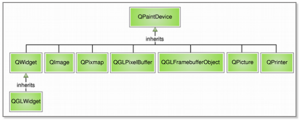
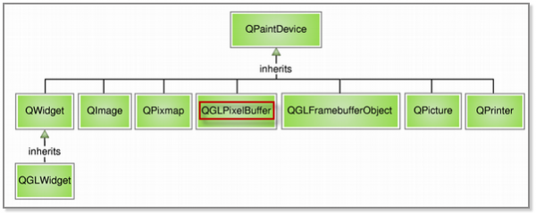
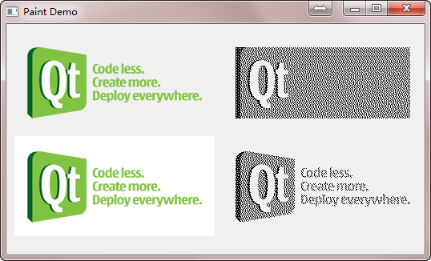
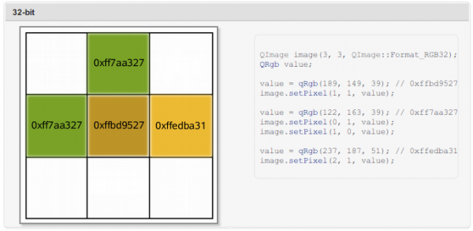

.. _paint_device:

`29. 绘制设备 <http://www.devbean.net/2012/12/qt-study-road-2-paint-device/>`_
==============================================================================

:作者: 豆子

:日期: 2012年12月03日

绘图设备是继承 QPainterDevice 的类。QPaintDevice 就是能够进行绘制的类，也就是说，QPainter 可以在任何 QPaintDevice 的子类上进行绘制。现在，Qt 提供了若干这样的类：

Qt4：

Qt5：

上面的是 Qt4 的相关类图，下面是 Qt5。这两部分大致相同，只是在 Qt5 中，QGLPixelBuffer 已经被废弃。本章我们关注的是 QPixmap、QBitmap、QImage 和 QPicture 这几个类。另外的部分，QWidget 就是所有组件的父类，我们已经在前面的章节中使用过，这里不再赘述。QGLWidget 和 QGLFramebufferObject，顾名思义，就是关于 OpenGL 的相关类。在 Qt 中，我们可以方便地结合 OpenGL 进行绘制。由于这部分需要牵扯到 OpenGL 的相关内容，现在也不再深入。在我们选择的几个类中，大多与图像密切相关。

QPixmap 专门为图像在屏幕上的显示做了优化；QBitmap 是QPixmap 的一个子类，它的色深限定为1，你可以使用 QPixmap 的 isQBitmap() 函数来确定这个 QPixmap 是不是一个 QBitmap。QImage 专门为图像的像素级访问做了优化。QPicture 则可以记录和重现 QPainter 的各条命令。下面我们将分两部分介绍这四种绘图设备。

QPixmap 继承了 QPaintDevice，因此，你可以使用 QPainter 直接在上面绘制图形。QPixmap 也可以接受一个字符串作为一个文件的路径来显示这个文件，比如你想在程序之中打开 png、jpeg 之类的文件，就可以使用 QPixmap。使用 QPainter::drawPixmap() 函数可以把这个文件绘制到一个 QLabel、QPushButton 或者其他的设备上面。正如前面所说的那样，QPixmap 是针对屏幕进行特殊优化的，因此，它与实际的底层显示设备息息相关。注意，这里说的显示设备并不是硬件，而是操作系统提供的原生的绘图引擎。所以，在不同的操作系统平台下，QPixmap 的显示可能会有所差别。

QPixmap 提供了静态的 grabWidget() 和 grabWindow() 函数，用于将自身图像绘制到目标上。同时，在使用 QPixmap 时，你可以直接使用传值的形式，不需要传指针，因为 QPixmap 提供了“隐式数据共享”。关于这一点，我们会在以后的章节中详细描述。简单来说，就是一般对于大型数据（图像无疑就是这种“大型数据”），为性能起见，通常会采用传指针的方式，但是由于 QPixmap 内置了隐式数据共享，所以只要知道传递 QPixmap。

前面说过，QBitmap 继承自 QPixmap，因此具有 QPixmap 的所有特性。不同之处在于，QBitmap 的色深始终为 1。色深这个概念来自计算机图形学，是指用于表现颜色的二进制的位数。我们知道，计算机里面的数据都是使用二进制表示的。为了表示一种颜色，我们也会使用二进制。比如我们要表示 8 种颜色，需要用 3 个二进制位，这时我们就说色深是 3。因此，所谓色深为 1，也就是使用 1 个二进制位表示颜色。1 个位只有两种状态：0 和 1，因此它所表示的颜色就有两种，黑和白。所以说，QBitmap 实际上是只有黑白两色的图像数据。由于 QBitmap 色深小，因此只占用很少的存储空间，所以适合做光标文件和笔刷。

下面我们来看同一个图像文件在 QPixmap 和 QBitmap 下的不同表现：

.. code-block:: c++

	void paintEvent(QPaintEvent *)
	{
	    QPainter painter(this);
	    QPixmap pixmap("qt-logo.png");
	    QBitmap bitmap("qt-logo.png");
	    painter.drawPixmap(10, 10, 250, 125, pixmap);
	    painter.drawPixmap(270, 10, 250, 125, bitmap);
	    QPixmap whitePixmap("qt-logo-white.png");
	    QBitmap whiteBitmap("qt-logo-white.png");
	    painter.drawPixmap(10, 140, 250, 125, whitePixmap);
	    painter.drawPixmap(270, 140, 250, 125, whiteBitmap);
	}

先来看一下运行结果：

这里我们给出了两张 png 图片。qt-logo.png 具有透明背景，qt-logo-white.png 具有白色背景。我们分别使用 QPixmap 和 QBitmap 来加载它们。注意看它们的区别：白色的背景在 QBitmap 中消失了，而透明色在QBitmap 中转换成了黑色（“黑色”，记住，QBitmap 只有两种颜色：黑色和白色）；其他颜色则是使用点的疏密程度来体现的。

QPixmap 使用底层平台的绘制系统进行绘制，无法提供像素级别的操作，而 QImage 则是使用独立于硬件的绘制系统，实际上是自己绘制自己，因此提供了像素级别的操作，并且能够在不同系统之上提供一个一致的显示形式。

QImage 与 QPixmap 相比，最大的优势在于能够进行像素级别的操作。我们通过上面的示意图可以看到，我们声明一个 3 x 3 像素的 QImage 对象，然后利用 setPixel() 函数进行颜色的设置。你可以把 QImage 想象成一个 RGB 颜色的二维数组，记录了每一像素的颜色。值得注意的是，在 QImage 上进行绘制时，不能使用 QImage::Format_Indexed8 这种格式。

最后一种 QPicture 是平台无关的，因此它可以使用在多种设备之上，比如 svg、pdf、ps、打印机或者屏幕。回忆下我们曾经说的 QPaintDevice，实际上是说可以由 QPainter 进行绘制的对象。QPicture 使用系统分辨率，并且可以调整 QPainter 来消除不同设备之间的显示差异。如果我们要记录下 QPainter 的命令，首先要使用 QPainter::begin() 函数，将 QPicture 实例作为参数传递进去，以便告诉系统开始记录，记录完毕后使用 QPainter::end() 命令终止。代码示例如下：

.. code-block:: c++

	QPicture picture;
	QPainter painter;
	painter.begin(&picture);             // 在 picture 进行绘制
	painter.drawEllipse(10, 20, 80, 70); // 绘制一个椭圆
	painter.end();                       // 绘制完成
	picture.save("drawing.pic");         // 保存 picture

如果我们要重现命令，首先要使用 QPicture::load() 函数进行装载：

.. code-block:: c++

	QPicture picture;
	picture.load("drawing.pic");           // 加载 picture
	QPainter painter;
	painter.begin(&myImage);               // 在 myImage 上开始绘制
	painter.drawPicture(0, 0, picture);    // 在 (0, 0) 点开始绘制 picture
	painter.end();                         // 绘制完成

我们也可以直接使用 QPicture::play() 进行绘制。这个函数接受一个 QPainter 对象，也就是进行绘制的画笔。
