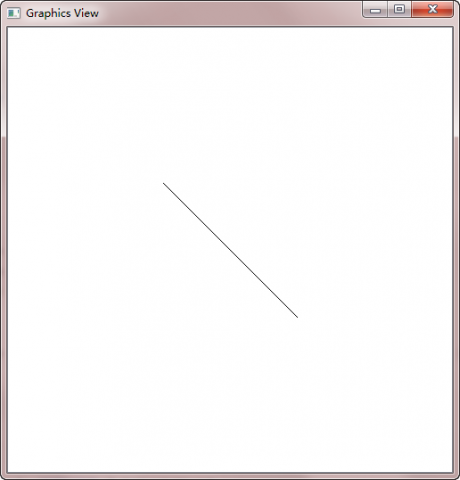

.. _gvf:

`30. Graphics View Framework <http://www.devbean.net/2012/12/qt-study-road-2-gvf/>`_
====================================================================================

:作者: 豆子

:日期: 2012年12月11日

Graphics View 提供了一种接口，用于管理大量自定义的 2D 图形元素，并与之进行交互；还提供了用于将这些元素进行可视化显示的观察组件，并支持缩放和旋转。我们通常所说的 Linux 的 KDE 桌面环境，就是建立在 Graphics View 基础之上的（尽管新版本的 KDE 有向 QML 迁移的趋势）。

Graphics View 框架包含了一套完整的事件体系，可以用于与场景中的元素进行双精度的交互。这些元素同样支持键盘事件、鼠标事件等。Graphics View 使用了 BSP 树（Binary Space Partitioning tree，这是一种被广泛应用于图形学方面的数据结构）来提供非常快速的元素发现，也正因为如此，才能够实现一种上百万数量级元素的实时显示机制。

Graphics View 最初在 Qt 4.2 引入，来取代 Qt 3 中的 QCanvas。当然，在最新的 Qt5 中，Qt3 的代码已经不能继续使用了（尽管在一定程度上， Qt4 还是可以使用这些遗留代码）。

Graphics View 是一个基于元素（item）的 MV 架构的框架。它可以分成三个部分：元素 item、场景 scene 和视图 view。

基于元素的意思是，它的每一个组件都是一个独立的元素。这是与我们之前讲到过的 QPainter 状态机机制不同。回忆一下，使用 QPainter 绘图，大多是采用一种面向过程的描述方式：首先使用 drawLine() 画一条直线，然后使用 drawPolygon() 画一个多边形。对于 Graphics View，相同的过程可以是，首先创建一个场景（scene），然后创建一个直线对象和一个多边形对象，再使用场景的 add() 函数，将直线和多边形添加到场景中，最后通过视图进行观察，就可以看到了。乍看起来，后者似乎更加复杂，但是，如果你的图像中包含了成千上万的直线、多边形之类，管理这些对象要比管理 QPainter 的绘制语句容易得多。并且，这些图形对象也更加符合面向对象的设计要求：一个很复杂的图形可以很方便的复用。

MV 架构的意思是，Graphics View 提供一个 model 和一个 view（正如 MVC 架构，只不过 MV 架构少了 C 这么一个组件）。所谓模型（model）就是我们添加的种种对象；所谓视图（view）就是我们观察这些对象的视口。同一个模型可以由很多视图从不同的角度进行观察，这是很常见的需求。使用 QPainter 很难实现这一点，这需要很复杂的计算，而 Graphics View 可以很容易的实现。

Graphics View 提供了 QGraphicsScene 作为场景，即是允许我们添加图形的空间，相当于整个世界；QGraphicsView 作为视口，也就是我们的观察窗口，相当于照相机的取景框，这个取景框可以覆盖整个场景，也可以是场景的一部分；QGraphicsItem 作为图形元件，以便添加到场景中去，Qt 内置了很多图形，比如直线、多边形等，它们都是继承自 QGraphicsItem。

下面我们通过一段代码看看 Graphics View 的使用。

.. code-block:: c++

	int main(int argc, char *argv[])
	{
	    QApplication app(argc, argv);
	 
	    QGraphicsScene scene;
	    scene.addLine(0, 0, 150, 150);
	 
	    QGraphicsView view(&scene);
	    view.setWindowTitle("Graphics View");
	    view.resize(500, 500);
	    view.show();
	 
	    return app.exec();
	}

这段代码很简单：首先创建一个场景，也就是 QGraphicsScene 对象。然后我们使用 addLine() 函数向场景中添加了一个直线，起始点和终点坐标分别是 (0, 0) 和 (150, 150)。可以想象，这是一个边长 150px 的正方形的对角线。通过这两步，我们已经有了场景和元素。之后，我们创建一个 GraphicsView 对象，绑定到一个场景上（也就是我们前面创建的 scene 对象）。注意，QGraphicsScene 不是 QWidget 的子类，因此该构造函数并不是调用的 QGraphicsView(QWidget \*parent)。接下来，我们可以运行一下代码：

我们看到，这个直线自动在视图居中显示。这并不需要我们进行任何额外的代码。如果不想这么做，我们可以给 scene 设置一下 sceneRect() 属性：

.. code-block:: c++

	QGraphicsScene scene;
	scene.setSceneRect(0, 0, 300, 300);
	scene.addLine(0, 0, 150, 150);

	QGraphicsView view(&scene);
	view.setWindowTitle("Graphics View");
	// view.resize(500, 500);
	view.show();

不仅如此，我们还去掉了 view.resize() 一行。QGraphicsScene 的 sceneRect 属性供 QGraphicsView 确定视图默认的滚动条区域，并且协助 QGraphicsScene 管理元素索引。之所以去掉 view.resize() 一行，是因为我们让系统去决定视图的最小尺寸（否则的话，我们需要手动将窗口标题栏等的大小同时考虑设置）。
