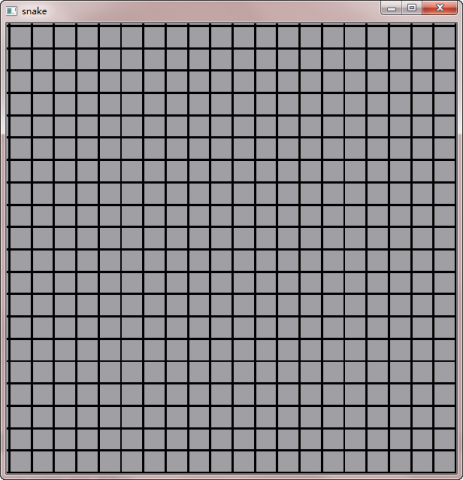

.. _snake_1:

`31. 贪吃蛇游戏（1） <http://www.devbean.net/2012/12/qt-study-road-2-snake-1/>`_
================================================================================

:作者: 豆子

:日期: 2012年12月18日

经过前面一段时间的学习，我们已经了解到有关 Qt 相当多的知识。现在，我们将把前面所讲过的知识综合起来，开发一个贪吃蛇游戏。游戏很简单，相信大家都有见过，多多少少也都玩过。我们在实现这个贪吃蛇游戏时，会利用到事件系统、Graphics View Framework、QPainter 等相关内容，也会了解到一个游戏所具有的一些特性，比如游戏循环等，在 Qt 中如何体现出来。当然，最重要的是，通过一个相对较大的程序，学习到如何将之前的点点滴滴结合在一起。

本部分的代码出自：`http://qtcollege.co.il/developing-a-qt-snake-game/ <http://qtcollege.co.il/developing-a-qt-snake-game/>`_ ，但是有一些基于软件工程方面考虑的修改，例如常量放置的位置等。

前面说过，Qt 提供了自己的绘制系统，还提供了 Graphics View Framework。很明显，绘制图形和移动图形，是一个游戏的核心。对于游戏而言，将其中的每一个部分看做对象是非常合理的，也是相当有成效的。因此，我们选择 Graphics View Framework 作为核心框架。回忆一下，这个框架具有一系列面向对象的特性，能够让我们将一个个图形作为对象进行处理。同时，Graphics View Framework 的性能很好，即便是数千上万的图形也没有压力。这一点非常适合于游戏。

正如我们前面所说，Graphics View Framework 有三个主要部分：

* QGraphicsScene：能够管理元素的非 GUI 容器；
* QGraphicsItem：能够被添加到场景的元素；
* QGraphicsView：能够观察场景的可视化组件视图。

对于游戏而言，我们需要一个 QGraphicsScene，作为游戏发生的舞台；一个 QGraphicsView，作为观察游戏舞台的组件；以及若干元素，用于表示游戏对象，比如蛇、食物以及障碍物等。

大致分析过游戏组成以及各部分的实现方式后，我们可以开始编码了。这当然是一个 GUI 工程，主窗口应该是一个 QGraphicsView。为了以后的实现方便（比如，我们希望向工具栏添加按钮等），我们不会直接以 QGraphicsView 作为顶层窗口，而是将其添加到一个主窗口上。这里，我们不会使用 QtDesigner 进行界面设计，而是直接编码完成（ **注意，我们这里的代码并不一定能够通过编译，因为会牵扯到其后几章的内容，因此，如果需要编译代码，请在全部代码讲解完毕之后进行** ）：

.. code-block:: c++

	#ifndef MAINWINDOW_H
	#define MAINWINDOW_H
	 
	#include <QMainWindow>
	 
	class QGraphicsScene;
	class QGraphicsView;
	 
	class GameController;
	 
	class MainWindow : public QMainWindow
	{
	    Q_OBJECT
	public:
	    MainWindow(QWidget *parent = 0);
	    ~MainWindow();
	 
	private slots:
	    void adjustViewSize();
	 
	private:
	    void initScene();
	    void initSceneBackground();
	 
	    QGraphicsScene *scene;
	    QGraphicsView *view;
	 
	    GameController *game;
	};
	 
	#endif // MAINWINDOW_H

在头文件中声明了 MainWindow。构造函数除了初始化成员变量，还设置了窗口的大小，并且需要对场景进行初始化：

.. code-block:: c++

	MainWindow::MainWindow(QWidget *parent) :
	    QMainWindow(parent),
	    scene(new QGraphicsScene(this)),
	    view(new QGraphicsView(scene, this)),
	    game(new GameController(*scene, this))
	{
	    setCentralWidget(view);
	    resize(600, 600);
	 
	    initScene();
	    initSceneBackground();
	 
	    QTimer::singleShot(0, this, SLOT(adjustViewSize()));
	}

值得说明的是最后一行代码。singleShot() 函数原型如下：

.. code-block:: c++

	static void QTimer::singleShot(int msec, QObject * receiver, const char * member);

该函数接受三个参数，简单来说，它的作用是，在 msec 毫秒之后，调用 receiver 的 member **槽函数** 。在我们的代码中，第一个参数传递的是 0，也就是 0ms 之后，调用 this->adjustViewSize()。这与直接调用 this->adjustViewSize(); 有什么区别呢？如果你看文档，这一段的解释很隐晦。文档中写到：“It is very convenient to use this function because you do not need to bother with a timerEvent or create a local QTimer object”，也就是说，它的作用是方便使用，无需重写 timerEvent() 函数或者是创建一个局部的 QTimer 对象。当我们使用 QTimer::signleShot(0, …) 的时候，实际上也是对 QTimer 的简化，而不是简单地函数调用。QTimer 的处理是将其放到事件列表中，等到下一次事件循环开始时去调用这个函数。那么，QTimer::signleShot(0, …) 意思是，在下一次事件循环开始时，立刻调用指定的槽函数。在我们的例子中，我们需要在视图绘制完毕后才去改变大小（视图绘制当然是在 paintEvent() 事件中），因此我们需要在下一次事件循环中调用 adjustViewSize() 函数。这就是为什么我们需要用 QTimer 而不是直接调用 adjustViewSize()。如果熟悉 flash，这相当于 flash 里面的 callLater() 函数。接下来看看 initScene() 和 initSceneBackground() 的代码：

.. code-block:: c++

	void MainWindow::initScene()
	{
	    scene->setSceneRect(-100, -100, 200, 200);
	}
	 
	void MainWindow::initSceneBackground()
	{
	    QPixmap bg(TILE_SIZE, TILE_SIZE);
	    QPainter p(&bg);
	    p.setBrush(QBrush(Qt::gray));
	    p.drawRect(0, 0, TILE_SIZE, TILE_SIZE);
	 
	    view->setBackgroundBrush(QBrush(bg));
	}

initScene() 函数设置场景的范围，是左上角在 (-100, -100)，长和宽都是 200px 的矩形。默认情况下，场景是无限大的，我们代码的作用是设置了一个有限的范围。Graphics View Framework 为每一个元素维护三个不同的坐标系：场景坐标，元素自己的坐标以及其相对于父组件的坐标。除了元素在场景中的位置，其它几乎所有位置都是相对于元素坐标系的。所以，我们选择的矩形 (-100, -100, 200, 200)，实际是设置了场景的坐标系。此时，如果一个元素坐标是 (-100, -100)，那么它将出现在场景左上角，(100, 100) 的坐标则是在右下角。

initSceneBackground() 函数看似很长，实际却很简单。首先我们创建一个边长 TILE_SIZE 的 QPixmap，将其使用灰色填充矩形。我们没有设置边框颜色，默认就是黑色。然后将这个 QPixmap 作为背景画刷，铺满整个视图。

现在我们的程序看起来是这样的：

在后面的章节中，我们将继续我们的游戏之旅。下一章，我们开始创建游戏对象。
