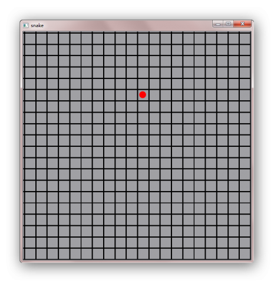

.. _snake_2:

`32. 贪吃蛇游戏（2） <http://www.devbean.net/2012/12/qt-study-road-2-snake-2/>`_
================================================================================

:作者: 豆子

:日期: 2012年12月27日

下面我们继续上一章的内容。在上一章中，我们已经完成了地图的设计，当然是相当简单的。在我们的游戏中，另外的主角便是蛇和食物。下面我们便开始这部分的开发。

我们的地图是建立在 QGraphicsScene 的基础之上的，所以，里面的对象应该是 QGraphicsItem 实例。通常，我们会把所有的图形元素（这里便是游戏中需要的对象，例如蛇、食物等）设计为 QGraphicsItem 的子类，在这个类中添加绘制自身的代码以及动画逻辑。这也是面向对象的开发方式：封装自己的属性和操作。在我们的游戏中，应该有三个对象：蛇 Snake、食物 Food 以及墙 Wall。

我们从食物开始。因为它是最简单的。我们将其作为一个红色的小圆饼，大小要比地图中的一个方格要小，因此我们可以将其放置在一个方格中。正如上面分析的那样，我们的 Food 类需要继承 QGraphicsItem。按照接口约束，QGraphicsItem 的子类需要重写至少两个函数：boundingRect() 和 paint()。

boundingRect() 返回一个用于包裹住图形元素的矩形，也就是这个图形元素的范围。需要注意的是，这个矩形必须能够 **完全包含** 图形元素。所谓“完全包含”，意思是，在图形元素有动画的时候，这个矩形也必须将整个图形元素包含进去。如果范围矩形过小。图形会被剪切；如果范围矩形过大，就会影响性能。

paint() 的作用是使用 QPainter 将图形元素绘制出来。

下面是 food.h 和 food.cpp 的内容：

.. code-block:: c++

	////////// food.h //////////
	#ifndef FOOD_H
	#define FOOD_H
	 
	#include <QGraphicsItem>
	 
	class Food : public QGraphicsItem
	{
	public:
	    Food(qreal x, qreal y);
	 
	    QRectF boundingRect() const;
	    void paint(QPainter *painter, const QStyleOptionGraphicsItem *, QWidget *);
	 
	    QPainterPath shape() const;
	};
	 
	#endif // FOOD_H
	 
	////////// food.cpp //////////
	#include <QPainter>
	 
	#include "constants.h"
	#include "food.h"
	 
	static const qreal FOOD_RADIUS = 3;
	 
	Food::Food(qreal x, qreal y)
	{
	    setPos(x, y);
	    setData(GD_Type, GO_Food);
	}
	 
	QRectF Food::boundingRect() const
	{
	    return QRectF(-TILE_SIZE,    -TILE_SIZE,
	                   TILE_SIZE * 2, TILE_SIZE * 2 );
	}
	 
	void Food::paint(QPainter *painter, const QStyleOptionGraphicsItem *, QWidget *)
	{
	    painter->save();
	 
	    painter->setRenderHint(QPainter::Antialiasing);
	    painter->fillPath(shape(), Qt::red);
	 
	    painter->restore();
	}
	 
	QPainterPath Food::shape() const
	{
	    QPainterPath p;
	    p.addEllipse(QPointF(TILE_SIZE / 2, TILE_SIZE / 2), FOOD_RADIUS, FOOD_RADIUS);
	    return p;
	}

虽然这段代码很简单，我们还是有必要解释一下。构造函数接受两个参数：x 和 y，用于指定该元素的坐标。setData() 函数是我们之后要用到的，这里简单提一句，它的作用为该图形元素添加额外的数据信息，类似于散列一样的键值对的形式。boundingRect() 简单地返回一个 QRect 对象。由于我们的元素就是一个圆形，所以我们返回的是一个简单的矩形。注意，这个矩形的范围实际是四倍于实际区域的：以元素坐标 (x, y) 为中心，边长为 TILE_SIZE * 2 的正方形。我们还重写了 shape() 函数。这也是一个虚函数，但是并不是必须覆盖的。这个函数返回的是元素实际的路径。所谓路径，可以理解成元素的矢量轮廓线，就是 QPainterPath 所表示的。我们使用 addEllipse() 函数，添加了一个圆心为 (TILE_SIZE / 2, TILE_SIZE / 2)，半径 FOOD_RADIUS 的圆，其范围是左上角为 (x, y) 的矩形。由于设置了 shape() 函数，paint() 反而更简单。我们所要做的，就是把 shape() 函数定义的路径绘制出来。注意，我们使用了 QPainter::save() 和 QPainter::restore() 两个函数，用于保存画笔状态。

现在我们有了第一个图形元素，那么，就让我们把它添加到场景中吧！对于一个游戏，通常需要有一个中心控制的类，用于控制所有游戏相关的行为。我们将其取名为 GameController。

GameController 的工作是，初始化场景中的游戏对象，开始游戏循环。每一个游戏都需要有一个游戏循环，类型于事件循环。想象一个每秒滴答 30 次的表。每次响起滴答声，游戏对象才有机会执行相应的动作：移动、检查碰撞、攻击或者其它一些游戏相关的活动。为方便起见，我们将这一次滴答成为一帧，那么，每秒 30 次滴答，就是每秒 30 帧。游戏循环通常使用定时器实现，因为应用程序不仅仅是一个游戏循环，还需要响应其它事件，比如游戏者的鼠标键盘操作。正因为如此，我们不能简单地使用无限的 for 循环作为游戏循环。

在 Graphics View Framework 中，每一帧都应该调用一个称为 advance() 的函数。QGraphicsScene::advance() 会调用场景中每一个元素自己的 advance() 函数。所以，如果图形元素需要做什么事，必须重写 QGraphicsItem 的 advance()，然后在游戏循环中调用这个函数。

GameController 创建并开始游戏循环。当然，我们也可以加入 pause() 和 resume() 函数。现在，我们来看看它的实现：

.. code-block:: c++

	GameController::GameController(QGraphicsScene *scene, QObject *parent) :
	    QObject(parent),
	    scene(scene),
	    snake(new Snake(this))
	{
	    timer.start(1000/33);
	 
	    Food *a1 = new Food(0, -50);
	    scene->addItem(a1);
	 
	    scene->addItem(snake);
	 
	    scene->installEventFilter(this);
	 
	    resume();
	}

GameController 的构造函数。首先开启充当游戏循环的定时器，定时间隔是 1000 / 33 毫秒，也就是每秒 30（1000 / 33 = 30）帧。GameController 有两个成员变量：scene 和 snake，我们将第一个食物和蛇都加入到场景中。同时，我们为 GameController 添加了事件过滤器，以便监听键盘事件。这里我们先不管这个事件过滤器，直接看看后面的代码：

.. code-block:: c++

	void GameController::pause()
	{
	    disconnect(&timer, SIGNAL(timeout()),
	               scene,  SLOT(advance()));
	}
	 
	void GameController::resume()
	{
	    connect(&timer, SIGNAL(timeout()),
	            scene,  SLOT(advance()));
	}

pause() 和 resume() 函数很简答：我们只是连接或者断开定时器的信号。当我们把这一切都准备好之后，我们把 GameController 添加到 MainWindow 中：

.. code-block:: c++

	MainWindow::MainWindow(QWidget *parent)
	    : QMainWindow(parent),
	      game(new GameController(scene, this))
	{
	    ...
	}

由于 GameController 在构造时已经开始游戏循环，因此我们不需要另外调用一个所谓的“start”函数。这样，我们就把第一个食物添加到了游戏场景：

接下来是有关蛇的处理。

蛇要更复杂一些。在我们的游戏中，蛇是由黄色的小方块组成，这是最简单的实现方式了。第一个是蛇的头部，紧接着是它的身体。对此，我们有两个必须面对的困难：

1. 蛇具有复杂得多的形状。因为蛇的形状随着游戏者的控制而不同，因此，我们必须找出一个能够恰好包含蛇头和所有身体块的矩形。这也是 boundingRect() 函数所要解决的问题。
2. 蛇会长大（比如吃了食物之后）。因此，我们需要在蛇对象中增加一个用于代表蛇身体长度的 growing 变量：当 growing 为正数时，蛇的身体增加一格；当 growing 为负数时，蛇的身体减少一格。
3. advance() 函数用于编码移动部分，这个函数会在一秒内调用 30 次（这是我们在 GameController 的定时器中决定的）。

我们首先从 boundingRect() 开始看起：

.. code-block:: c++

	QRectF Snake::boundingRect() const
	{
	    qreal minX = head.x();
	    qreal minY = head.y();
	    qreal maxX = head.x();
	    qreal maxY = head.y();
	 
	    foreach (QPointF p, tail) {
	        maxX = p.x() > maxX ? p.x() : maxX;
	        maxY = p.y() > maxY ? p.y() : maxY;
	        minX = p.x() < minX ? p.x() : minX;
	        minY = p.y() < minY ? p.y() : minY;
	    }
	 
	    QPointF tl = mapFromScene(QPointF(minX, minY));
	    QPointF br = mapFromScene(QPointF(maxX, maxY));
	 
	    QRectF bound = QRectF(tl.x(),  // x
	                          tl.y(),  // y
	                          br.x() - tl.x() + SNAKE_SIZE,      // width
	                          br.y() - tl.y() + SNAKE_SIZE       //height
	                          );
	    return bound;
	}

这个函数的算法是：遍历蛇身体的每一个方块，找出所有部分的最大的 x 坐标和 y 坐标，以及最小的 x 坐标和 y 坐标。这样，夹在其中的便是蛇身体的外围区域。

shape() 函数决定了蛇身体的形状，我们遍历蛇身体的每一个方块向路径中添加：

.. code-block:: c++

	QPainterPath Snake::shape() const
	{
	    QPainterPath path;
	    path.setFillRule(Qt::WindingFill);
	 
	    path.addRect(QRectF(0, 0, SNAKE_SIZE, SNAKE_SIZE));
	 
	    foreach (QPointF p, tail) {
	        QPointF itemp = mapFromScene(p);
	        path.addRect(QRectF(itemp.x(), itemp.y(), SNAKE_SIZE, SNAKE_SIZE));
	    }
	 
	    return path;
	}

在我们实现了 shape() 函数的基础之上，paint() 函数就很简单了：

.. code-block:: c++

	void Snake::paint(QPainter *painter, const QStyleOptionGraphicsItem *, QWidget *)
	{
	    painter->save();
	    painter->fillPath(shape(), Qt::yellow);
	    painter->restore();
	}

现在我们已经把蛇“画”出来。下一章中，我们将让它“动”起来，从而完成我们的贪吃蛇游戏。
