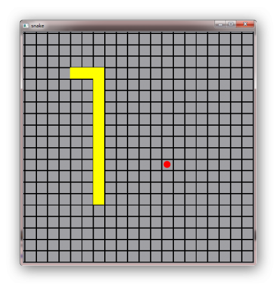

.. _snake_4:

`34. 贪吃蛇游戏（4） <http://www.devbean.net/2012/12/qt-study-road-2-snake-4/>`_
================================================================================

:作者: 豆子

:日期: 2012年12月30日

这将是我们这个稍大一些的示例程序的最后一部分。在本章中，我们将完成 GameController 中有关用户控制的相关代码。

首先，我们来给 GameControll 添加一个事件过滤器：

.. code-block:: c++

	bool GameController::eventFilter(QObject *object, QEvent *event)
	{
	    if (event->type() == QEvent::KeyPress) {
	        handleKeyPressed((QKeyEvent *)event);
	        return true;
	    } else {
	        return QObject::eventFilter(object, event);
	    }
	}

回忆一下，我们使用 QGraphicsScene 作为游戏场景。为什么不直接继承 QGprahicsScene，重写其 keyPressEvent() 函数呢？这里的考虑是：第一，我们不想只为重写一个键盘事件而继承 QGraphicScene。这不符合面向对象设计的要求。继承首先应该有“是一个（is-a）”的关系。我们将游戏场景继承 QGraphcisScene 当然满足这个关系，无可厚非。但是，继承还有一个“特化”的含义，我们只想控制键盘事件，并没有添加其它额外的代码，因此感觉并不应该作此继承。第二，我们希望将表示层与控制层分离：明明已经有了 GameController，显然，这是一个用于控制游戏的类，那么，为什么键盘控制还要放在场景中呢？这岂不将控制与表现层耦合起来了吗？基于以上两点考虑，我们选择不继承 QGraphicsScene，而是在 GameController 中为场景添加事件过滤器，从而完成键盘事件的处理。下面我们看看这个 handleKeyPressed() 函数是怎样的：

.. code-block:: c++

	void GameController::handleKeyPressed(QKeyEvent *event)
	{
	    switch (event->key()) {
	        case Qt::Key_Left:
	            snake->setMoveDirection(Snake::MoveLeft);
	            break;
	        case Qt::Key_Right:
	            snake->setMoveDirection(Snake::MoveRight);
	            break;
	        case Qt::Key_Up:
	            snake->setMoveDirection(Snake::MoveUp);
	            break;
	        case Qt::Key_Down:
	            snake->setMoveDirection(Snake::MoveDown);
	            break;
	    }
	}

这段代码并不复杂：只是设置蛇的运动方向。记得我们在前面的代码中，已经为蛇添加了运动方向的控制，因此，我们只需要修改这个状态，即可完成对蛇的控制。由于前面我们已经在蛇的对象中完成了相应控制的代码，因此这里的游戏控制就是这么简单。接下来，我们要完成游戏逻辑：吃食物、生成新的食物以及咬到自己这三个逻辑：

.. code-block:: c++

	void GameController::snakeAteFood(Snake *snake, Food *food)
	{
	    scene.removeItem(food);
	    delete food;
	 
	    addNewFood();
	}

首先是蛇吃到食物。如果蛇吃到了食物，那么，我们将食物从场景中移除，然后添加新的食物。为了避免内存泄露，我们需要在这里 delete 食物，以释放占用的空间。当然，你应该想到，我们肯定会在 addNewFood() 函数中使用 new 运算符重新生成新的食物。

.. code-block:: c++

	void GameController::addNewFood()
	{
	    int x, y;
	 
	    do {
	        x = (int) (qrand() % 100) / 10;
	        y = (int) (qrand() % 100) / 10;
	 
	        x *= 10;
	        y *= 10;
	    } while (snake->shape().contains(snake->mapFromScene(QPointF(x + 5, y + 5))));
	 
	    Food *food = new Food(x , y);
	    scene.addItem(food);
	}

在 addNewFood() 代码中，我们首先计算新的食物的坐标：使用一个循环，直到找到一个不在蛇身体中的坐标。为了判断一个坐标是不是位于蛇的身体上，我们利用蛇的 shape() 函数。需要注意的是，shape() 返回元素坐标系中的坐标，而我们计算而得的 x，y 坐标位于场景坐标系，因此我们必须利用 QGraphicsItem::mapFromScene() 将场景坐标系映射为元素坐标系。当我们计算出食物坐标后，我们在堆上重新创建这个食物，并将其添加到游戏场景。

.. code-block:: c++

	void GameController::snakeAteItself(Snake *snake)
	{
	    QTimer::singleShot(0, this, SLOT(gameOver()));
	}
	 
	void GameController::gameOver()
	{
	    scene.clear();
	 
	    snake = new Snake(*this);
	    scene.addItem(snake);
	    addNewFood();
	}

如果蛇咬到了它自己，游戏即宣告结束。因此，我们直接调用 gameOver() 函数。这个函数将场景清空，然后重新创建蛇并增加第一个食物。为什么我们不直接调用 gameOver() 函数，而是利用 QTimer 调用呢（希望你没有忘记 QTimer::singleShot(0, …) 的用法）？这是因为，我们不应该在一个 update 操作中去清空整个场景。因此我们使用 QTimer，在 update 事件之后完成这个操作。

至此，我们已经把这个简单的贪吃蛇游戏全部完成。最后我们来看一下运行结果：

文末的附件中是我们当前的全部代码。如果你检查下这部分代码，会发现我们其实还没有完成整个游戏：Wall 对象完全没有实现，难度控制也没有完成。当然，通过我们的讲解，希望你已经理解了我们设计的原则以及各部分代码之间的关系。如果感兴趣，可以继续完成这部分代码。豆子在 github 上面创建了一个代码库，如果你感觉自己的改进比较成功，或者希望与大家分享，欢迎 clone 仓库提交代码！

* 附件：:download:`snake <res/snake.zip>`
* git：``git@github.com:devbean/snake-game.git``
