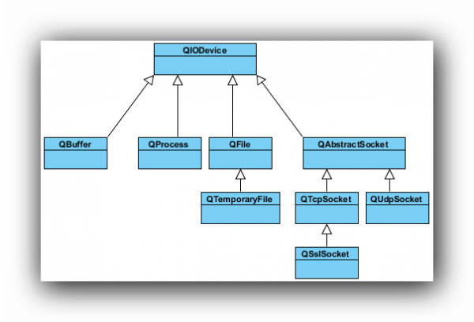
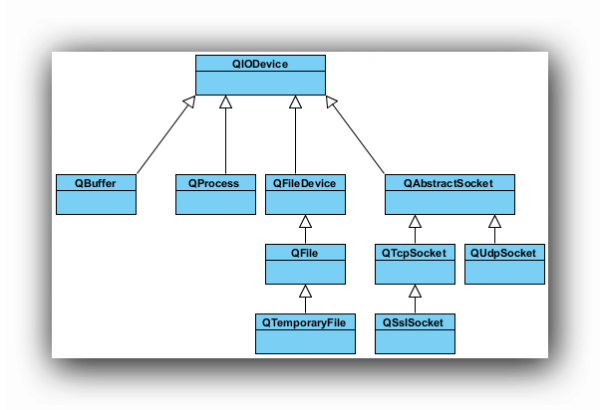

.. _file:

`35. 文件 <http://www.devbean.net/2013/01/qt-study-road-2-file/>`_
==================================================================

:作者: 豆子

:日期: 2013年01月05日

文件操作是应用程序必不可少的部分。Qt 作为一个通用开发库，提供了跨平台的文件操作能力。从本章开始，我们来了解下 Qt 的文件以及输入输出的功能，也就是 I/O 系统。

Qt 通过 QIODevice 提供了对 I/O 设备的抽象，这些设备具有读写字节块的能力。下面是 I/O 设备的类图：

Qt4

Qt5

从上面的类图可以看出，Qt4 和 Qt5 在 I/O 设备部分大同小异。只不过 Qt5 新增加了一个 QFileDevice 类。途中所涉及的类及其用途简要说明如下：

* QIODevice：所有 I/O 设备类的父类，提供了字节块读写的通用操作以及基本接口；
* QFlie：访问本地文件或者嵌入资源；
* QTemporaryFile：创建和访问本地文件系统的临时文件；
* QBuffer：读写 QByteArray；
* QProcess：运行外部程序，处理进程间通讯；
* QAbstractSocket：所有套接字类的父类；
* QTcpSocket：TCP 协议网络数据传输；
* QUdpSocket：传输 UDP 报文；
* QSslSocket：使用 SSL/TLS 传输数据；
* QFileDevice：Qt5 新增加的类，提供了有关文件操作的通用实现。

这其中，QProcess、QTcpSocket、QUdpSoctet 和 QSslSocket 是顺序访问设备。所谓“顺序访问”，是指它们的数据只能访问一遍：从头走到尾，从第一个字节开始访问，直到最后一个字节，中途不能返回去读取上一个字节；QFile、QTemporaryFile 和 QBuffer 是随机访问设备，可以访问任意位置任意次数，还可以使用 QIODevice::seek() 函数来重新定位文件访问位置指针。

本章将主要介绍 QFile 及其相关类，后面的章节则开始介绍有关输入输出的流。

在所有的 I/O 设备中，文件 I/O 是最重要的部分之一。因为我们大多数的程序依旧需要首先访问本地文件（当然，在云计算大行其道的将来，这一观点可能改变）。QFile 提供了从文件中读取和写入数据的能力。Qt5 新加入的 QFileDevice 类，则将这部分公共操作放到了这个单独的类中。显然，这部分代码在 Qt4 中位于 QFile 类。这样看来，Qt5 的代码结构更为清晰，层次更好。

我们通常会将文件路径作为参数传给 QFile 的构造函数。不过也可以在创建好对象最后，使用 setFileName() 来修改。QFile 需要使用 / 作为文件分隔符，不过，它会自动将其转换成操作系统所需要的形式。例如 C:/windows 这样的路径在 Windows 平台下同样是可以的。

QFile 主要提供了有关文件的各种操作，比如打开文件、关闭文件、刷新文件等。我们可以使用 QDataStream 或 QTextStream 类来读写文件，也可以使用 QIODevice 类提供的 read()、readLine()、readAll() 以及 write() 这样的函数。值得注意的是，有关文件本身的信息，比如文件名、文件所在目录的名字等，则是通过 QFileInfo 获取，而不是自己分析文件路径字符串。

下面我们使用一段代码来看看 QFile 的有关操作：

.. code-block:: c++

	int main(int argc, char *argv[])
	{
	    QApplication app(argc, argv);
	 
	    QFile file("in.txt");
	    if (!file.open(QIODevice::ReadOnly | QIODevice::Text)) {
	        qDebug() << "Open file failed.";
	        return -1;
	    } else {
	        while (!file.atEnd()) {
	            qDebug() << file.readLine();
	        }
	    }
	 
	    QFileInfo info(file);
	    qDebug() << info.isDir();
	    qDebug() << info.isExecutable();
	    qDebug() << info.baseName();
	    qDebug() << info.completeBaseName();
	    qDebug() << info.suffix();
	    qDebug() << info.completeSuffix();
	 
	    return app.exec();
	}

在这段代码中，我们首先使用 QFile 创建了一个文件对象。这个文件名字是 in.txt。如果你不知道应该把它放在哪里，<del>可以使用 app.applicationFilePath(); 或者 app.applicationDirPath(); 来获得应用程序的执行路径。只要将这个文件放在同执行路径一致的目录下即可。</del>可以使用 QDir::currentPath() 来获得应用程序执行时的当前路径。只要将这个文件放在与当前路径一致的目录下即可。然后，我们使用 open() 函数打开这个文件，打开形式是只读方式，文本格式。这个类似于 fopen() 的 r 这样的参数。open() 函数返回一个 bool 类型，如果打开失败，我们在控制台输出一段提示然后程序退出。否则，我们利用 while 循环，将每一行读到的内容输出。

程序的第二部分，我们使用 QFileInfo 获取有关该文件的信息。QFileInfo 有很多类型的函数，我们只举出一些例子。比如这里，isDir() 检查该文件是否是目录；isExecutable() 检查该文件是否是可执行文件等。baseName() 可以直接获得文件名；suffix() 则直接获取文件后缀名。我们可以由下面的示例看到，baseName() 和 completeBaseName()，以及 suffix() 和 completeSuffix() 的区别：

.. code-block:: c++

	QFileInfo fi("/tmp/archive.tar.gz");
	QString base  = fi.baseName();  // base = "archive"
	QString cbase = fi.completeBaseName();  // base = "archive.tar"
	QString ext   = fi.suffix();  // ext = "gz"
	QString ext   = fi.completeSuffix();  // ext = "tar.gz"
