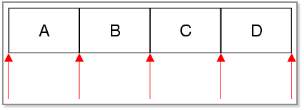
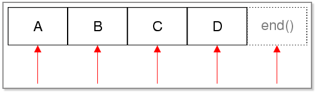

.. _iterator:

`39. 遍历容器 <http://www.devbean.net/2013/01/qt-study-road-2-iterator/>`_
==========================================================================

:作者: 豆子

:日期: 2013年01月16日

上一节我们大致了解了有关存储容器的相关内容。对于所有的容器，最常用的操作就是遍历。本章我们将详细了解有关遍历器的内容。

尽管这个问题不是本章需要考虑的，但是我们还是需要来解释下，为什么要有遍历器。没有遍历器时，如果我们需要向外界提供一个列表，我们通常会将其返回：

.. code-block:: c++

	QList<int> intlist() const
	{
	    return list;
	}

这么做的问题是：向用户暴露了集合的内部实现。用户知道，原来你用的就是一个 QList 啊~那我就可以向里面增加东西了，或者修改其中的内容。有时这不是我们所期望的。很多时候，我们只是想提供用户一个集合，只允许用户知道这个集合中有什么，而不是对它进行修改。为此，我们希望有这么一种对象：通过它就能够提供一种通用的访问集合元素的方法，不管底层的集合是链表还是散列，都可以通过这种对象实现。这就是遍历器。

Qt 的容器类提供了两种风格的遍历器：Java 风格和 STL 风格。这两种风格的遍历器在通过非 const 函数对集合进行修改时都是不可用的。

Java 风格的遍历器
-----------------

Java 风格的遍历器是在 Qt4 首先引入的，是 Qt 应用程序首先推荐使用的形式。这种风格比起 STL 风格的遍历器更方便。方便的代价就是不如后者高效。它们的 API 非常类似于 Java 的遍历器类，故名。

每一种容器都有两种 Java 风格的遍历器：一种提供只读访问，一种提供读写访问：

=================================  ======================  ==============================
容器                               只读遍历器              读写遍历器
=================================  ======================  ==============================
QList<T>, QQueue<T>                QListIterator<T>        QMutableListIterator<T>
QLinkedList<T>                     QLinkedListIterator<T>  QMutableLinkedListIterator<T>
QVector<T>, QStack<T>              QVectorIterator<T>      QMutableVectorIterator<T>
QSet<T>                            QSetIterator<T>         QMutableSetIterator<T>
QMap<Key, T>, QMultiMap<Key, T>    QMapIterator<T>         QMutableMapIterator<T>
QHash<Key, T>, QMultiHash<Key, T>  QHashIterator<T>        QMutableHashIterator<T>
=================================  ======================  ==============================

这里我们只讨论 QList 和 QMap 的遍历器。QLinkedList、QVector 和 QSet 的遍历器接口与 QList 的是一样的；QHash 遍历器的接口则同 QMap 是一样的。

不同于下面我们将要介绍的 STL 风格的遍历器，Java 风格的遍历器指向的是两个元素之间的位置，而不是指向元素本身。因此，它们可能会指向集合第一个元素之前的位置，也可能指向集合的最后一个元素之后的位置，如下图所示：

我们通过下面的代码看看如何使用这种遍历器：

.. code-block:: c++

	QList list;
	list << "A" << "B" << "C" << "D";
	 
	QListIterator i(list);
	while (i.hasNext()) {
	    qDebug() << i.next();
	}

首先，我们使用 list 对象创建一个遍历器。刚刚创建完成时，该遍历器位于第一个元素之前（也就是 A 之前）。我们通过调用 hasNext() 函数判断遍历器之后的位置上有无元素。如果有，调用 next() 函数将遍历器跳过其后的元素。next() 函数返回刚刚跳过的元素。当然，我们也可以使用 hasPrevious() 和 previous() 函数来从尾部开始遍历，详细内容可以参考 API 文档。

QListIterator 是只读遍历器，不能插入或者删除数据。如果需要这些操作，我们可以使用 QMutableListIterator。来看下面的代码：

.. code-block:: c++

	QMutableListIterator i(list);
	while (i.hasNext()) {
	    if (i.next() % 2 != 0) {
	        i.remove();
	    }
	}

这段代码使用 QMutableListIterator 遍历集合，如果其值是奇数则将其删除。在每次循环中都要调用 next() 函数。正如前面所说，它会跳过其后的一个元素。remove() 函数会删除我们刚刚跳过的元素。调用 remove() 函数并不会将遍历器置位不可用，因此我们可以连续调用这个函数。向前遍历也是类似的，这里不再赘述。

如果我们需要修改已经存在的元素，使用 setValue() 函数。例如：

.. code-block:: c++

	QMutableListIterator i(list);
	while (i.hasNext()) {
	    if (i.next() > 128) {
	        i.setValue(128);
	    }
	}

如同 remove() 函数，setValue() 也是对刚刚跳过的元素进行操作。实际上，next() 函数返回的是集合元素的非 const 引用，因此我们根本不需要调用 setValue() 函数：

.. code-block:: c++

	QMutableListIterator i(list);
	while (i.hasNext()) {
	    i.next() *= 2;
	}

QMapItrator 也是类似的。例如，使用 QMapItrator 我们可以将数据从 QMap 复制到 QHash：

.. code-block:: c++

	QMap<int, QWidget *> map;
	QHash<int, QWidget *> hash;
	 
	QMapIterator<int, QWidget *> i(map);
	while (i.hasNext()) {
	    i.next();
	    hash.insert(i.key(), i.value());
	}

STL 风格的遍历器
----------------

STL 风格的遍历器从 Qt 2.0 就开始提供。这种遍历器能够兼容 Qt 和 STL 的通用算法，并且为速度进行了优化。同 Java 风格遍历器类似，Qt 也提供了两种 STL 风格的遍历器：一种是只读访问，一种是读写访问。我们推荐尽可能使用只读访问，因为它们要比读写访问的遍历器快一些。

==================================  ==============================  ========================
容器                                只读遍历器                      读写遍历器
==================================  ==============================  ========================
 QList<T>, QQueue<T>                QList<T>::const_iterator        QList<T>::iterator
 QLinkedList<T>                     QLinkedList<T>::const_iterator  QLinkedList<T>::iterator
 QVector<T>, QStack<T>              QVector<T>::const_iterator      QVector<T>::iterator
 QSet<T>                            QSet<T>::const_iterator         QSet<T>::iterator
 QMap<Key, T>, QMultiMap<Key, T>    QMap<Key, T>::const_iterator    QMap<Key, T>::iterator
 QHash<Key, T>, QMultiHash<Key, T>  QHash<Key, T>::const_iterator   QHash<Key, T>::iterator
==================================  ==============================  ========================

STL 风格的遍历器具有类似数组指针的行为。例如，我们可以使用 ++ 运算符让遍历器移动到下一个元素，使用 \* 运算符获取遍历器所指的元素。对于 QVector 和 QStack，虽然它们是在连续内存区存储元素，遍历器类型是 typedef T\*，const_iterator 类型则是 typedef const T \*。

我们还是以 QList 和 QMap 为例，理由如上。下面是有关 QList 的相关代码：

.. code-block:: c++

	QList list;
	list << "A" << "B" << "C" << "D";
	 
	QList::iterator i;
	for (i = list.begin(); i != list.end(); ++i) {
	    *i = (*i).toLower();
	}

不同于 Java 风格遍历器，STL 风格遍历器直接指向元素本身。容器的 begin() 函数返回指向该容器第一个元素的遍历器；end() 函数返回指向该容器最后一个元素之后的元素的遍历器。end() 实际是一个非法位置，永远不可达。这是为跳出循环做的一个虚元素。如果集合是空的，begin() 等于 end()，我们就不能执行循环。

下图是 STL 风格遍历器的示意图：

我们使用 const_iterator 进行只读访问，例如：

.. code-block:: c++

	QList::const_iterator i;
	for (i = list.constBegin(); i != list.constEnd(); ++i) {
	    qDebug() << *i;
	}

QMap 和 QHash 的遍历器，* 运算符返回集合键值对。下面的代码，我们打印出 QMap 的所有元素：

.. code-block:: c++

	QMap<int, int> map;
	 
	QMap<int, int>::const_iterator i;
	for (i = map.constBegin(); i != map.constEnd(); ++i) {
	    qDebug() << i.key() << ":" << i.value();
	}

由于有隐式数据共享（我们会在后面的章节介绍该部分内容），即使一个函数返回集合中元素的值也不会有很大的代价。Qt API 包含了很多以值的形式返回 QList 或 QStringList 的函数（例如 QSplitter::sizes()）。如果你希望使用 STL 风格的遍历器遍历这样的元素，应该使用容器的拷贝，例如：

.. code-block:: c++

	// 正确的方式
	const QList sizes = splitter->sizes();
	QList::const_iterator i;
	for (i = sizes.begin(); i != sizes.end(); ++i)
	    ...
	 
	// 错误的方式
	QList::const_iterator i;
	for (i = splitter->sizes().begin();
	     i != splitter->sizes().end(); ++i)
	    ...

这个问题不存在于那些返回集合的 const 或非 const 引用的函数。隐式数据共享对 STL 风格遍历器造成的另外影响是，在容器上运行着非 const 遍历器的时候，不能对容器进行拷贝。Java 风格的遍历器没有这个问题。

foreach 关键字
--------------

如果我们仅仅想要遍历集合所有元素，我们可以使用 Qt 的 foreach 关键字。这个关键字是 Qt 特有的，通过预处理器进行处理。C++ 11 也提供了自己的 foreach 关键字，不过与此还是有区别的。

foreach 的语法是 foreach (variable, container)。例如，我们使用 foreach 对 QLinkedList 进行遍历：

.. code-block:: c++

	QLinkedList list;
	...
	QString str;
	foreach (str, list) {
	    qDebug() << str;
	}

这段代码与下面是等价的：

.. code-block:: c++

	QLinkedList list;
	...
	QLinkedListIterator i(list);
	while (i.hasNext()) {
	    qDebug() << i.next();
	}

如果类型名中带有逗号，比如 QPair<int, int>，我们只能像上面一样，先创建一个对象，然后使用 foreach 关键字。如果没有逗号，则可以直接在 foreach 关键字中使用新的对象，例如：

.. code-block:: c++

	QLinkedList list;
	...
	foreach (const QString &str, list) {
	    qDebug() << str;
	}

Qt 会在 foreach 循环时自动拷贝容器。这意味着，如果在遍历时修改集合，对于正在进行的遍历是没有影响的。即使不修改容器，拷贝也是会发生的。但是由于存在隐式数据共享，这种拷贝还是非常迅速的。

因为 foreach 创建了集合的拷贝，使用集合的非 const 引用也不能实际修改原始集合，所修改的只是这个拷贝。
