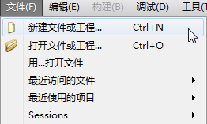
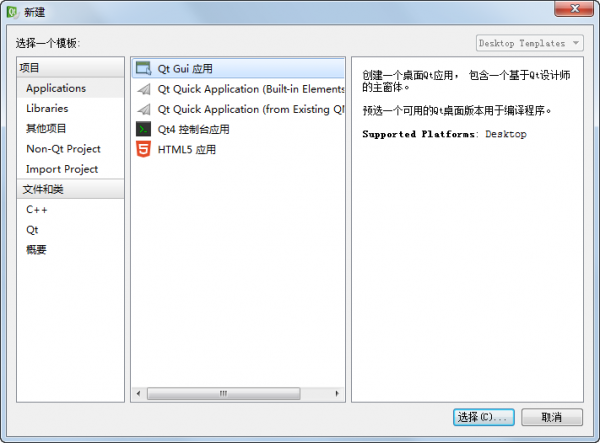
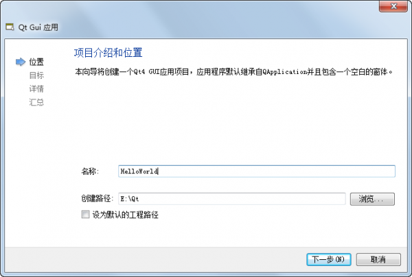
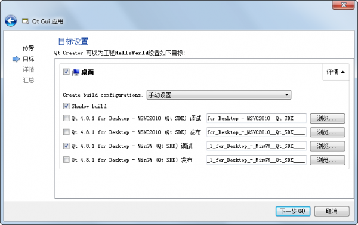
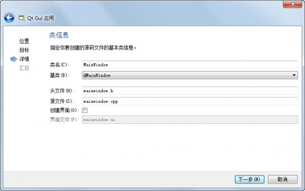
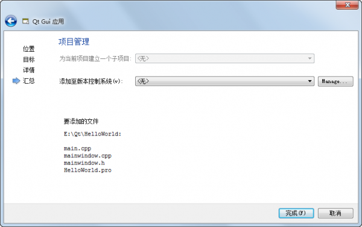

.. _hello_world:

`3. Hello, world! <http://www.devbean.net/2012/08/qt-study-road-2-hello-world/>`_
=================================================================================

:作者: 豆子

:日期: 2012年08月22日

想要学习 Qt 开发，首先要搭建 Qt 开发环境。好在现在搭建 Qt 开发环境还是比较简单的。我们可以到 Qt 官方网站找到最新版本的 Qt。在 Downloads 页面，可以看到有几个版本的 Qt：Qt SDK、Qt Library、Qt Creator 等等。它们分别是：

* **Qt SDK：** 包含了 Qt 库以及 Qt 的开发工具（IDE、i18n 等工具），是一套完整的开发环境。当然，这个的体积也是最大的（Windows 平台大约 1.7G，其它平台大约 780M）。如果仅仅为开发 Qt，建议选择这一项下载安装。安装方法很简单，同普通程序没有什么区别。所需注意的是，安装过程中可能能够提供选择是否安装源代码，是否安装 mingw 编译器（Windows），这个就按照需要进行选择即可。另外值得说明的是，Qt SDK 通常比单独的 Qt 库版本要旧一些。比如现在 Qt 正式版是 4.8.2，但是 Qt SDK 的最新版 1.2.1 中包含的 Qt 是 4.8.1。

* **Qt Library：** 仅包含 Qt 库。如果您已经安装了 Qt 开发环境，为了升级一下 SDK 中提供的 Qt 库版本，就可以安装这一个。安装过之后，应该需要在 IDE 中配置安装路径，以便找到最新版本的 Qt（如果不是覆盖安装的话）。

* **Qt Creator：** 基于 Qt 构建的一个轻量级 IDE，现在最新版是 2.5.2，还是比较好用的，建议使用 Qt Creator 进行开发。当然，如果你已经习惯了 VS2010 这样的工具，可以在页面最下方找到相应的 Addin。很多朋友希望阅读 Qt 代码以提高自己的开发水平。当然，Qt 的经典代码是 KDE，不过这个项目不大适合初学者阅读。此时，我们就可以选择阅读 Qt Creator 的代码，它的代码还是比较清晰的。

当我们安装完成 Qt 开发环境之后，就可以使用 Qt Creator 进行开发。在本系列中，豆子会一直使用这个 IDE 进行讲解。至于编译器，豆子一般会使用 mingw 或者 gcc。为了编译 Qt 5 的程序，你应该使用 gcc 4.5 以上的版本，这意味着，如果你是使用 Qt SDK 自带的 mingw，是不能编译 Qt 5 的程序的（因为这个自带的版本是 4.4），你应该升级 mingw 为 4.5 以上版本。

至此，我们已经有了 Qt 4 的完整开发环境。如果你想要开发 Qt 5，由于现在（2012 年 8 月） Qt 5 还处于测试阶段，并没有提供二进制库，所以我们需要使用 git 自己获取 Qt 5 的源代码自己编译（一般需要几个小时时间）。豆子非常不建议在 Windows 上编译 Qt 5，因为可能会出很多问题。如果你想尝试，可以参考这里。豆子提一句，在 Windows 上编译 Qt 5，需要安装 perl（并且要安装 GetOpt::Long 模块）、python 和 git，并且需要找到彼此路径。相比而言，Linux 上面就会简单很多。豆子建议，如果你想在 Windows 上尝试 Qt 5，可以考虑安装一个虚拟机，使用 Linux 平台；或者自己试着直接在 Windows 本地编译。豆子的环境是使用 openSUSE。openSUSE 的 `Qt 5.0 Development Snapshots <http://download.opensuse.org/repositories/KDE:/Qt50/openSUSE_12.1/>`_ 已经提供了 Qt 5 二进制版本，免去了编译的过程。*基于此，本文的 Qt 4 版本将在 Windows 平台上使用 mingw 进行测试；Qt 5 版本将在 openSUSE 上使用 gcc 4.6 进行测试。在未来官方推出 Qt 5 Windows 平台的二进制版本，也不排除在 Windows 上面测试 Qt 5 代码。*

在 Qt Creator 中，我们可以在菜单栏的工具-选项-构建和运行的“Qt 版本”和“工具链”这两个选项卡中配置 Qt Creator 所使用的 Qt 版本和编译器。这或许是最重要的步骤，包括添加新的 Qt 版本以及以后的切换编译器或者 Qt 升级等。

下面尝试开发第一个 Qt 项目：HelloWorld。在 Qt Creator 中新建一个工程：

点击这个“新建文件或工程”，在左侧选择项目-Applications，中间选择 Qt Gui 应用，然后点击“选择…”：

在弹出的对话框中填写名称、创建路径等信息：

点击“下一步”，选择该工程的编译器。这里我们只选择 mingw 调试即可（在以后的项目中，根据自己的需要选择。）Shadow Build 的含义是“影子构建”，即将构建生成的文件不放在源代码文件夹下。这样可以最大地保持源代码文件夹的整洁。

点击“下一步”，可以选择生成的主窗口文件。不过在我们的简单示例中是不需要这么复杂的窗口的，因此我们尽可能简单地选择，将“创建界面”的选择去除：

终于到了最后一步。这里是在询问我们是否添加版本控制。对于我们的小项目当然是不需要的，所以选择“无”，然后点击“完成”即可：

可以看到，Qt Creator 帮助我们在 HelloWorld 项目文件夹下生成了四个文件：main.cpp，mainwindow.cpp，mainwindow.h 和 HelloWorld.pro。pro 文件就是 Qt 工程文件（project file），由 qmake 处理，生成 make 程序所需要的 makefile；main.cpp 里面就是一个main函数，作为应用程序的入口函数；其他两个文件就是先前我们曾经指定的文件名的文件。

我们将 main.cpp 修改如下：

.. code-block:: c++

	#include <QApplication>
	#include <QLabel>
	 
	int main(int argc, char *argv[])
	{
	    QApplication app(argc, argv);
	 
	    QLabel label("Hello, world");
	    label.show();
	 
	    return app.exec();
	}

点击 Qt Creater 左侧下面的绿色三角按钮即可运行（这里一共有三个按钮，从上到下分别是“运行”、“调试”和“构建”）。如果没有错误的话，就会看到运行结果：

.. image:: imgs/3/qt-hello-world.png

这个程序有这么几行。我们解释一下。

前两行是 C++ 的 include 语句，这里我们引入的是 QApplication 以及 QLabel 这两个类。main() 函数中第一句是创建一个 QApplication 类的实例。对于 Qt 程序来说，main() 函数一般以创建 application 对象（GUI 程序是 QApplication，非 GUI 程序是 QCoreApplication。**QApplication** 实际上是 **QCoreApplication** 的子类。）开始，后面才是实际业务的代码。这个对象用于管理 Qt 程序的生命周期，开启事件循环，这一切都是必不可少的。在我们创建了 QApplication 对象之后，直接创建一个 QLabel 对象，构造函数赋值“Hello, world”，当然就是能够在 **QLabel** 上面显示这行文本。最后调用 QLabel 的 show() 函数将其显示出来。main() 函数最后，调用 app.exec()，开启事件循环。我们现在可以简单地将事件循环理解成一段无限循环。正因为如此，我们在栈上构建了 QLabel 对象，却能够一直显示在那里（试想，如果不是无限循环，main() 函数立刻会退出，QLabel 对象当然也就直接析构了）。

示例程序我们已经讲解完毕。下面再说一点。我们可以将上面的程序改写成下面的代码吗？

.. code-block:: c++

	#include <QApplication>
	#include <QLabel>
	 
	int main(int argc, char *argv[])
	{
	    QApplication app(argc, argv);
	 
	    QLabel *label = new QLabel("Hello, world");
	    label->show();
	 
	    return app.exec();
	}

答案是，**不可以！**

首先，按照标准 C++ 来看这段程序。这里存在着内存泄露。当 exec() 退出时（也就是事件循环结束的时候。窗口关闭，事件循环就会结束），label 是没办法 delete 的。这就造成了内存泄露。当然，由于程序结束，操作系统会负责回收内存，所以这个问题不会很严重。即便你这样修改了代码再运行，也不会有任何错误。

严重的是，label 是建立在堆上的，app 是建立在栈上的。这意味着，label 会在 app 之后析构。也就是说，label 的生命周期长于 app 的生命周期。**这可是 Qt 编程的大忌。** 因为在 Qt 中，所有的 QPaintDevice 必须要在有 QApplication 实例的情况下创建和使用。大家好奇的话，可以提一句，QLabel 继承自 QWidget，QWidget 则是 QPaintDevice 的子类。之所以上面的代码不会有问题，是因为 app 退出时，label 已经关闭，这样的话，label 的所有 QPaintDevice 一般都不会被访问到了。但是，如果我们的程序，在 app 退出时，组件却没有关闭，这就会造成程序崩溃。（如果你想知道，怎样做才能让 app 退出时，组件却不退出，那么豆子可以告诉你，当你的程序在打开了一个网页的下拉框时关闭窗口，你的程序就会崩溃了！）
