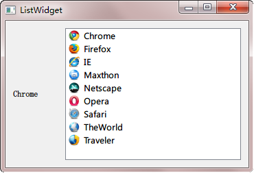
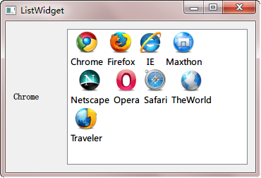
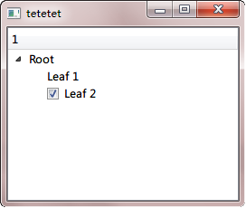
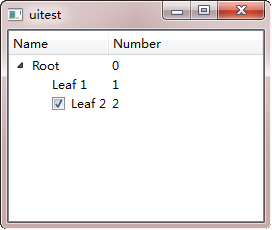
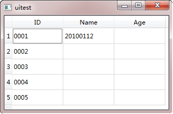

.. _qlistwidget_qtreewidget_qtablewidget:

`42. QListWidget、QTreeWidget 和 QTableWidget <http://www.devbean.net/2013/02/qt-study-road-2-qlistwidget-qtreewidget-qtablewidget/>`_
======================================================================================================================================

:作者: 豆子

:日期: 2013年02月05日

上一章我们了解了 model/view 架构的基本概念。现在我们从最简单的 QListWidget、QTreeWidget 和 QTableWidget 三个类开始了解最简单的 model/view 的使用。这部分内容的确很难组织。首先，从最标准的 model/view 开始，往往会纠结于复杂的代码；但是，如果从简单的 QListWidget、QTreeWidget 和 QTableWidget 开始，由于这三个类都是继承自各自的 view 类，很难避免 model/view 的相关内容。于是，我们这部分的组织是，首先进行简单的数据显示，更复杂的设置则放在后面的章节。

QListWidget
-----------

我们要介绍的第一个是 QListWidget。先来看下面的代码示例：

.. code-block:: c++

	label = new QLabel(this);
	label->setFixedWidth(70);
	 
	listWidget = new QListWidget(this);
	 
	new QListWidgetItem(QIcon(":/Chrome.png"), tr("Chrome"), listWidget);
	new QListWidgetItem(QIcon(":/Firefox.png"), tr("Firefox"), listWidget);
	 
	listWidget->addItem(new QListWidgetItem(QIcon(":/IE.png"), tr("IE")));
	listWidget->addItem(new QListWidgetItem(QIcon(":/Netscape.png"), tr("Netscape")));
	listWidget->addItem(new QListWidgetItem(QIcon(":/Opera.png"), tr("Opera")));
	listWidget->addItem(new QListWidgetItem(QIcon(":/Safari.png"), tr("Safari")));
	listWidget->addItem(new QListWidgetItem(QIcon(":/TheWorld.png"), tr("TheWorld")));
	listWidget->addItem(new QListWidgetItem(QIcon(":/Traveler.png"), tr("Traveler")));
	 
	QListWidgetItem *newItem = new QListWidgetItem;
	newItem->setIcon(QIcon(":/Maxthon.png"));
	newItem->setText(tr("Maxthon"));
	listWidget->insertItem(3, newItem);
	 
	QHBoxLayout *layout = new QHBoxLayout;
	layout->addWidget(label);
	layout->addWidget(listWidget);
	 
	setLayout(layout);
	 
	connect(listWidget, SIGNAL(currentTextChanged(QString)),
	        label, SLOT(setText(QString)));

QListWidget 是简单的列表组件。当我们不需要复杂的列表时，可以选择 QListWidget。QListWidget 中可以添加 QListWidgetItem 类型作为列表项，QListWidgetItem 即可以有文本，也可以有图标。上面的代码显示了三种向列表中添加列表项的方法（实际是两种，后两种其实是一样的），我们的列表组件是 listWidget，那么，向 listWidget 添加列表项可以：第一，使用下面的语句

.. code-block:: c++

	new QListWidgetItem(QIcon(":/Chrome.png"), tr("Chrome"), listWidget);

第二，使用

.. code-block:: c++

	listWidget->addItem(new QListWidgetItem(QIcon(":/IE.png"), tr("IE")));
	// 或者
	QListWidgetItem *newItem = new QListWidgetItem;
	newItem->setIcon(QIcon(":/Maxthon.png"));
	newItem->setText(tr("Maxthon"));
	listWidget->insertItem(3, newItem);

注意这两种添加方式的区别：第一种需要在构造时设置所要添加到的 QListWidget 对象；第二种方法不需要这样设置，而是要调用 addItem() 或者 insertItem() 自行添加。如果你仔细查阅 QListWidgetItem 的构造函数，会发现有一个默认的 type 参数。该参数有两个合法值：QListWidgetItem::Type（默认）和 QListWidgetItem::UserType。如果我们继承 QListWidgetItem，可以设置该参数，作为我们子类的一种区别，以便能够在 QListWidget 区别处理不同子类。

我们的程序的运行结果如下：

我们可以利用 QListWidget 发出的各种信号来判断是哪个列表项被选择，具体细节可以参考文档。另外，我们也可以改变列表的显示方式。前面的列表是小图标显示，我们也可以更改为图标显示，只要添加一行语句：

.. code-block:: c++

	listWidget->setViewMode(QListView::IconMode);

结果如下：

QTreeWidget
-----------

我们要介绍的第二个组件是 QTreeWidget。顾名思义，这是用来展示树型结构（也就是层次结构）的。同前面说的 QListWidget 类似，这个类需要同另外一个辅助类 QTreeWidgetItem 一起使用。不过，既然是提供方面的封装类，即便是看上去很复杂的树，在使用这个类的时候也是显得比较简单的。当不需要使用复杂的 QTreeView 特性的时候，我们可以直接使用 QTreeWidget 代替。

下面我们使用代码构造一棵树：

.. code-block:: c++

	QTreeWidget treeWidget;
	treeWidget.setColumnCount(1);
	 
	QTreeWidgetItem *root = new QTreeWidgetItem(&treeWidget,
	                                            QStringList(QString("Root")));
	new QTreeWidgetItem(root, QStringList(QString("Leaf 1")));
	QTreeWidgetItem *leaf2 = new QTreeWidgetItem(root, QStringList(QString("Leaf 2")));
	leaf2->setCheckState(0, Qt::Checked);
	 
	QList<QTreeWidgetItem *> rootList;
	rootList << root;
	treeWidget.insertTopLevelItems(0, rootList);
	 
	treeWidget.show();

首先，我们创建了一个 QTreeWidget 实例。然后我们调用 setColumnCount() 函数设定栏数。这个函数的效果我们会在下文了解到。最后，我们向 QTreeWidget 添加 QTreeWidgetItem。QTreeWidgetItem 有很多重载的构造函数。我们在这里看看其中的一个，其余的请自行查阅文档。这个构造函数的签名如下：

.. code-block:: c++

	QTreeWidgetItem(QTreeWidget *parent, const QStringList &strings, int type = Type);

这里有 3 个参数，第一个参数用于指定这个项属于哪一个树，类似前面的 QListWidgetItem，如果指定了这个值，则意味着该项被直接添加到树中；第二个参数指定显示的文字；第三个参数指定其类型，同 QListWidgetItem 的 type 参数十分类似。值得注意的是，第二个参数是 QStringList 类型的，而不是 QString 类型。我们会在下文了解其含义。

在这段代码中，我们创建了作为根的 QTreeWidgetItem root。然后添加了第一个叶节点，之后又添加一个，而这个则设置了可选标记。最后，我们将这个 root 添加到一个 QTreeWidgetItem 的列表，作为 QTreeWidget 的数据项。此时你应该想到，既然 QTreeWidget 接受 QList 作为项的数据，它就能够支持多棵树的一起显示，而不仅仅是单根树。下面我们来看看运行结果：

从代码来看，我们能够想象到这个样子，只是这个树的头上怎么会有一个 1？还记得我们跳过去的那个函数吗？下面我们修改一下代码看看：

.. code-block:: c++

	QTreeWidget treeWidget;
	 
	QStringList headers;
	headers << "Name" << "Number";
	treeWidget.setHeaderLabels(headers);
	 
	QStringList rootTextList;
	rootTextList << "Root" << "0";
	QTreeWidgetItem *root = new QTreeWidgetItem(&treeWidget, rootTextList);
	 
	new QTreeWidgetItem(root, QStringList() << QString("Leaf 1") << "1");
	QTreeWidgetItem *leaf2 = new QTreeWidgetItem(root,
	                                   QStringList() << QString("Leaf 2") << "2");
	leaf2->setCheckState(0, Qt::Checked);
	 
	QList<QTreeWidgetItem *> rootList;
	rootList << root;
	treeWidget.insertTopLevelItems(0, rootList);
	 
	treeWidget.show();

这次我们没有使用 setColumnCount()，而是直接使用 QStringList 设置了 headers，也就是树的表头。接下来我们使用的还是 QStringList 设置数据。这样，我们实现的是带有层次结构的树状表格。利用这一属性，我们可以比较简单地实现类似 Windows 资源管理器的界面。

如果你不需要显示这个表头，可以调用 setHeaderHidden() 函数将其隐藏。

QTableWidget
------------

我们要介绍的最后一个是 QTableWidget。QTableWidget 并不比前面的两个复杂到哪里去，这点我们可以从代码看出来：

.. code-block:: c++

	QTableWidget tableWidget;
	tableWidget.setColumnCount(3);
	tableWidget.setRowCount(5);
	 
	QStringList headers;
	headers << "ID" << "Name" << "Age" << "Sex";
	tableWidget.setHorizontalHeaderLabels(headers);
	 
	tableWidget.setItem(0, 0, new QTableWidgetItem(QString("0001")));
	tableWidget.setItem(1, 0, new QTableWidgetItem(QString("0002")));
	tableWidget.setItem(2, 0, new QTableWidgetItem(QString("0003")));
	tableWidget.setItem(3, 0, new QTableWidgetItem(QString("0004")));
	tableWidget.setItem(4, 0, new QTableWidgetItem(QString("0005")));
	tableWidget.setItem(0, 1, new QTableWidgetItem(QString("20100112")));
	 
	tableWidget.show();

这段代码运行起来是这样子的：

首先我们创建了 QTableWidget 对象，然后设置列数和行数。接下来使用一个 QStringList，设置每一列的标题。我们可以通过调用 setItem() 函数来设置表格的单元格的数据。这个函数前两个参数分别是行索引和列索引，这两个值都是从 0 开始的，第三个参数则是一个 QTableWidgetItem 对象。Qt 会将这个对象放在第 row 行第 col 列的单元格中。有关 QTableWidgetItem 的介绍完全可以参见上面的 QListWidgetItem 和 QTreeWidgetItem。
