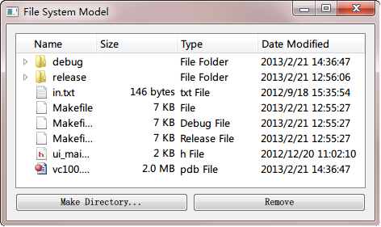

.. _qfilesystemmodel:

`44. QFileSystemModel <http://www.devbean.net/2013/02/qt-study-road-2-qfilesystemmodel/>`_
==========================================================================================

:作者: 豆子

:日期: 2013年02月21日

上一章我们详细了解了 QStringListModel。本章我们将再来介绍另外一个内置模型：QFileSystemModel。看起来，QFileSystemModel 比 QStringListModel 要复杂得多；事实也是如此。但是，虽然功能强大，QFileSystemModel 的使用还是简单的。

让我们从 Qt 内置的模型说起。实际上，Qt 内置了两种模型：QStandardItemModel 和 QFileSystemModel。QStandardItemModel 是一种多用途的模型，能够让列表、表格、树等视图显示不同的数据结构。这种模型会将数据保存起来。试想一下，列表和表格所要求的数据结构肯定是不一样的：前者是一维的，后者是二维的。因此，模型需要保存有实际数据，当视图是列表时，以一维的形式提供数据；当视图是表格时，以二维的形式提供数据。QFileSystemModel 则是另外一种方式。它的作用是维护一个目录的信息。因此，它不需要保存数据本身，而是保存这些在本地文件系统中的实际数据的一个索引。我们可以利用 QFileSystemModel 显示文件系统的信息、甚至通过模型来修改文件系统。

QTreeView 是最适合应用 QFileSystemModel 的视图。下面我们看一段代码：

.. code-block:: c++

	FileSystemWidget::FileSystemWidget(QWidget *parent) :
	    QWidget(parent)
	{
	    model = new QFileSystemModel;
	    model->setRootPath(QDir::currentPath());
	 
	    treeView = new QTreeView(this);
	    treeView->setModel(model);
	    treeView->setRootIndex(model->index(QDir::currentPath()));
	 
	    QPushButton *mkdirButton = new QPushButton(tr("Make Directory..."), this);
	    QPushButton *rmButton = new QPushButton(tr("Remove"), this);
	    QHBoxLayout *buttonLayout = new QHBoxLayout;
	    buttonLayout->addWidget(mkdirButton);
	    buttonLayout->addWidget(rmButton);
	 
	    QVBoxLayout *layout = new QVBoxLayout;
	    layout->addWidget(treeView);
	    layout->addLayout(buttonLayout);
	 
	    setLayout(layout);
	    setWindowTitle("File System Model");
	 
	    connect(mkdirButton, SIGNAL(clicked()),
	            this, SLOT(mkdir()));
	    connect(rmButton, SIGNAL(clicked()),
	            this, SLOT(rm()));
	}

构造函数很简单，我们首先创建了 QFileSystemModel 实例，然后将其作为一个 QTreeView 的模型。注意我们将 QFileSystemModel 的根目录路径设置为当前目录。剩下来的都很简单，我们添加了按钮之类，这些都不再赘述。对于 treeView 视图，我们使用了 setRootIndex() 对模型进行过滤。我们可以尝试一下，去掉这一句的话，我们的程序会显示整个文件系统的目录；而这一句的作用是，从模型中找到 QDir::currentPath() 所对应的索引，然后显示这一位置。也就是说，这一语句的作用实际是设置显示哪个目录。我们会在后面的章节中详细讨论 index() 函数。

现在，我们可以运行以下程序看看界面：

虽然我们基本一行代码都没写（有关文件系统的代码都没有写），但是从运行截图可以看出，QFileSystemModel 完全将所能想到的东西——名称、大小、类型、修改时间等全部显示出来，可见其强大之处。

下面是 mkdir() 槽函数：

.. code-block:: c++

	void FileSystemWidget::mkdir()
	{
	    QModelIndex index = treeView->currentIndex();
	    if (!index.isValid()) {
	        return;
	    }
	    QString dirName = QInputDialog::getText(this,
	                                            tr("Create Directory"),
	                                            tr("Directory name"));
	    if (!dirName.isEmpty()) {
	        if (!model->mkdir(index, dirName).isValid()) {
	            QMessageBox::information(this,
	                                     tr("Create Directory"),
	                                     tr("Failed to create the directory"));
	        }
	    }
	}

正如代码所示，首先我们获取选择的目录。后面这个 isValid() 判断很重要，因为默认情况下是没有目录被选择的，此时路径是非法的，为了避免程序出现异常，必须要有这一步判断。然后弹出对话框询问新的文件夹名字，如果创建失败会有提示，否则就是创建成功。这时候你会发现，硬盘的实际位置的确创建了新的文件夹。

下面则是 rm() 槽函数：

.. code-block:: c++

	void FileSystemWidget::rm()
	{
	    QModelIndex index = treeView->currentIndex();
	    if (!index.isValid()) {
	        return;
	    }
	    bool ok;
	    if (model->fileInfo(index).isDir()) {
	        ok = model->rmdir(index);
	    } else {
	        ok = model->remove(index);
	    }
	    if (!ok) {
	        QMessageBox::information(this,
	                         tr("Remove"),
	                         tr("Failed to remove %1").arg(model->fileName(index)));
	    }
	}

这里同样需要先检测路径是否合法。另外需要注意的是，目录和文件的删除不是一个函数，需要调用 isDir() 函数检测。这一步在代码中有很清楚的描述，这里就不再赘述了。

实际上，我们这里不需要十分担心 QFileSystemModel 的性能问题，因为它会启动自己的线程进行文件夹扫描，不会发生因扫描文件夹而导致的主线程阻塞的现象。另外需要注意的是，QFileSystemModel 会对模型的结果进行缓存，如果你要立即刷新结果，需要通知 QFileSystemWatcher 类。

如果仔细查看就会发现，我们的视图不能排序不能点击列头。为此，我们可以使用下面代码：

.. code-block:: c++

	treeView->header()->setStretchLastSection(true);
	treeView->header()->setSortIndicator(0, Qt::AscendingOrder);
	treeView->header()->setSortIndicatorShown(true);
	treeView->header()->setClickable(true);

这是 Qt 中视图类常用的一种技术：如果我们要修改有关列头、行头之类的位置，我们需要从视图类获取到列头对象，然后对其进行设置。正如代码中所显示的那样。

现在我们简单介绍了有关两个常用的模型类：QStringListModel 和 QFileSystemModel。下一章，我们将在此基础上详细介绍模型的相关细节。
