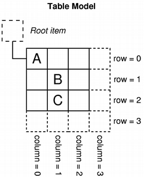
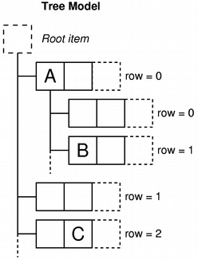

.. _model:

`45. 模型 <http://www.devbean.net/2013/02/qt-study-road-2-model/>`_
===================================================================

:作者: 豆子

:日期: 2013年02月26日

在前面两章的基础之上，我们将开始介绍 model 的通用概念。

在 model/view 架构中，model 提供一种标准接口，供视图和委托访问数据。在 Qt 中，这个接口由 QAbstractItemModel 类进行定义。不管底层数据是如何存储的，只要是 QAbstractItemModel 的子类，都提供一种表格形式的层次结构。视图利用统一的转换来访问模型中的数据。但是，需要提供的是，尽管模型内部是这样组织数据的，但是并不要求也得这样子向用户展示数据。

下面是各种 model 的组织示意图。我们利用此图来理解什么叫“一种表格形式的层次结构”。

.. image:: imgs/45/model-intro.png

如上图所示，List Model 虽然是线性的列表，也有一个 Root Item（根节点），之下才是呈线性的一个个数据，而这些数据实际可以看作是一个只有一列的表格，但是它是有层次的，因为有一个根节点。Table Model 就比较容易理解，只是也存在一个根节点。Tree Model 主要面向层次数据，而每一层次都可以都很多列，因此也是一个带有层次的表格。

为了能够使得数据的显示同存储分离，我们引入模型索引（model index）的概念。通过索引，我们可以访问模型的特定元素的特定部分。视图和委托使用索引来请求所需要的数据。由此可以看出，只有模型自己需要知道如何获得数据，模型所管理的数据类型可以使用通用的方式进行定义。索引保存有创建的它的那个模型的指针，这使得同时操作多个模型成为可能。

.. code-block:: c++

	QAbstractItemModel *model = index.model();

模型索引提供了所需要的信息的 **临时索引** ，可以用于通过模型取回或者修改数据。由于模型随时可能重新组织其内部的结构，因此模型索引很可能变成不可用的，此时，就不应该保存这些数据。如果你需要长期有效的数据片段，必须创建 **持久索引** 。持久索引保证其引用的数据及时更新。临时索引（也就是通常使用的索引）由 QModelIndex 类提供，持久索引则是 QPersistentModelIndex 类。

为了定位模型中的数据，我们需要三个属性：行号、列号以及父索引。下面我们对其一一进行解释。

我们前面介绍过模型的基本形式：数据以二维表的形式进行存储。此时，一个数据可以由行号和列号进行定位。注意，我们仅仅是使用“二维表”这个名词，并不意味着模型内部真的是以二维数组的形式进行存储；所谓“行号”“列号”，也仅仅是为方便描述这种对应关系，并不真的是有行列之分。通过指定行号和列号，我们可以定位一个元素项，取出其信息。此时，我们获得的是一个索引对象（回忆一下，通过索引我们可以获取具体信息）：

.. code-block:: c++

	QModelIndex index = model->index(row, column, ...);

模型提供了一个简单的接口，用于列表以及表格这种非层次视图的数据获取。不过，正如上面的代码暗示的那样，实际接口并不是那么简单。我们可以通过文档查看这个函数的原型：

.. code-block:: c++

	QModelIndex QAbstractItemModel::index(int row,
	                                      int column,
	                                      const QModelIndex &parent=QModelIndex()) const

这里，我们仅仅使用了前两个参数。通过下图来理解一下：

 

在一个简单的表格中，每一个项都可以由行号和列号确定。因此，我们只需提供两个参数即可获取到表格中的某一个数据项：

.. code-block:: c++

	QModelIndex indexA = model->index(0, 0, QModelIndex());
	QModelIndex indexB = model->index(1, 1, QModelIndex());
	QModelIndex indexC = model->index(2, 1, QModelIndex());

函数的最后一个参数始终是 QModelIndex()，接下来我们就要讨论这个参数的含义。

在类似表格的视图中，比如列表和表格，行号和列号足以定位一个数据项。但是，对于树型结构，仅有两个参数就不足够了。这是因为树型结构是一个层次结构，而层次结构中每一个节点都有可能是另外一个表格。所以，每一个项需要指明其父节点。前面说过，在模型外部只能用过索引访问内部数据，因此，index() 函数还需要一个 parent 参数：

.. code-block:: c++

	QModelIndex index = model->index(row, column, parent);

类似的，我们来看看下面的示意图：

图中，A 和 C 都是模型中的顶级项：

.. code-block:: c++

	QModelIndex indexA = model->index(0, 0, QModelIndex());
	QModelIndex indexC = model->index(2, 1, QModelIndex());

A 还有自己的子项。那么，我们就应该使用下面的代码获取 B 的索引：

.. code-block:: c++

	QModelIndex indexB = model->index(1, 0, indexA);

由此我们看到，如果只有行号和列号两个参数，B 的行号是 1，列号是 0，这同与 A 同级的行号是 1，列号是 0 的项相同，所以我们通过 parent 属性区别开来。

以上我们讨论了有关索引的定位。现在我们来看看模型的另外一个部分：数据角色。模型可以针对不同的组件（或者组件的不同部分，比如按钮的提示以及显示的文本等）提供不同的数据。例如，Qt::DisplayRole 用于视图的文本显示。通常来说，数据项包含一系列不同的数据角色，这些角色定义在 Qt::ItemDataRole 枚举中。

我们可以通过指定索引以及角色来获得模型所提供的数据：

.. code-block:: c++

	QVariant value = model->data(index, role);

通过为每一个角色提供恰当的数据，模型可以告诉视图和委托如何向用户显示内容。不同类型的视图可以选择忽略自己不需要的数据。当然，我们也可以添加我们所需要的额外数据。

总结一下：

* 模型使用索引来提供给视图和委托有关数据项的位置的信息，这样做的好处是，模型之外的对象无需知道底层的数据存储方式；
* 数据项通过行号、列号以及父项三个坐标进行定位；
* 模型索引由模型在其它组件（视图和委托）请求时才会被创建；
* 如果使用 index() 函数请求获得一个父项的可用索引，该索引会指向模型中这个父项下面的数据项。这个索引指向该项的一个子项；如果使用 index() 函数请求获得一个父项的不可用索引，该索引指向模型的最顶级项；
* 角色用于区分数据项的不同类型的数据。

下面回到前面我们曾经见过的模型 QFileSystemModel，看看如何从模型获取数据。

.. code-block:: c++

	QFileSystemModel *model = new QFileSystemModel;
	QModelIndex parentIndex = model->index(QDir::currentPath());
	int numRows = model->rowCount(parentIndex);

在这个例子中，我们创建了 QFileSystemModel 的实例，使用 QFileSystemModel 重载的 index() 获取索引，然后使用 rowCount() 函数计算当前目录下有多少数据项（也就是行数）。前面一章中迷迷糊糊的代码，现在已经相当清楚了。

为简单起见，下面我们只关心模型第一列。我们遍历所有数据，取得第一列索引：

.. code-block:: c++

	for (int row = 0; row < numRows; ++row) {
	    QModelIndex index = model->index(row, 0, parentIndex);

我们使用 index() 函数，第一个参数是每一行行号，第二个参数是 0，也就是第一列，第三个参数是 parentIndex，也就是当前目录作为父项。我们可以使用模型的 data() 函数获取每一项的数据。注意，该函数返回值是 QVariant，实际是一个字符串，因此我们直接转换成 QString：

.. code-block:: c++

	    QString text = model->data(index, Qt::DisplayRole).toString();
	    // 使用 text 数据
	}

上面的代码片段显示了从模型获取数据的一些有用的函数：

* 模型的数目信息可以通过 rowCount() 和 columnCount() 获得。这些函数需要制定父项；
* 索引用于访问模型中的数据。我们需要利用行号、列号以及父项三个参数来获得该索引；
* 当我们使用 QModelIndex() 创建一个空索引使用时，我们获得的就是模型中最顶级项；
* 数据项包含了不同角色的数据。为获取特定角色的数据，必须指定这个角色。
