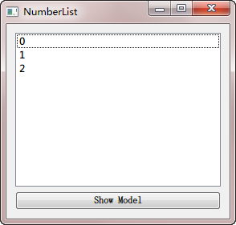
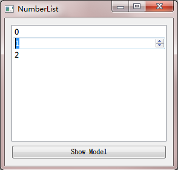

.. _view_delegate:

`46. 视图和委托 <http://www.devbean.net/2013/03/qt-study-road-2-view-delegate/>`_
=================================================================================

:作者: 豆子

:日期: 2013年03月11日

前面我们介绍了模型的概念。下面则是另外一个基本元素：视图。在 model/view 架构中，视图是数据从模型到最终用户的途径。数据通过视图向用户进行显示。此时，这种显示方式不必须同模型的存储结构相一致。实际上，很多情况下，数据的显示同底层数据的存储是完全不同的。

我们使用 QAbstractItemModel 提供标准的模型接口，使用 QAbstractItemView 提供标准的视图接口，而结合这两者，就可以将数据同表现层分离，在视图中利用前面所说的模型索引。视图管理来自模型的数据的布局：既可以直接渲染数据本身，也可以通过委托渲染和编辑数据。

视图不仅仅用于展示数据，还用于在数据项之间的导航以及数据项的选择。另外，视图也需要支持很多基本的用户界面的特性，例如右键菜单以及拖放。视图可以提供数据编辑功能，也可以将这种编辑功能交由某个委托完成。视图可以脱离模型创建，但是在其进行显示之前，必须存在一个模型。也就是说，视图的显示是完全基于模型的，这是不能脱离模型存在的。对于用户的选择，多个视图可以相互独立，也可以进行共享。

某些视图，例如 QTableView 和 QTreeView，不仅显示数据，还会显示列头或者表头。这些是由 QHeaderView 视图类提供的。在《:ref:`QFileSystemModel <qfilesystemmodel>`》一章的最后，我们曾经提到过这个问题。表头通常访问视图所包含的同一模型。它们使用 QAbstractItemModel::headerData() 函数从模型中获取数据，然后将其以标签 label 的形式显示出来。我们可以通过继承 QHeaderView 类，实现某些更特殊的功能。

正如前面的章节介绍的，我们通常会为视图提供一个模型。拿前面我们曾经见过的一个例子来看：

.. code-block:: c++

	QStringList data;
	data << "0" << "1" << "2";
	model = new QStringListModel(this);
	model->setStringList(data);
	 
	listView = new QListView(this);
	listView->setModel(model);
	 
	QPushButton *btnShow = new QPushButton(tr("Show Model"), this);
	connect(btnShow, SIGNAL(clicked()),
	        this, SLOT(showModel()));
	QHBoxLayout *buttonLayout = new QHBoxLayout;
	buttonLayout->addWidget(btnShow);
	 
	QVBoxLayout *layout = new QVBoxLayout;
	layout->addWidget(listView);
	layout->addLayout(buttonLayout);
	setLayout(layout);

运行一下程序，这个界面十分简单：

跟我们前面的演示几乎一模一样。现在我们有一个问题：如果我们双击某一行，列表会允许我们进行编辑。但是，我们没办法控制用户只能输入数字——当然，我们可以在提交数据时进行检测，这也是一种办法，不过，更友好的方法是，根本不允许用户输入非法字符。为了达到这一目的，我们使用了委托。下面，我们增加一个委托：

.. code-block:: c++

	class SpinBoxDelegate : public QStyledItemDelegate
	{
	    Q_OBJECT
	public:
	    QStyledItemDelegate(QObject *parent = 0) ： QStyledItemDelegate(parent) {}
	 
	    QWidget *createEditor(QWidget *parent, const QStyleOptionViewItem &option,
	                          const QModelIndex &index) const;
	 
	    void setEditorData(QWidget *editor, const QModelIndex &index) const;
	    void setModelData(QWidget *editor, QAbstractItemModel *model,
	                      const QModelIndex &index) const;
	 
	    void updateEditorGeometry(QWidget *editor,
	                              const QStyleOptionViewItem &option,
	                              const QModelIndex &index) const;
	};

正如前面所说，委托就是供视图实现某种高级的编辑功能。不同于经典的 Model-View-Controller（MVC）模式，model/view 没有将用户交互部分完全分离。一般地，视图将数据向用户进行展示并且处理通用的输入。但是，对于某些特殊要求（比如这里的要求必须输入数字），则交予委托完成。这些组件提供输入功能，同时也能渲染某些特殊数据项。委托的接口由 QAbstractItemDelegate 定义。在这个类中，委托通过 paint() 和 sizeHint() 两个函数渲染用户内容（也就是说，你必须自己将渲染器绘制出来）。为使用方便，从 4.4 开始，Qt 提供了另外的基于组件的子类：QItemDelegate 和 QStyledItemDelegate。默认的委托是 QStyledItemDelegate。二者的区别在于绘制和向视图提供编辑器的方式。QStyledItemDelegate 使用当前样式绘制，并且能够使用 Qt Style Sheet（我们会在后面的章节对 QSS 进行介绍），因此我们推荐在自定义委托时，使用 QStyledItemDelegate 作为基类。不过，除非自定义委托需要自己进行绘制，否则，二者的代码其实是一样的。

继承 QStyledItemDelegate 需要实现以下几个函数：

* createEditor()：返回一个组件。该组件会被作为用户编辑数据时所使用的编辑器，从模型中接受数据，返回用户修改的数据。
* setEditorData()：提供上述组件在显示时所需要的默认值。
* updateEditorGeometry()：确保上述组件作为编辑器时能够完整地显示出来。
* setModelData()：返回给模型用户修改过的数据。

下面依次看看各函数的实现：

.. code-block:: c++

	QWidget *SpinBoxDelegate::createEditor(QWidget *parent,
	                                       const QStyleOptionViewItem & /* option */,
	                                       const QModelIndex & /* index */) const
	{
	    QSpinBox *editor = new QSpinBox(parent);
	    editor->setMinimum(0);
	    editor->setMaximum(100);
	    return editor;
	}

在 createEditor() 函数中，parent 参数会作为新的编辑器的父组件。

.. code-block:: c++

	void SpinBoxDelegate::setEditorData(QWidget *editor,
	                                    const QModelIndex &index) const
	{
	    int value = index.model()->data(index, Qt::EditRole).toInt();
	    QSpinBox *spinBox = static_cast<QSpinBox*>(editor);
	    spinBox->setValue(value);
	}

setEditorData() 函数从模型中获取需要编辑的数据（具有 Qt::EditRole 角色）。由于我们知道它就是一个整型，因此可以放心地调用 toInt() 函数。editor 就是所生成的编辑器实例，我们将其强制转换成 QSpinBox 实例，设置其数据作为默认值。

.. code-block:: c++

	void SpinBoxDelegate::setModelData(QWidget *editor,
	                                   QAbstractItemModel *model,
	                                   const QModelIndex &index) const
	{
	    QSpinBox *spinBox = static_cast<QSpinBox*>(editor);
	    spinBox->interpretText();
	    int value = spinBox->value();
	    model->setData(index, value, Qt::EditRole);
	}

在用户编辑完数据后，委托会调用 setModelData() 函数将新的数据保存到模型中。因此，在这里我们首先获取 QSpinBox 实例，得到用户输入值，然后设置到模型相应的位置。标准的 QStyledItemDelegate 类会在完成编辑时发出 closeEditor() 信号，视图会保证编辑器已经关闭并且销毁，因此无需对内存进行管理。由于我们的处理很简单，无需在发出 closeEditor() 信号，但是在复杂的实现中，记得可以在这里发出这个信号。针对数据的任何操作都必须提交给 QAbstractItemModel，这使得委托独立于特定的视图。当然，在真实应用中，我们需要检测用户的输入是否合法，是否能够存入模型。

.. code-block:: c++

	void SpinBoxDelegate::updateEditorGeometry(QWidget *editor,
	                                           const QStyleOptionViewItem &option,
	                                           const QModelIndex &index) const
	{
	    editor->setGeometry(option.rect);
	}

最后，由于我们的编辑器只有一个数字输入框，所以只是简单将这个输入框的大小设置为单元格的大小（由 option.rect 提供）。如果是复杂的编辑器，我们需要根据单元格参数（由 option 提供）、数据（由 index 提供）结合编辑器（由 editor 提供）计算编辑器的显示位置和大小。

现在，我们的委托已经编写完毕。接下来需要将这个委托设置为 QListView 所使用的委托：

.. code-block:: c++

	listView->setItemDelegate(new SpinBoxDelegate(listView));

值得注意的是，new 操作符并不会真的创建编辑器实例。相反，只有在真正需要时，Qt 才会生成一个编辑器实例。这保证了程序运行时的性能。

然后我们运行下程序：

