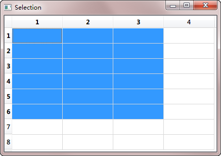
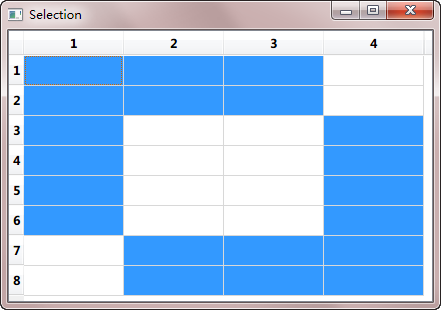

.. _view_selection:

`47. 视图选择 <http://www.devbean.net/2013/03/qt-study-road-2-view-selection/>`_
=================================================================================

:作者: 豆子

:日期: 2013年03月28日

选择是视图中常用的一个操作。在列表、树或者表格中，通过鼠标点击可以选中某一项，被选中项会变成高亮或者反色。在 Qt 中，选择也是使用了一种模型。在 model/view 架构中，这种选择模型提供了一种更通用的对选择操作的描述。对于一般应用而言，Qt 内置的选择模型已经足够，但是，Qt 还是允许你创建自己的选择模型，来实现一些特殊的操作。

Qt 使用 QItemSelectionModel 类获取视图中项目的选择情况。这个模型保持有项目的索引，并且独立于任何视图。这意味着，我们可以让不同的视图共享同一个选择模型，从来达到一种同步操作的目的。选择由选择区域组成。模型只将选区的开始和结束的索引位置记录下来，以保证对于很大的选区也有很好的性能。非连续选区则由多个连续选择组成。

选择会直接应用于选择模型所维护的那些被选中的索引上面。最新的选择就是当前选择。这意味着，即便界面上没有显示有任何项目被选择，如果通过某些命令对选区进行操作，同样会有作用。

在视图中，始终存在一个当前项和被选择项（即便从界面上看不到有任何选择）。与通常所想的不同，当前项和选择项是相互独立的两个状态。一个项目可以即是当前项又是选择项。下表是当前项和选择项的区别：

==========================================================  ======================
当前项                                                      选择项                
==========================================================  ======================
只能有一个当前项。                                          可以有多个选择项。
使用键盘或者鼠标点击可以改变当前项。                        选择项使用两种状态：选择和未选择，这取决于项目之前的状态和其它一些设置，例如，单选或多选。只有在用户进行交互的时候，这种状态才会发生改变。
当前项可以使用 F2 或者鼠标双击进行编辑（前提是程序允许）。  当前项可以结合另外一个锚点指定被选择或者去除选择的一块选区（或二者的结合）。
当前项通常会有一个焦点框进行标识。                          选择项使用选区颜色进行标识。
==========================================================  ======================

在处理选择的时候，我们可以将 QItemSelectionModel 当成数据模型中所有数据项的选择状态的一个记录。一旦选择模型创建好，这些数据项就可以在不知道哪些项被选择的情况下进行选择、取消选择或者改变选择状态的操作。所有被选择项的索引都在可随时更改，其它组件也可以通过信号槽机制修改这些选择的信息。

标准视图类（QListView、QTreeView 以及 QTableView）已经提供了默认的选择模型，足以满足大多数应用程序的需求。某一个视图的选择模型可以通过 selectionModel() 函数获取，然后使用 setSelectionModel() 提供给其它视图共享，因此，一般没有必要新建选择模型。

如果需要创建一个选区，我们需要指定一个模型以及一对索引，使用这些数据创建一个 QItemSelection 对象。这两个索引应该指向给定的模型中的数据，并且作为一个块状选区的左上角和右下角的索引。为了将选区应用到模型上，需要将选区提交到选择模型。这种操作有多种实现，对于现有选择模型有着不同的影响。

下面我们来看一些代码片段。首选构建一个总数 32 个数据项的表格模型，然后将其设置为一个表格视图的数据：

.. code-block:: c++

    QTableWidget tableWidget(8, 4);

    QItemSelectionModel *selectionModel = tableWidget.selectionModel();

在代码的最后，我们获得 QTableView 的选择模型，以备以后使用。现在，我们没有修改模型中的数据，而是选择表格左上角的一些单元格。下面我们来看看代码如何实现：

.. code-block:: c++

    QModelIndex topLeft = tableWidget.model()->index(0, 0, QModelIndex());
    QModelIndex bottomRight = tableWidget.model()->index(5, 2, QModelIndex());

接下来，我们将获得的两个索引定义为选区。为达这一目的，我们首先构造一个 QItemSelection 对象，然后将其赋值给我们获取的选择模型：

.. code-block:: c++

    QItemSelection selection(topLeft, bottomRight);
    selectionModel->select(selection, QItemSelectionModel::Select);

正如前面我们说的，首先利用左上角和右下角的坐标构建一个 QItemSelection 对象，然后将这个对象设置为选择模型的选择区。select() 函数的第一个参数就是需要选择的选区，第二个参数是选区的标志位。Qt 提供了很多不同的操作，可以参考下 QItemSelectionModel::SelectionFlags 的文档。在本例中，我们使用了 QItemSelectionModel::Select，这意味着选区中所包含的所有单元格都会被选择。

下面就是我们的运行结果：

现在我们知道如何设置选区。下面来看看如何获取选区。获取选区需要使用 selectedIndexes() 函数。该函数返回一个无序列表。我们可以通过遍历这个列表获得哪些被选择：

.. code-block:: c++

    QModelIndexList indexes = selectionModel->selectedIndexes();
    QModelIndex index;
    
    foreach(index, indexes) {
        QString text = QString("(%1,%2)").arg(index.row()).arg(index.column());
        model->setData(index, text);
    }

在选择发生更改时，选择模型会发出信号。我们可以连接 selectionChanged() 信号，在选区改变时检查哪个项目发生了变化。这个信号有两个参数：第一个是新选择的项目，第二个是刚刚被取消选择的项目。在下面的示例中，我们通过 selectionChanged() 信号，将所有新选择的项目填充字符串，将所有被取消选择的部分清空：

.. code-block:: c++

    void MainWindow::updateSelection(const QItemSelection &selected,
                                     const QItemSelection &deselected)
    {
        QModelIndex index;
        QModelIndexList items = selected.indexes();

        foreach (index, items) {
            QString text = QString("(%1,%2)").arg(index.row()).arg(index.column());
            model->setData(index, text);
        }

        items = deselected.indexes();

        foreach (index, items) {
            model->setData(index, "");
        }
    }

通过 currentChanged()，我们可以追踪当前有焦点的项。同 selectionChanged() 信号类似，这个信号也有两个参数：第一个是新的当前项，第二个是上一个当前项。下面的代码则是该信号的使用：

.. code-block:: c++

    void MainWindow::changeCurrent(const QModelIndex &current,
                                   const QModelIndex &previous)
    {
        statusBar()->showMessage(
            tr("Moved from (%1,%2) to (%3,%4)")
                .arg(previous.row()).arg(previous.column())
                .arg(current.row()).arg(current.column()));
    }

这些信号可以用来监控选区的改变。如果你还要直接更新选区，我们还有另外的方法。

同样是利用前面所说的 QItemSelectionModel::SelectionFlag，我们可以对选区进行组合操作。还记得我们在前面的 select() 函数中使用过的第二个参数吗？当我们替换这个参数，就可以获得不同的组合方式。最常用的就是 QItemSelectionModel::Select，它的作用是将所有指定的选区都选择上。QItemSelectionModel::Toggle 则是一种取反的操作：如果指定的部分原来已经被选择，则取消选择，否则则选择上。QItemSelectionModel::Deselect 则是取消指定的已选择的部分。在下面的例子中，我们使用 QItemSelectionModel::Toggle 对前面的示例作进一步的操作：

.. code-block:: c++

    QItemSelection toggleSelection;
     
    topLeft = tableWidget.model()->index(2, 1, QModelIndex());
    bottomRight = tableWidget.model()->index(7, 3, QModelIndex());
    toggleSelection.select(topLeft, bottomRight);
     
    selectionModel->select(toggleSelection, QItemSelectionModel::Toggle);

运行结果将如下所示：

默认情况下，选择操作会只会影响到指定的模型索引。但是，我们也可以改变这一设置。例如，只选择整行或者整列：

.. code-block:: c++

    QItemSelection columnSelection;
    
    topLeft = model->index(0, 1, QModelIndex());
    bottomRight = model->index(0, 2, QModelIndex());
    
    columnSelection.select(topLeft, bottomRight);
    
    selectionModel->select(columnSelection,
                           QItemSelectionModel::Select | QItemSelectionModel::Columns);
    
    QItemSelection rowSelection;
    
    topLeft = model->index(0, 0, QModelIndex());
    bottomRight = model->index(1, 0, QModelIndex());
    
    rowSelection.select(topLeft, bottomRight);
    
    selectionModel->select(rowSelection,
                           QItemSelectionModel::Select | QItemSelectionModel::Rows);

上面的代码，我们依然使用两个索引设置了一个区域，但是，在选择的使用我们使用了 QItemSelectionModel::Rows 和 QItemSelectionModel::Columns 这两个参数，因此只会选择这两个区域中指定的行或者列：

使用 QItemSelectionModel::Current 参数可以将当前选区替换为新的选区；使用 QItemSelectionModel::Clear 则会将原来已有的选区全部取消。为了进行全选，我们可以设置选区为左上角和右下角两个索引：

.. code-block:: c++

    QModelIndex topLeft = model->index(0, 0, parent);
    QModelIndex bottomRight = model->index(model->rowCount(parent)-1,
    model->columnCount(parent)-1, parent);
     
    QItemSelection selection(topLeft, bottomRight);
    selectionModel->select(selection, QItemSelectionModel::Select);
