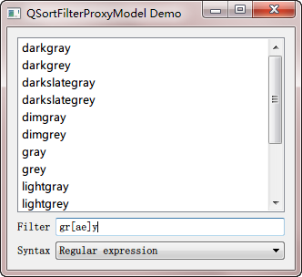

.. _qsortfilterproxymodel:

`48. QSortFilterProxyModel <http://www.devbean.net/2013/04/qt-study-road-2-qsortfilterproxymodel/>`_
====================================================================================================

:作者: 豆子

:日期: 2013年04月11日

从本章开始，我们将逐步了解有关自定义模型的相关内容。尽管前面我们曾经介绍过 Qt 提供的几个内置模型：QStringListModel 和 QFileSystemModel，但对于千变万化的需求而言，这些显然是远远不够的。于是，Qt 也允许我们对模型进行自定义。

在正式开始介绍自定义模形之前，我们先来了解一个新的类：QSortFilterProxyModel。之所以将这个类放在这里，是因为在一定程序上，我们可以使用 QSortFilterProxyModel 获得一些可能必须自定义才能达到的效果。QSortFilterProxyModel 并不能单独使用。顾名思义，它是一个“代理”，其真正的数据需要另外的一个模型提供。它的作用是对数据进行排序和过滤。排序很好理解，而过滤，则是按照输入的内容对数据及进行筛选，很像 Excel 里面的过滤器。不过 Qt 提供的过滤功能是基于正则表达式的，功能很强大。

下面我们根据代码来了解下 QSortFilterProxyModel 的使用：

.. code-block:: c++

    class SortView : public QWidget
    {
        Q_OBJECT
    public:
        SortView();
     
    private:
        QListView *view;
        QStringListModel *model;
        QSortFilterProxyModel *modelProxy;
        QComboBox *syntaxBox;
     
    private slots:
        void filterChanged(const QString &text);
    };

头文件中，我们声明了一个类 SortView，继承自 QWidget。它有四个成员变量以及一个私有槽函数。

.. code-block:: c++

    SortView::SortView()
    {
        model = new QStringListModel(QColor::colorNames(), this);
     
        modelProxy = new QSortFilterProxyModel(this);
        modelProxy->setSourceModel(model);
        modelProxy->setFilterKeyColumn(0);
     
        view = new QListView(this);
        view->setModel(modelProxy);
     
        QLineEdit *filterInput = new QLineEdit;
        QLabel *filterLabel = new QLabel(tr("Filter"));
        QHBoxLayout *filterLayout = new QHBoxLayout;
        filterLayout->addWidget(filterLabel);
        filterLayout->addWidget(filterInput);
     
        syntaxBox = new QComboBox;
        syntaxBox->setSizePolicy(QSizePolicy::Expanding, QSizePolicy::Preferred);
        syntaxBox->addItem(tr("Regular expression"), QRegExp::RegExp);
        syntaxBox->addItem(tr("Wildcard"), QRegExp::Wildcard);
        syntaxBox->addItem(tr("Fixed string"), QRegExp::FixedString);
        QLabel *syntaxLabel = new QLabel(tr("Syntax"));
        QHBoxLayout *syntaxLayout = new QHBoxLayout;
        syntaxLayout->addWidget(syntaxLabel);
        syntaxLayout->addWidget(syntaxBox);
     
        QVBoxLayout *layout = new QVBoxLayout(this);
        layout->addWidget(view);
        layout->addLayout(filterLayout);
        layout->addLayout(syntaxLayout);
     
        connect(filterInput, SIGNAL(textChanged(QString)),
                this, SLOT(filterChanged(QString)));
    }

在构造函数中，我们首先创建一个 QStringListModel 对象，其内容是 Qt 预定义的所有颜色的名字（利用 QColor::colorNames() 获取）。然后是 QSortFilterProxyModel 对象，我们将其原模型设置为刚刚创建的 model，也就是要为这个 model 进行代理；然后将 FilterKeyColumn 设置为 0，也就是仅仅对第一列进行过滤。我们使用一个QStringListModel包装这个数据，这和前面的内容没有什么区别。然后创建一个QSortFilterProxyModel对象，使用它的setSourceModel()函数将前面定义的QStringListModel传进去，也就是我们需要对这个model进行代理。最后重要的一点是，QListView 的数据源必须设置为 QSortFilterProxyModel，而不是最开始的 model 对象。

作为过滤选项，syntaxBox 添加了三个数据项：

.. code-block:: c++

    syntaxBox->addItem(tr("Regular expression"), QRegExp::RegExp);
    syntaxBox->addItem(tr("Wildcard"), QRegExp::Wildcard);
    syntaxBox->addItem(tr("Fixed string"), QRegExp::FixedString);

这正是正则表达式的几种类型。正则表达式自己有一套相对通用的语法，但是对于不同的语言环境（例如 Java、C# 和 Python），其具体定义可能会略有差别。这里我们使用的是 Qt 自己的正则表达式处理工具（C++ 本身并没有解析正则表达式的机制，虽然 boost 提供了一套）。第一个 QregExp::RegExp 提供了最一般的正则表达式语法，但这个语法不支持贪婪限定符。这也是 Qt 默认的规则；如果需要使用贪婪限定符，需要使用 QRegExp::RegExp2。尽管在 Qt4 的文档中声明，QRegExp::RegExp2 将会作为 Qt5 的默认规则，但其实并不是这样。第二个我们提供的是 Unix shell 常见的一种规则，使用通配符处理。第三个即固定表达式，也就是说基本上不使用正则表达式。

接下来我们看看 filterChanged() 函数的实现：

.. code-block:: c++

    void SortView::filterChanged(const QString &text)
    {
        QRegExp::PatternSyntax syntax = QRegExp::PatternSyntax(
                    syntaxBox->itemData(syntaxBox->currentIndex()).toInt());
        QRegExp regExp(text, Qt::CaseInsensitive, syntax);
        modelProxy->setFilterRegExp(regExp);
    }

在这段代码中，首先使用 QComboBox 的选择值创建一个 QRegExp::PatternSyntax 对象；然后利用这个语法规则构造一个正则表达式，注意我们在 QLineEdit 里面输入的内容是通过参数传递进来的，然后设置数据模型代理的过滤表达式。下面可以运行一下看看结果：

上图中，我们输入的是 gr[ae]y 作为正则表达式。这是说，我们希望获取这样一个颜色的名字：它的名字中有这样的四个字母，第一个字母是 g，第二个字母是 r，第三个字母要么是 a，要么是 e，第四个字母是 y。如果找到符合条件的名字，就要把它过滤出来，显示到列表中，不符合条件的全部不显示。我们的程序正是这样的结果。如果你对这个正则表达式不熟悉，请自行查阅有关正则表达式的内容。
