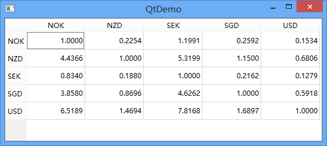

.. _custom_readonly_model:

`49. 自定义只读模型 <http://www.devbean.net/2013/05/qt-study-road-2-custom-readonly-model/>`_
=============================================================================================

:作者: 豆子

:日期: 2013年05月05日

model/view 模型将数据与视图分割开来，也就是说，我们可以为不同的视图，QListView、QTableView 和 QTreeView 提供一个数据模型，这样我们可以从不同角度来展示数据的方方面面。但是，面对变化万千的需求，Qt 预定义的几个模型是远远不能满足需要的。因此，我们还必须自定义模型。

类似 QAbstractView 类之于自定义视图，QAbstractItemModel 为自定义模型提供了一个足够灵活的接口。它能够支持数据源的层次结构，能够对数据进行增删改操作，还能够支持拖放。不过，有时候一个灵活的类往往显得过于复杂，所以，Qt 又提供了 QAbstarctListModel 和 QAbstractTableModel 两个类来简化非层次数据模型的开发。顾名思义，这两个类更适合于结合列表和表格使用。

本节，我们正式开始对自定义模型进行介绍。

在开始自定义模型之前，我们首先需要思考这样一个问题：我们的数据结构适合于哪种视图的显示方式？是列表，还是表格，还是树？如果我们的数据仅仅用于列表或表格的显示，那么 QAbstractListModel 或者 QAbstractTableModel 已经足够，它们为我们实现了很多默认函数。但是，如果我们的数据具有层次结构，并且必须向用户显示这种层次，我们只能选择 QAbstractItemModel。不管底层数据结构是怎样的格式，最好都要直接考虑适应于标准的 QAbstractItemModel 的接口，这样就可以让更多视图能够轻松访问到这个模型。

现在，我们开始自定义一个模型。这个例子修改自《C++ GUI Programming with Qt4, 2nd Edition》。首先描述一下需求。我们想要实现的是一个货币汇率表，就像银行营业厅墙上挂着的那种电子公告牌。当然，你可以选择 QTableWidget。的确，直接使用 QTableWidget 确实很方便。但是，试想一个包含了 100 种货币的汇率表。显然，这是一个二维表，并且对于每一种货币，都需要给出相对于其他 100 种货币的汇率（我们把自己对自己的汇率也包含在内，只不过这个汇率永远是 1.0000）。现在，按照我们的设计，这张表要有 100 x 100 = 10000 个数据项。我们希望减少存储空间，有没有更好的方式？于是我们想，如果我们的数据不是直接向用户显示的数据，而是这种货币相对于美元的汇率，那么其它货币的汇率都可以根据这个汇率计算出来了。比如，我存储人民币相对美元的汇率，日元相对美元的汇率，那么人民币相对日元的汇率只要作一下比就可以得到了。这种数据结构就没有必要存储 10000 个数据项，只要存储 100 个就够了（实际情况中这可能是不现实的，因为两次运算会带来更大的误差，但这不在我们现在的考虑范畴中）。

于是我们设计了 CurrencyModel 类。它底层使用 QMap<QString, double> 数据结构进行存储，QString 类型的键是货币名字，double 类型的值是这种货币相对美元的汇率。（这里提一点，实际应用中，永远不要使用 double 处理金额敏感的数据！因为 double 是不精确的，不过这一点显然不在我们的考虑中。）

首先从头文件开始看起：

.. code-block:: c++

    class CurrencyModel : public QAbstractTableModel
    {
    public:
        CurrencyModel(QObject *parent = 0);
        void setCurrencyMap(const QMap<QString, double> &map);
        int rowCount(const QModelIndex &parent) const;
        int columnCount(const QModelIndex &parent) const;
        QVariant data(const QModelIndex &index, int role) const;
        QVariant headerData(int section, Qt::Orientation orientation, int role) const;
    private:
        QString currencyAt(int offset) const;
        QMap<QString, double> currencyMap;
    };

这段代码平淡无奇，我们继承了 QAbstractTableModel 类，然后重写了所要求的几个函数。构造函数同样如此：

.. code-block:: c++

    CurrencyModel::CurrencyModel(QObject *parent)
        : QAbstractTableModel(parent)
    {
    }

rowCount() 和 columnCount() 用于返回行和列的数目。记得我们保存的是每种货币相对美元的汇率，而需要显示的是它们两两之间的汇率，因此这两个函数都应该返回这个 map 的项数：

.. code-block:: c++

    int CurrencyModel::rowCount(const QModelIndex & parent) const
    {
        return currencyMap.count();
    }
     
    int CurrencyModel::columnCount(const QModelIndex & parent) const
    {
        return currencyMap.count();
    }

headerData() 用于返回列名：

.. code-block:: c++

    QVariant CurrencyModel::headerData(int section, Qt::Orientation, int role) const
    {
        if (role != Qt::DisplayRole) {
            return QVariant();
        }
        return currencyAt(section);
    }

我们在前面的章节中介绍过有关角色的概念。这里我们首先判断这个角色是不是用于显示的，如果是，则调用 currencyAt() 函数返回第 section 列的名字；如果不是则返回一个空白的 QVariant 对象。currencyAt() 函数定义如下：

.. code-block:: c++

    QString CurrencyModel::currencyAt(int offset) const
    {
        return (currencyMap.begin() + offset).key();
    }

如果不了解 QVariant 类，可以简单认为这个类型相当于 Java 里面的 Object，它把 Qt 提供的大部分数据类型封装起来，起到一个类型擦除的作用。比如我们的单元格的数据可以是 string，可以是 int，也可以是一个颜色值，这么多类型怎么使用一个函数返回呢？回忆一下，返回值并不用于区分一个函数。于是，Qt 提供了 QVariant 类型。你可以把很多类型存放进去，到需要使用的时候使用一系列的 to 函数取出来即可。比如把 int 包装成一个 QVariant，使用的时候要用 QVariant::toInt() 重新取出来。这非常类似于 union，但是 union 的问题是，无法保持没有默认构造函数的类型，于是 Qt 提供了 QVariant 作为 union 的一种模拟。

setCurrencyMap() 函数则是用于设置底层的实际数据。由于我们不可能将这种数据硬编码，所以我们必须为模型提供一个用于设置的函数：

.. code-block:: c++

    void CurrencyModel::setCurrencyMap(const QMap<QString, double> &map)
    {
        beginResetModel();
        currencyMap = map;
        endResetModel();
    }

我们当然可以直接设置 currencyMap，但是我们依然添加了 beginResetModel() 和 endResetModel() 两个函数调用。这将告诉关心这个模型的其它类，现在要重置内部数据，大家要做好准备。这是一种契约式的编程方式。

接下来便是最复杂的 data() 函数：

.. code-block:: c++

    QVariant CurrencyModel::data(const QModelIndex &index, int role) const
    {
        if (!index.isValid()) {
            return QVariant();
        }
     
        if (role == Qt::TextAlignmentRole) {
            return int(Qt::AlignRight | Qt::AlignVCenter);
        } else if (role == Qt::DisplayRole) {
            QString rowCurrency = currencyAt(index.row());
            QString columnCurrency = currencyAt(index.column());
            if (currencyMap.value(rowCurrency) == 0.0) {
                return "####";
            }
            double amount = currencyMap.value(columnCurrency)
                                / currencyMap.value(rowCurrency);
            return QString("%1").arg(amount, 0, 'f', 4);
        }
        return QVariant();
    }

data() 函数返回一个单元格的数据。它有两个参数：第一个是 QModelIndex，也就是单元格的位置；第二个是 role，也就是这个数据的角色。这个函数的返回值是 QVariant 类型。我们首先判断传入的 index 是不是合法，如果不合法直接返回一个空白的 QVariant。然后如果 role 是 Qt::TextAlignmentRole，也就是文本的对齐方式，返回 int(Qt::AlignRight | Qt::AlignVCenter)；如果是 Qt::DisplayRole，就按照我们前面所说的逻辑进行计算，然后以字符串的格式返回。这时候你就会发现，其实我们在 if…else… 里面返回的不是一种数据类型：if 里面返回的是 int，而 else 里面是 QString，这就是 QVariant 的作用了。

为了看看实际效果，我们可以使用这样的 main() 函数代码：

.. code-block:: c++

    int main(int argc, char *argv[])
    {
        QApplication a(argc, argv);
     
        QMap<QString, double> data;
        data["NOK"] = 1.0000;
        data["NZD"] = 0.2254;
        data["SEK"] = 1.1991;
        data["SGD"] = 0.2592;
        data["USD"] = 0.1534;
     
        QTableView view;
        CurrencyModel *model = new CurrencyModel(&view);
        model->setCurrencyMap(data);
        view.setModel(model);
        view.resize(400, 300);
        view.show();
     
        return a.exec();
    }

这是我们的实际运行效果：

