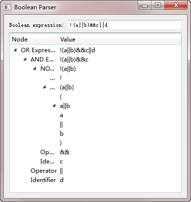

.. _bool_tree_model:

`51. 布尔表达式树模型 <http://www.devbean.net/2013/05/qt-study-road-2-bool-tree-model/>`_
=========================================================================================

:作者: 豆子

:日期: 2013年05月15日

本章将会是自定义模型的最后一部分。原本打算结束这部分内容，不过实在不忍心放弃这个示例。来自于 C++ GUI Programming with Qt 4, 2nd Edition 这本书的布尔表达式树模型的示例相当精彩，复杂而又不失实用性，所以我们还是以这个例子结束这部分内容。

这个例子是将布尔表达式分析成一棵树。这个分析过程在离散数学中经常遇到，特别是复杂的布尔表达式。类似的分析方法可以套用于表达式化简、求值等一系列的运算。同时，这个技术也可以很方便地分析一个表达式是不是一个正确的布尔表达式。在这个例子中，一共有四个类：

* Node：组成树的节点；
* BooleanModel：布尔表达式的模型，实际上这是一个树状模型，用于将布尔表达式形象地呈现为一棵树；
* BooleanParser：分析布尔表达式的分析器；
* BooleanWindow：图形用户界面，用户在此输入布尔表达式并进行分析，最后将结果展现成一棵树。

首先，我们来看看最基础的 Node 类。这是分析树的节点，也是构成整棵树的基础。

.. code-block:: c++

    class Node
    {
    public:
        enum Type { Root, OrExpression, AndExpression, NotExpression, Atom,
                    Identifier, Operator, Punctuator };
     
        Node(Type type, const QString &str = "");
        ~Node();
     
        Type type;
        QString str;
        Node *parent;
        QList<Node *> children;
    };

Node 的 cpp 文件也非常简单：

.. code-block:: c++

    Node::Node(Type type, const QString &str)
    {
        this->type = type;
        this->str = str;
        parent = 0;
    }
     
    Node::~Node()
    {
        qDeleteAll(children);
    }

Node 很像一个典型的树的节点：一个 Node 指针类型的 parent 属性，保存父节点；一个 QString 类型的 str，保存数据。另外，Node 还有一个 Type 属性，指明这个 Node 的类型，是一个词素，还是操作符，或者其他什么东西；children 是QList<Node \*> 类型，保存这个 node 的所有子节点。注意，在 Node 类的析构函数中，使用了 qDeleteAll() 这个全局函数。这个函数是将 [start, end) 范围内的所有元素进行 delete 运算。因此，它的参数的元素必须是指针类型的。并且，这个函数使用 delete 之后并不会将指针赋值为 0，所以，如果要在析构函数之外调用这个函数，建议在调用之后显示的调用 clear() 函数，将列表所有元素的指针重置为 0。

虽然我们将这个例子放在自定义模型这部分，但实际上这个例子的核心类是 BooleanParser。我们来看一下 BooleanParser 的代码：

.. code-block:: c++

    // booleanparser.h
    class BooleanParser
    {
    public:
        Node *parse(const QString &expr);
     
    private:
        Node *parseOrExpression();
        Node *parseAndExpression();
        Node *parseNotExpression();
        Node *parseAtom();
        Node *parseIdentifier();
        void addChild(Node *parent, Node *child);
        void addToken(Node *parent, const QString &str, Node::Type type);
        bool matchToken(const QString &str) const;
     
        QString in;
        int pos;
    };
     
    // booleanparser.cpp
    Node *BooleanParser::parse(const QString &expr)
    {
        in = expr;
        in.replace(" ", "");
        pos = 0;
     
        Node *node = new Node(Node::Root);
        addChild(node, parseOrExpression());
        return node;
    }
     
    Node *BooleanParser::parseOrExpression()
    {
        Node *childNode = parseAndExpression();
        if (matchToken("||")) {
            Node *node = new Node(Node::OrExpression);
            addChild(node, childNode);
            while (matchToken("||")) {
                addToken(node, "||", Node::Operator);
                addChild(node, parseAndExpression());
            }
            return node;
        } else {
            return childNode;
        }
    }
     
    Node *BooleanParser::parseAndExpression()
    {
        Node *childNode = parseNotExpression();
        if (matchToken("&&")) {
            Node *node = new Node(Node::AndExpression);
            addChild(node, childNode);
            while (matchToken("&&")) {
                addToken(node, "&&", Node::Operator);
                addChild(node, parseNotExpression());
            }
            return node;
        } else {
            return childNode;
        }
    }
     
    Node *BooleanParser::parseNotExpression()
    {
        if (matchToken("!")) {
            Node *node = new Node(Node::NotExpression);
            while (matchToken("!"))
                addToken(node, "!", Node::Operator);
            addChild(node, parseAtom());
            return node;
        } else {
            return parseAtom();
        }
    }
     
    Node *BooleanParser::parseAtom()
    {
        if (matchToken("(")) {
            Node *node = new Node(Node::Atom);
            addToken(node, "(", Node::Punctuator);
            addChild(node, parseOrExpression());
            addToken(node, ")", Node::Punctuator);
            return node;
        } else {
            return parseIdentifier();
        }
    }
     
    Node *BooleanParser::parseIdentifier()
    {
        int startPos = pos;
        while (pos < in.length() && in[pos].isLetterOrNumber())
            ++pos;
        if (pos > startPos) {
            return new Node(Node::Identifier,
                            in.mid(startPos, pos - startPos));
        } else {
            return 0;
        }
    }
     
    void BooleanParser::addChild(Node *parent, Node *child)
    {
        if (child) {
            parent->children += child;
            parent->str += child->str;
            child->parent = parent;
        }
    }
     
    void BooleanParser::addToken(Node *parent, const QString &str,
                                 Node::Type type)
    {
        if (in.mid(pos, str.length()) == str) {
            addChild(parent, new Node(type, str));
            pos += str.length();
        }
    }
     
    bool BooleanParser::matchToken(const QString &str) const
    {
        return in.mid(pos, str.length()) == str;
    }

这里我们一次把 BooleanParser 的所有代码全部列了出来。我们首先从轮廓上面来看一下，BooleanParser 作为核心类，并没有掺杂有关界面的任何代码。这是我们提出这个例子的另外一个重要原因：分层。对于初学者而言，如何设计好一个项目至关重要。分层就是其中一个重要的设计手法。或许你已经明白了 MVC 架构的基本概念，在这里也不再赘述。简单提一句，所谓分层，就是将程序的不同部分完全分离。比如这里的 BooleanParser 类，仅仅是处理 Node 的节点，然后返回处理结果，至于处理结果如何显示，BooleanParser 不去关心。通过前面我们了解到的 model/view 的相关知识也可以看出，这样做的好处是，今天我们可以使用 QAbstractItemModel 来显示这个结果，明天我发现图形界面不大合适，我想换用字符界面显示——没问题，只需要替换掉用于显示的部分就可以了。

大致了解了 BooleanParser 的总体设计思路（也就是从显示逻辑完全剥离开来）后，我们详细看看这个类的业务逻辑，也就是算法。虽然算法不是我们这里的重点，但是针对一个示例而言，这个算法是最核心的部分，并且体现了一类典型的算法，豆子觉得还是有必要了解下。

注意到 BooleanParser 类只有一个公共函数，显然我们必须从这里着手来理解这个算法。在 Node \*parse(const QString &) 函数中，首先将传入的布尔表达式的字符串保存下来，避免直接修改参数（这也是库的接口设计中常见的一个原则：不修改参数）；然后我们将其中的空格全部去掉，并将 pos 设为 0。pos 就是我们在分析布尔表达式字符串时的当前字符位置，起始为 0。之后我们创建了 Root 节点——布尔表达式的树状表达，显然需要有一个根节点，所以我们在这里直接创建根节点，这个根节点就是一个完整的布尔表达式。

首先我们先来看看布尔表达式的文法：

.. code-block:: none

    BE→ BE OR BE
      | BE AND BE
      | NOT BE
      | (BE)
      | RE | true | false
    RE→ RE RELOP RE | (RE) | E
    E → E op E | -E | (E) | Identifier | Number

这是一个相对比较完整的布尔表达式文法。这里我们只使用其中一部分：

.. code-block:: none

    BE→ BE OR BE
      | BE AND BE
      | NOT BE
      | (BE)
      | Identifier

从我们简化的文法可以看出，布尔表达式 BE 可以由 BE | BE、BE AND BE、NOT BE、(BE) 和 Identifier 五部分组成，而每一部分都可以再递归地由 BE 进行定义。

接下来看算法的真正核心：我们按照上述文法来展开算法。要处理一个布尔表达式，或运算的优先级是最低，应该最后被处理。一旦或运算处理完毕，意味着整个布尔表达式已经处理完毕，所以我们在调用了 addChild(node, parseOrExpression()) 之后，返回整个 node。下面来看 parseOrExpression() 函数。要想处理 OR 运算，首先要处理 AND 运算，于是 parseOrExpression() 函数的第一句，我们调用了 parseAndExpression() 函数。要想处理 AND 运算，首先要处理 NOT 运算，于是 parseAndExpression() 的第一句，我们调用了 parseNotExpression() 函数。在 parseNotExpression() 函数中，检查第一个字符是不是 !，如果是，意味着这个表达式是一个 NOT 运算，生成 NOT 节点。NOT 节点可能会有两种不同的情况：

1. 子表达式（也就是用括号包围起来的部分，由于这部分的优先级最高，所以看做是一个完整的子表达式），子表达式是原子性的，需要一个独立的处理，也要生成一个节点，其分隔符是 ( 和 )。( 和 ) 之间又是一个完整的布尔表达式，回忆一下，一个完整的布尔表达式最后要处理的部分是 OR 运算，因此调用 parseOrExpression() 函数进行递归。

2. 标识符（如果 ! 符号后面不是 ( 和 )，则只能是一个标识符，这是布尔表达式文法决定的），我们使用 parseIdentifier() 函数来获得这个标识符。这个函数很简单：从 pos 位置开始一个个检查当前字符是不是字母，如果是，说明这个字符是标识符的一部分，如果不是，说明标识符已经在上一个字符的位置结束（注意，是上一个字符的位置，而不是当前字符，当检测到当前字符不是字母时，说明标识符已经在上一个字母那里结束了，当前字母不属于标识符的一部分），我们截取 startPos 开始，pos – startPos 长度的字符串作为标识符名称，而不是 pos – startPos + 1 长度。

NOT 节点处理完毕，函数返回到 parseAndExpression()。如果 NOT 节点后面是 &&，说明是 AND 节点。我们生成一个 AND 节点，把刚刚处理过的 NOT 节点添加为其子节点，如果一直找到了 && 符号，就要一直作为 AND 节点处理，直到找到的不是 &&，AND 节点处理完毕，返回这个 node。另一方面，如果 NOT 节点后面不是 &&，说明根本不是 AND 节点，则直接把刚刚处理过的 NOT 节点返回。函数重新回到 parseOrExpression() 这里。此时需要检查是不是 ||，其过程同 && 类型，这里不再赘述。

这个过程看起来非常复杂，实际非常清晰：一层一层按照文法递归执行，从最顶层一直到最底层。如果把有限自动机图示画出来，这个过程非常简洁明了。这就是编译原理的词法分析中最重要的算法之一：**递归下降算法**。由于这个算法简洁明了，很多编译器的词法分析都是使用的这个算法（当然，其性能有待商榷，所以成熟的编译器很可能选择了其它性能更好的算法）。最后，如果你觉得对这部分理解困难，不妨跳过，原本有关编译原理的内容都比较复杂。

最复杂的算法已经完成，接下来是 BooleanModel 类：

.. code-block:: c++

    class BooleanModel : public QAbstractItemModel
    {
    public:
        BooleanModel(QObject *parent = 0);
        ~BooleanModel();
     
        void setRootNode(Node *node);
     
        QModelIndex index(int row, int column,
                          const QModelIndex &parent) const;
        QModelIndex parent(const QModelIndex &child) const;
     
        int rowCount(const QModelIndex &parent) const;
        int columnCount(const QModelIndex &parent) const;
        QVariant data(const QModelIndex &index, int role) const;
        QVariant headerData(int section, Qt::Orientation orientation,
                            int role) const;
     
    private:
        Node *nodeFromIndex(const QModelIndex &index) const;
     
        Node *rootNode;
    };

BooleanModel 类继承了 QAbstractItemModel。之所以不继承 QAbstractListModel 或者 QAbstractTableModel，是因为我们要构造一个带有层次结构的模型。在构造函数中，我们把根节点的指针赋值为 0，因此我们提供了另外的一个函数 setRootNode()，将根节点进行有效地赋值。而在析构中，我们直接使用 delete 操作符将这个根节点释放掉。在 setRootNode() 函数中，首先我们释放原有的根节点，再将根节点赋值。此时我们需要通知所有视图对界面进行重绘，以表现最新的数据：

.. code-block:: c++

    BooleanModel::BooleanModel(QObject *parent)
        : QAbstractItemModel(parent)
    {
        rootNode = 0;
    }
     
    BooleanModel::~BooleanModel()
    {
        delete rootNode;
    }
     
    void BooleanModel::setRootNode(Node *node)
    {
        beginResetModel();
        delete rootNode;
        rootNode = node;
        endResetModel();
    }

直接继承 QAbstractItemModel 类，我们必须实现它的五个纯虚函数。首先是 index() 函数。这个函数在 QAbstractTableModel 或者 QAbstractListModel 中不需要实现，因此那两个类已经实现过了。但是，因为我们现在继承的 QAbstractItemModel，必须提供一个合适的实现：

.. code-block:: c++

    QModelIndex BooleanModel::index(int row, int column,
                                    const QModelIndex &parent) const
    {
        if (!rootNode || row < 0 || column < 0)
            return QModelIndex();
        Node *parentNode = nodeFromIndex(parent);
        Node *childNode = parentNode->children.value(row);
        if (!childNode)
            return QModelIndex();
        return createIndex(row, column, childNode);
    }

index() 函数用于返回第 row 行，第 column 列，父节点为 parent 的那个元素的 QModelIndex 对象。对于树状模型，我们关注的是其 parent 参数。在我们实现中，如果 rootNode 或者 row 或者 column 非法，直接返回一个非法的 QModelIndex。否则的话，使用 nodeFromIndex() 函数取得索引为 parent 的节点，然后使用 children 属性（这是我们前面定义的 Node 里面的属性）获得子节点。如果子节点不存在，返回一个非法值；否则，返回由 createIndex() 函数创建的一个有效的 QModelIndex 对象。对于具有层次结构的模型，只有 row 和 column 值是不能确定这个元素的位置的，因此，QModelIndex 中除了 row 和 column 之外，还有一个 void* 或者 int 的空白属性，可以存储一个值。在这里我们就把父节点的指针存入，这样，就可以由这三个属性定位这个元素。这里的 createIndex() 第三个参数就是这个内部使用的指针。所以我们自己定义一个 nodeFromIndex() 函数的时候要注意使用 QModelIndex 的 internalPointer() 函数获得这个内部指针，从而定位我们的节点。

rowCount() 和 columnCount() 两个函数相对简单：

.. code-block:: c++

    int BooleanModel::rowCount(const QModelIndex &parent) const
    {
        if (parent.column() > 0)
            return 0;
        Node *parentNode = nodeFromIndex(parent);
        if (!parentNode)
            return 0;
        return parentNode->children.count();
    }
     
    int BooleanModel::columnCount(const QModelIndex & /* parent */) const
    {
        return 2;
    }

对于 rowCount()，显然返回的是 parentNode 的子节点的数目；对于 columnCount()，由于我们界面分为两列，所以始终返回 2。

parent() 函数返回子节点所属的父节点的索引。我们需要从子节点开始寻找，直到找到其父节点的父节点，这样才能定位到这个父节点，从而得到子节点的位置。而 data() 函数则要返回每个单元格的显示值。在前面两章的基础之上，我们应该可以很容易地理解这两个函数的内容。headerData() 函数返回列头的名字，同前面一样，这里就不再赘述了：

.. code-block:: c++

    QModelIndex BooleanModel::parent(const QModelIndex &child) const
    {
        Node *node = nodeFromIndex(child);
        if (!node)
            return QModelIndex();
        Node *parentNode = node->parent;
        if (!parentNode)
            return QModelIndex();
        Node *grandparentNode = parentNode->parent;
        if (!grandparentNode)
            return QModelIndex();
     
        int row = grandparentNode->children.indexOf(parentNode);
        return createIndex(row, 0, parentNode);
    }
     
    QVariant BooleanModel::data(const QModelIndex &index, int role) const
    {
        if (role != Qt::DisplayRole)
            return QVariant();
     
        Node *node = nodeFromIndex(index);
        if (!node)
            return QVariant();
     
        if (index.column() == 0) {
            switch (node->type) {
            case Node::Root:
                 return tr("Root");
            case Node::OrExpression:
                return tr("OR Expression");
            case Node::AndExpression:
                return tr("AND Expression");
            case Node::NotExpression:
                return tr("NOT Expression");
            case Node::Atom:
                return tr("Atom");
            case Node::Identifier:
                return tr("Identifier");
            case Node::Operator:
                return tr("Operator");
            case Node::Punctuator:
                return tr("Punctuator");
            default:
                return tr("Unknown");
            }
        } else if (index.column() == 1) {
            return node->str;
        }
        return QVariant();
    }
     
    QVariant BooleanModel::headerData(int section,
                                      Qt::Orientation orientation,
                                      int role) const
    {
        if (orientation == Qt::Horizontal && role == Qt::DisplayRole) {
            if (section == 0) {
                return tr("Node");
            } else if (section == 1) {
                return tr("Value");
            }
        }
        return QVariant();
    }

最后是我们定义的一个辅助函数：

.. code-block:: c++

    Node *BooleanModel::nodeFromIndex(const QModelIndex &index) const
    {
        if (index.isValid()) {
            return static_cast(index.internalPointer());
        } else {
            return rootNode;
        }
    }

正如我们上面所说的那样，我们利用 index 内部存储的一个指针来获取 index 对应的节点。

最后，BooleanWindow 类非常简单，我们不再详细解释它的代码：

.. code-block:: c++

    BooleanWindow::BooleanWindow()
    {
        label = new QLabel(tr("Boolean expression:"));
        lineEdit = new QLineEdit;
     
        booleanModel = new BooleanModel(this);
     
        treeView = new QTreeView;
        treeView->setModel(booleanModel);
     
        connect(lineEdit, SIGNAL(textChanged(const QString &)),
                this, SLOT(booleanExpressionChanged(const QString &)));
     
        QGridLayout *layout = new QGridLayout;
        layout->addWidget(label, 0, 0);
        layout->addWidget(lineEdit, 0, 1);
        layout->addWidget(treeView, 1, 0, 1, 2);
        setLayout(layout);
     
        setWindowTitle(tr("Boolean Parser"));
    }
     
    void BooleanWindow::booleanExpressionChanged(const QString &expr)
    {
        BooleanParser parser;
        Node *rootNode = parser.parse(expr);
        booleanModel->setRootNode(rootNode);
    }

这样，我们的布尔表达式树模型已经创建完毕。下面来运行一下看看效果：

最后，我们附上整个项目的代码：:download:`下载 <res/booleanparser.zip>`
