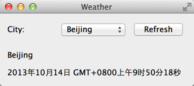

.. _access_network_2:

`66. 访问网络（2） <http://www.devbean.net/2013/10/qt-study-road-2-access-network-2/>`_
=======================================================================================

:作者: 豆子

:日期: 2013年10月31日

上一章我们了解了 NetWorker 类的简单实现。不仅如此，我们还提到了几个 C++ 开发时常用的设计模式。这些在接下来得代码中依然会用到。

现在我们先来研究下 `OpenWeatherMap 的相关 API <http://api.openweathermap.org/api>`_ 。之所以选择 OpenWeatherMap，主要是因为这个网站提供了简洁的 API 接口，非常适合示例程序，并且其开发也不需要额外申请 App ID。OpenWeatherMap 的 API 可以选择返回 JSON 或者 XML，这里我们选择使用 JSON 格式。在进行查询时，OpenWeatherMap 支持使用城市名、地理经纬度以及城市 ID，为简单起见，我们选择使用城市名。我们先来看一个例子： `http://api.openweathermap.org/data/2.5/weather?q=Beijing,cn&mode=json&units=metric&lang=zh_cn <http://api.openweathermap.org/data/2.5/weather?q=Beijing,cn&mode=json&units=metric&lang=zh_cn>`_ 。下面是这个链接的参数分析：

======== =========== ==================
参数名字 传入值      说明
-------- ----------- ------------------
q        Beijing,cn  查询中国北京的天气
mode     json        返回格式为 JSON
units    metric      返回单位为公制
lang     zh_cn       返回语言为中文
======== =========== ==================

点击链接，服务器返回一个 JSON 字符串（此时你应该能够使用浏览器看到这个字符串）：

.. code-block:: json

    {"coord":{"lon":116.397232,"lat":39.907501},"sys":{"country":"CN","sunrise":1381530122,"sunset":1381570774},"weather":[{"id":800,"main":"Clear","description":"晴","icon":"01d"}],"base":"gdps stations","main":{"temp":20,"pressure":1016,"humidity":34,"temp_min":20,"temp_max":20},"wind":{"speed":2,"deg":50},"clouds":{"all":0},"dt":1381566600,"id":1816670,"name":"Beijing","cod":200}

我们从 `这里 <http://bugs.openweathermap.org/projects/api/wiki/Weather_Data>`_ 找到 JSON 各个字段的含义。现在我们关心的是：时间（dt）；气温（temp）；气压（pressure）；湿度（humidity）和天气状况（weather）。基于此，我们设计了 WeatherInfo 类，用于封装服务器返回的信息：

.. code-block:: c++

    class WeatherDetail
    {
    public:
        WeatherDetail();
        ~WeatherDetail();

        QString desc() const;
        void setDesc(const QString &desc);

        QString icon() const;
        void setIcon(const QString &icon);

    private:
        class Private;
        friend class Private;
        Private *d;
    };

    class WeatherInfo
    {
    public:
        WeatherInfo();
        ~WeatherInfo();

        QString cityName() const;
        void setCityName(const QString &cityName);

        quint32 id() const;
        void setId(quint32 id);

        QDateTime dateTime() const;
        void setDateTime(const QDateTime &dateTime);

        float temperature() const;
        void setTemperature(float temperature);

        float humidity() const;
        void setHumidity(float humidity);

        float pressure() const;
        void setPressure(float pressure);

        QList details() const;
        void setDetails(const QList details);

    private:
        class Private;
        friend class Private;
        Private *d;
    };

    QDebug operator <<(QDebug dbg, const WeatherDetail &w);
    QDebug operator <<(QDebug dbg, const WeatherInfo &w);

WeatherInfo 和 WeatherDetail 两个类相互合作存储我们所需要的数据。由于是数据类，所以只有单纯的 setter 和 getter 函数，这里不再把源代码写出来。值得说明的是最后两个全局函数：

.. code-block:: c++

    QDebug operator <<(QDebug dbg, const WeatherDetail &w);
    QDebug operator <<(QDebug dbg, const WeatherInfo &w);

我们重写了 << 运算符，以便能够使用类似 qDebug() << weatherInfo; 这样的语句进行调试。它的实现是这样的：

.. code-block:: c++

    QDebug operator <<(QDebug dbg, const WeatherDetail &w)
    {
        dbg.nospace() << "("
                      << "Description: " << w.desc() << "; "
                      << "Icon: " << w.icon()
                      << ")";
        return dbg.space();
    }

    QDebug operator <<(QDebug dbg, const WeatherInfo &w)
    {
        dbg.nospace() << "("
                      << "id: " << w.id() << "; "
                      << "City name: " << w.cityName() << "; "
                      << "Date time: " << w.dateTime().toString(Qt::DefaultLocaleLongDate) << ": " << endl
                      << "Temperature: " << w.temperature() << ", "
                      << "Pressure: " << w.pressure() << ", "
                      << "Humidity: " << w.humidity() << endl
                      << "Details: [";
        foreach (WeatherDetail *detail, w.details()) {
            dbg.nospace() << "( Description: " << detail->desc() << ", "
                          << "Icon: " << detail->icon() << "), ";
        }
        dbg.nospace() << "] )";
        return dbg.space();
    }

这两个函数虽然比较长，但是很简单，这里不再赘述。

下面我们来看主窗口：

.. code-block:: c++

    class MainWindow : public QMainWindow
    {
        Q_OBJECT
    public:
        MainWindow(QWidget *parent = 0);
        ~MainWindow();

    private:
        class Private;
        friend class Private;
        Private *d;
    };

正如前面所说的，这里依然使用了 d 指针模式。头文件没有什么可说的。MainWindow::Private 的实现依旧简单：

.. code-block:: c++

    class MainWindow::Private
    {
    public:
        Private()
        {
            netWorker = NetWorker::instance();
        }

        void fetchWeather(const QString &cityName) const
        {
            netWorker->get(QString("http://api.openweathermap.org/data/2.5/weather?q=%1&mode=json&units=metric&lang=zh_cn").arg(cityName));
        }

        NetWorker *netWorker;
    };

我们将 MainWindow 所需要的 NetWorker 作为 MainWindow::Private 的一个成员变量。MainWindow::Private 提供了一个 fetchWeather() 函数。由于 NetWorker 提供的函数都是相当底层的，为了提供业务级别的处理，我们将这样的函数封装在 MainWindow::Private 中。当然，你也可以在 NetWorker 中直接提供类似的函数，这取决于你的系统分层设计。

.. code-block:: c++

    MainWindow::MainWindow(QWidget *parent)
        : QMainWindow(parent),
          d(new MainWindow::Private(this))
    {
        QComboBox *cityList = new QComboBox(this);
        cityList->addItem(tr("Beijing"), QLatin1String("Beijing,cn"));
        cityList->addItem(tr("Shanghai"), QLatin1String("Shanghai,cn"));
        cityList->addItem(tr("Nanjing"), QLatin1String("Nanjing,cn"));
        QLabel *cityLabel = new QLabel(tr("City: "), this);
        QPushButton *refreshButton = new QPushButton(tr("Refresh"), this);
        QHBoxLayout *cityListLayout = new QHBoxLayout;
        cityListLayout->setDirection(QBoxLayout::LeftToRight);
        cityListLayout->addWidget(cityLabel);
        cityListLayout->addWidget(cityList);
        cityListLayout->addWidget(refreshButton);

        QVBoxLayout *weatherLayout = new QVBoxLayout;
        weatherLayout->setDirection(QBoxLayout::TopToBottom);
        QLabel *cityNameLabel = new QLabel(this);
        weatherLayout->addWidget(cityNameLabel);
        QLabel *dateTimeLabel = new QLabel(this);
        weatherLayout->addWidget(dateTimeLabel);

        QWidget *mainWidget = new QWidget(this);
        QVBoxLayout *mainLayout = new QVBoxLayout(mainWidget);
        mainLayout->addLayout(cityListLayout);
        mainLayout->addLayout(weatherLayout);
        setCentralWidget(mainWidget);
        resize(320, 120);
        setWindowTitle(tr("Weather"));

        connect(d->netWorker, &NetWorker::finished, [=] (QNetworkReply *reply) {
            qDebug() << reply;
            QJsonParseError error;
            QJsonDocument jsonDocument = QJsonDocument::fromJson(reply->readAll(), &error);
            if (error.error == QJsonParseError::NoError) {
                if (!(jsonDocument.isNull() || jsonDocument.isEmpty()) && jsonDocument.isObject()) {
                    QVariantMap data = jsonDocument.toVariant().toMap();
                    WeatherInfo weather;
                    weather.setCityName(data[QLatin1String("name")].toString());
                    QDateTime dateTime;
                    dateTime.setTime_t(data[QLatin1String("dt")].toLongLong());
                    weather.setDateTime(dateTime);
                    QVariantMap main = data[QLatin1String("main")].toMap();
                    weather.setTemperature(main[QLatin1String("temp")].toFloat());
                    weather.setPressure(main[QLatin1String("pressure")].toFloat());
                    weather.setHumidity(main[QLatin1String("humidity")].toFloat());
                    QVariantList detailList = data[QLatin1String("weather")].toList();
                    QList details;
                    foreach (QVariant w, detailList) {
                        QVariantMap wm = w.toMap();
                        WeatherDetail *detail = new WeatherDetail;
                        detail->setDesc(wm[QLatin1String("description")].toString());
                        detail->setIcon(wm[QLatin1String("icon")].toString());
                        details.append(detail);
                    }
                    weather.setDetails(details);

                    cityNameLabel->setText(weather.cityName());
                    dateTimeLabel->setText(weather.dateTime().toString(Qt::DefaultLocaleLongDate));
                }
            } else {
                QMessageBox::critical(this, tr("Error"), error.errorString());
            }
            reply->deleteLater();
        });
        connect(refreshButton, &QPushButton::clicked, [=] () {
            d->fetchWeather(cityList->itemData(cityList->currentIndex()).toString());
        });
    }

    MainWindow::~MainWindow()
    {
        delete d;
        d = 0;
    }

接下来我们来看 MainWindow 的构造函数和析构函数。构造函数虽然很长但是并不复杂，主要是对界面的构建。我们这里略过这些界面的代码，直接看两个信号槽的连接。

.. code-block:: c++

    connect(d->netWorker, &NetWorker::finished, [=] (QNetworkReply *reply) {
        QJsonParseError error;
        QJsonDocument jsonDocument = QJsonDocument::fromJson(reply->readAll(), &error);
        if (error.error == QJsonParseError::NoError) {
            if (!(jsonDocument.isNull() || jsonDocument.isEmpty()) && jsonDocument.isObject()) {
                QVariantMap data = jsonDocument.toVariant().toMap();
                WeatherInfo weather;
                weather.setCityName(data[QLatin1String("name")].toString());
                QDateTime dateTime;
                dateTime.setTime_t(data[QLatin1String("dt")].toLongLong());
                weather.setDateTime(dateTime);
                QVariantMap main = data[QLatin1String("main")].toMap();
                weather.setTemperature(main[QLatin1String("temp")].toFloat());
                weather.setPressure(main[QLatin1String("pressure")].toFloat());
                weather.setHumidity(main[QLatin1String("humidity")].toFloat());
                QVariantList detailList = data[QLatin1String("weather")].toList();
                QList details;
                foreach (QVariant w, detailList) {
                    QVariantMap wm = w.toMap();
                    WeatherDetail *detail = new WeatherDetail;
                    detail->setDesc(wm[QLatin1String("description")].toString());
                    detail->setIcon(wm[QLatin1String("icon")].toString());
                    details.append(detail);
                }
                weather.setDetails(details);

                cityNameLabel->setText(weather.cityName());
                dateTimeLabel->setText(weather.dateTime().toString(Qt::DefaultLocaleLongDate));
            }
        } else {
            QMessageBox::critical(this, tr("Error"), error.errorString());
        }
        reply->deleteLater();
    });
    connect(refreshButton, &QPushButton::clicked, [=] () {
        d->fetchWeather(cityList->itemData(cityList->currentIndex()).toString());
    });

由于使用了 Qt5，我们选择新的连接语法。第一个 connect() 函数中，我们按照 API 文档中描述的那样对服务器返回的 JSON 字符串进行解析，然后将数据填充到一个 WeatherInfo 的对象。然后操作界面的两个控件显示数据。值得注意的是函数的最后一行，reply->deleteLater();。当网络请求结束时，delete 服务器返回的 QNetworkReply 对象是用户的责任。用户需要选择一个恰当的时机进行 delete 操作。但是，我们不能直接在 finiahed() 信号对应的槽函数中调用 delete 运算符。相反，我们需要使用 deleteLater() 函数，正如前面代码中显示的那样。第二个槽函数则相对简单，仅仅是重新获取新的数据。

选择我们可以运行下程序了：

