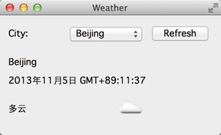

.. _access_network_3:

`67. 访问网络（3） <http://www.devbean.net/2013/11/qt-study-road-2-access-network-3/>`_
=============================================================================================

:作者: 豆子

:日期: 2013年11月05日

:ref:`上一章 <access_network_2>` 我们了解了如何使用我们设计的 NetWorker 类实现我们所需要的网络操作。本章我们将继续完善前面介绍的天气程序。

注意到我们在 WeatherDetail 类中有一个 icon 属性。到现在为止我们还没有用到这个属性。下面我们考虑如何修改我们的程序。

通过查看 `OpenWeatherMap 的相关 API <http://api.openweathermap.org/api>`_ 我们可以发现，当我们查询天气时会附带这么一个 icon 属性。这个属性其实是网站上的一个天气的图片。还是以上一章我们见到的 JSON 返回值为例：

.. code-block:: json

    {"coord":{"lon":116.397232,"lat":39.907501},"sys":{"country":"CN","sunrise":1381530122,"sunset":1381570774},"weather":[{"id":800,"main":"Clear","description":"晴","icon":"01d"}],"base":"gdps stations","main":{"temp":20,"pressure":1016,"humidity":34,"temp_min":20,"temp_max":20},"wind":{"speed":2,"deg":50},"clouds":{"all":0},"dt":1381566600,"id":1816670,"name":"Beijing","cod":200}

注意到其中的 icon:01d 这个键值对。通过文档我们知道，01d 实际对应于网站上的一张图片： `http://openweathermap.org/img/w/01d.png <http://openweathermap.org/img/w/10d.png>`_ 。这就是我们的思路：当我们获取到实际天气数据时，我们根据这个返回值从网站获取到图片，然后显示到我们的程序中。

回忆下我们的 NetWorker 类的实现。我们将其 finished() 信号与我们自己实现的槽函数连接起来，其代码大致相当于：

.. code-block:: c++

    connect(d->netWorker, &NetWorker::finished, [=] (QNetworkReply *reply) {
        ...
    });

我们将 finished() 信号与一个 Lambda 表达式连接起来，其参数就是服务器的响应值。这样一来就会有一个问题：我们实际是有两次网络请求，第一次是向服务器请求当前的天气情况，第二次是根据第一次响应值去请求一张图片。每次网络请求完成时都会发出 finished() 信号，这就要求我们在槽函数中区分当前到底是哪一个请求的返回。所以，我们需要修改下有关网络请求的代码：

.. code-block:: c++

    class NetWorker : public QObject
    {
        ...
        QNetworkReply *get(const QString &url);
        ...
    };

    ...

    QNetworkReply * NetWorker::get(const QString &url)
    {
        return d->manager->get(QNetworkRequest(QUrl(url)));
    }

首先要修改的是 NetWorker 类的 get() 函数。我们要让这个函数返回一个 QNetworkReply \* 变量。这个对象其实是 QNetworkAccessManager::get() 函数的返回值，我们简单地将其返回出来。接下来要修改的是 MainWindow::Private 的代码：

.. code-block:: c++

    class MainWindow::Private
    {
    public:
        Private(MainWindow *q) :
            mainWindow(q)
        {
            netWorker = NetWorker::instance();
        }

        void fetchWeather(const QString &cityName)
        {
            QNetworkReply *reply = netWorker->get(QString("http://api.openweathermap.org/data/2.5/weather?q=%1&mode=json&units=metric&lang=zh_cn").arg(cityName));
            replyMap.insert(reply, FetchWeatherInfo);
        }

        void fetchIcon(const QString &iconName)
        {
            QNetworkReply *reply = netWorker->get(QString("http://openweathermap.org/img/w/%1.png").arg(iconName));
            replyMap.insert(reply, FetchWeatherIcon);
        }

        NetWorker *netWorker;
        MainWindow *mainWindow;
        QMap replyMap;
    };

我们的请求是在 MainWindow::Private 私有类中完成的，为此添加了一个 QMap 属性。注意我们在原有的 fetchWeather() 和新增的 fetchIcon() 函数中都将 NetWorker::get() 函数的返回值保存下来。RemoteRequest 只是一个枚举，定义如下：

.. code-block:: c++

    enum RemoteRequest {
        FetchWeatherInfo,
        FetchWeatherIcon
    };

显然，我们的代码能够清晰地描述出我们的网络请求的返回结果对应于哪一种操作：fetchWeather() 中 NetWorker::get() 函数的返回值对应于 FetchWeatherInfo 操作，而 fetchIcon() 中 NetWorker::get() 函数的返回值则对应于 FetchWeatherIcon 操作。我们不需要区分每种操作的具体 URL 地址，因为我们的响应依照操作的不同而不同，与 URL 无关。

下面我们只看槽函数的改变：

.. code-block:: c++

    connect(d->netWorker, &NetWorker::finished, [=] (QNetworkReply *reply) {
        RemoteRequest request = d->replyMap.value(reply);
        switch (request) {
        case FetchWeatherInfo:
        {
            QJsonParseError error;
            QJsonDocument jsonDocument = QJsonDocument::fromJson(reply->readAll(), &error);
            if (error.error == QJsonParseError::NoError) {
                if (!(jsonDocument.isNull() || jsonDocument.isEmpty()) && jsonDocument.isObject()) {
                    QVariantMap data = jsonDocument.toVariant().toMap();
                    WeatherInfo weather;
                    weather.setCityName(data[QLatin1String("name")].toString());
                    QDateTime dateTime;
                    dateTime.setTime_t(data[QLatin1String("dt")].toLongLong());
                    weather.setDateTime(dateTime);
                    QVariantMap main = data[QLatin1String("main")].toMap();
                    weather.setTemperature(main[QLatin1String("temp")].toFloat());
                    weather.setPressure(main[QLatin1String("pressure")].toFloat());
                    weather.setHumidity(main[QLatin1String("humidity")].toFloat());
                    QVariantList detailList = data[QLatin1String("weather")].toList();
                    QList details;
                    foreach (QVariant w, detailList) {
                        QVariantMap wm = w.toMap();
                        WeatherDetail *detail = new WeatherDetail;
                        detail->setDesc(wm[QLatin1String("description")].toString());
                        detail->setIcon(wm[QLatin1String("icon")].toString());
                        details.append(detail);

                        QHBoxLayout *weatherDetailLayout = new QHBoxLayout;
                        weatherDetailLayout->setDirection(QBoxLayout::LeftToRight);
                        weatherDetailLayout->addWidget(new QLabel(detail->desc(), this));
                        weatherDetailLayout->addWidget(new QLabel(this));
                        weatherLayout->addLayout(weatherDetailLayout);

                        d->fetchIcon(detail->icon());
                    }
                    weather.setDetails(details);

                    cityNameLabel->setText(weather.cityName());
                    dateTimeLabel->setText(weather.dateTime().toString(Qt::DefaultLocaleLongDate));
                }
            } else {
                QMessageBox::critical(this, tr("Error"), error.errorString());
            }
            break;
        }
        case FetchWeatherIcon:
        {
            QHBoxLayout *weatherDetailLayout = (QHBoxLayout *)weatherLayout->itemAt(2)->layout();
            QLabel *iconLabel = (QLabel *)weatherDetailLayout->itemAt(1)->widget();
            QPixmap pixmap;
            pixmap.loadFromData(reply->readAll());
            iconLabel->setPixmap(pixmap);
            break;
        }
        }

        reply->deleteLater();
    });

槽函数最大的变化是，我们依照 MainWindow::Private 中保存的对应值，找到这个 reply 对应的操作类型，然后使用一个 switch 语句进行区分。注意我们在 FetchWeatherInfo 操作的 foreach 循环中增加了对 WeatherDetail 数据的显示。在末尾使用一个 d->fetchIcon(detail->icon()) 语句从网络获取对应的图片。在 FetchWeatherIcon 操作中，我们根据 QHBoxLayout 的 itemAt() 函数找到先前添加的用于显示图片的 label，然后读取 reply 的数据值，以二进制的形式加载图片。虽然代码很长，有些函数我们也是第一次见到，但是整体思路很简单。下面来看最终的运行结果：

我们今天介绍了这种技术，用于区分一个程序中的多次网络请求（这在一个应用中是经常遇到的）。当然这只是其中一种解决方案，如果你有更好的解决方案，也请留言告诉豆子~
