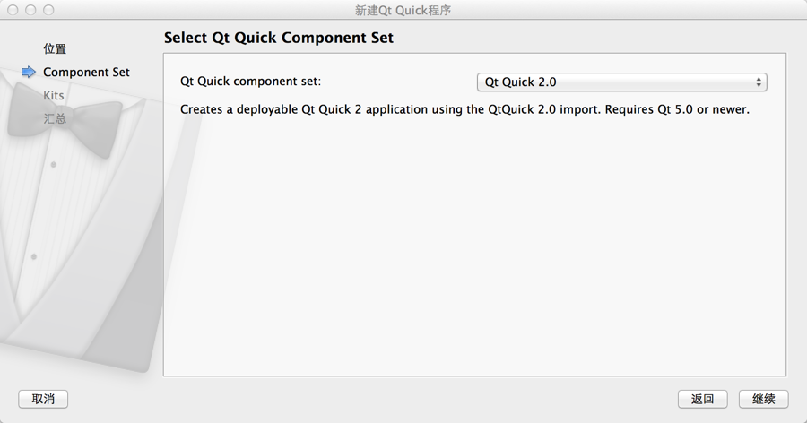
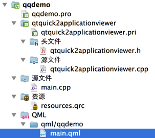
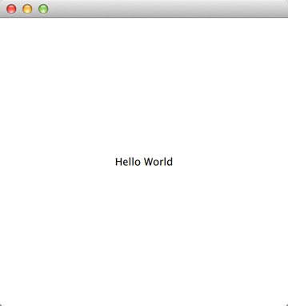

.. _qml_and_qtquick2:

`76. QML 和 QtQuick 2 <http://www.devbean.net/2013/12/qt-study-road-2-qml-and-qtquick2/>`_
==========================================================================================

:作者: 豆子

:日期: 2013年12月18日

前面我们已经了解了 Qt 的一部分内容。这部分内容全部集中在 C++ 方面。也就是说，至今为止我们的程序都是使用 C++ 语言完成的。这在 Qt 5 之前的版本中是唯一的途径。不过，自从 Qt 5 开始，情况有了变化。事实上，从 Qt 4.7 开始，Qt 引入了一种声明式脚本语言，称为 QML（Qt Meta Language 或者 Qt Modeling Language），作为 C++ 语言的一种替代。而 Qt Quick 就是使用 QML 构建的一套类库。

QML 是一种基于 JavaScript 的声明式语言。在 Qt 5 中，QML 有了长足进步，并且同 C++ 并列成为 Qt 的首选编程语言。也就是说，使用 Qt 5，我们不仅可以使用 C++ 开发 Qt 程序，而且可以使用 QML。虽然 QML 是解释型语言，性能要比 C++ 低一些，但是新版 QML 使用 V8，Qt 5.2 又引入了专为 QML 优化的 V4 引擎，使得其性能不再有明显降低。在 Nokia 发布 Qt 4.7 的时候，QML 被用于开发手机应用程序，全面支持触摸操作、流畅的动画效果等。但是在 Qt 5 中，QML 已经不仅限于开发手机应用，也可以用户开发传统的桌面程序。

QML 文档描述了一个对象树。QML 元素包含了其构造块、图形元素（矩形、图片等）和行为（例如动画、切换等）。这些 QML 元素按照一定的嵌套关系构成复杂的组件，供用户交互。

本章我们先来编写一个简单的 QML 程序，了解 QML 的基本概念。需要注意的是，这里的 Qt Quick 使用的是 Qt Quick 2 版本，与 Qt 4.x 提供的 Qt Quick 1 不兼容。

首先，使用 Qt Creator 创建一个 Qt Quick Application。在之后的 Qt Quick Component 选项中，我们选择 Qt Quick 2.0：

完成创建之后，我们可以看到一个 QML 项目所需要的基本文件。这里的项目名字为 qqdemo，而且有一个自己添加的资源文件，所以这个示意图可能与你的不同。

qtquick2applicationviewer 里面的内容是 Qt Creator 帮助我们生成的，这里面的文件一般不会修改。我们可以认为这个文件夹下的文件就是运行 QML 的一个加载器。Application Viewer 用于加载 QML 文件并将其解释显示，类似于浏览器解释运行网页。

我们真正关心的是 main.qml 里面的内容：

.. code-block:: javascript

    import QtQuick 2.0

    Rectangle {
        width: 360
        height: 360
        Text {
            text: qsTr("Hello World")
            anchors.centerIn: parent
        }
        MouseArea {
            anchors.fill: parent
            onClicked: {
                Qt.quit();
            }
        }
    }

这段代码看起来很简单，事实也的确如此。一个 QML 文档分为 import 和 declaration 两部分。前者用于引入文档中所需要的组件（有可能是类库，也可以是一个 JavaScript 文件或者另外的 QML 文件）；后者用于声明本文档中的 QML 元素。

第一行，我们使用import语句引入 QtQuick 2.0。由于这只是一个示例程序，所以我们没有引入更多的内容。

每一个 QML 有且只有一个根元素，类似于 XML 文档。这个根元素就是这个 QML 文档中定义的 QML 元素，在这个例子中就是一个Rectangle对象。注意一下这个 QML 文档的具体语法，非常类似于 JSON 的定义，使用键值对的形式区分元素属性。所以我们能够很清楚看到，我们定义了一个矩形，宽度为 360 像素，高度为 360 像素。记得我们说过，QML 文档定义了一个对象树，所以 QML 文档中元素是可以嵌套的。在这个矩形中，我们又增加了一个Text元素，顾名思义，就是一个文本。Text显示的是 Hello World 字符串，而这个字符串是由qsTr()函数返回的。qsTr()函数就是QObject::tr()函数的 QML 版本，用于返回可翻译的字符串。Text的位置则是由锚点（anchor）定义。示例中的Text位置定义为 parent 中心，其中parent属性就是这个元素所在的外部的元素。同理，我们可以看到MouseArea是充满父元素的。MouseArea还有一个onClicked属性。这是一个回调，也就是鼠标点击事件。MouseArea可以看作是可以相应鼠标事件的区域。当点击事件发出时，就会执行onClicked中的代码。这段代码其实是让整个程序退出。注意我们的MouseArea充满整个矩形，所以整个区域都可以接受鼠标事件。

当我们运行这个项目时，我们就可以看到一个宽和高都是 360 像素的矩形，中央有一行文本，鼠标点击矩形任意区域就会使其退出：

接下来我们可以改变 main.qml 文件中的“Hello World”字符串，不重新编译直接运行，就会看到运行结果也会相应的变化。这说明 QML 文档是运行时解释的，不需要经过编译。所以，利用 QML 的解释执行的特性，QML 尤其适合于快速开发和原型建模。另外，由于 QML 比 C++ 简单很多，所以 QML 也适用于提供插件等机制。
