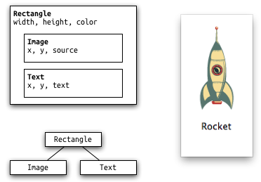

.. _qml_syntax:

`77. QML 语法 <http://www.devbean.net/2013/12/qt-study-road-2-qml-syntax/>`_
============================================================================

:作者: 豆子

:日期: 2013年12月27日

前面我们已经见识过 QML 文档。一个 QML 文档分为 import 和对象声明两部分。如果你要使用 Qt Quick，就需要 import QtQuick 2。QML 是一种声明语言，用于描述程序界面。QML 将用户界面分解成一块块小的元素，每一元素都由很多组件构成。QML 定义了用户界面元素的外观和行为；更复杂的逻辑则可以结合 JavaScript 脚本实现。这有点类似于 HTML 和 JavaScript 的关系，前者用来显示界面，后者用来定义行为。我们这部分文章有些来自于 `QmlBook <http://qmlbook.org/>`_ ，在此表示感谢！

QML 在最简单的元素关系是层次关系。子元素处于相对于父元素的坐标系统中。也就是说，子元素的 x 和 y 的坐标值始终相对于父元素。这一点比起 Graphics View Framework 要简单得多。

下面我们使用一个简单的示例文档来了解 QML 的语法：

.. code-block:: javascript

    // rectangle.qml
    import QtQuick 2.0
    // 根元素：Rectangle
    Rectangle {
        // 命名根元素
        id: root // 声明属性：<name>: <value>
        width: 120; height: 240
        color: "#D8D8D8" // 颜色属性
        // 声明一个嵌套元素（根元素的子元素）
        Image {
            id: rocket
            x: (parent.width - width)/2; y: 40 // 使用 parent 引用父元素
            source: 'assets/rocket.png'
        }
        // 根元素的另一个子元素
        Text {
            // 该元素未命名
            y: rocket.y + rocket.height + 20 // 使用 id 引用元素
            width: root.width // 使用 id 引用元素
            horizontalAlignment: Text.AlignHCenter
            text: 'Rocket'
        }
    }

第一个需要注意的是 import 语句。前面我们简单介绍过，QML 文档总要有 import 部分，用于指定该文档所需要引入的模块。通常这是一个模块名和版本号，比如这里的QtQuick 2.0。当然，我们也可以引入自己的模块或者其他文件，具体细节会在后面的章节中详细介绍。

QML文档的第二个部分是 QML 元素。一个 QML 文档有且只有一个根元素，类似 XML 文档的规定。在我们的例子中，这个根元素就是Rectangle元素。QML 元素使用 {} 包围起来。{} 之中是该元素的属性；属性以键值对name : value的形式给出。这十分类似与 JSON 语法。QML 元素可以有一个id属性，作为该元素的名字。以后我们可以直接用这个名字指代该元素，相当于该元素的指针。需要注意的是，id属性在整个 QML 文档中必须是唯一的。QML 元素允许嵌套，一个 QML 元素可以没有、可以有一个或多个子元素。子元素可以使用parent关键字访问其父元素。正如上面的例子中显示的那样，我们可以用 id，也可以用parent关键字访问其他元素。一个最佳实践是，将根元素的 id 命名为 root。这样我们就可以很方便地访问到根元素。

QML 文档的注释使用//或者/\* \*/。这同 C/C++ 或者 JavaScript 是一致的。

QML 元素的属性就是键值对，这同 JSON 是一致的。属性是一些预定义的类型，也可以有自己的初始值。比如下面的代码：

.. code-block:: javascript

    Text {
        // (1) 标识符
        id: thisLabel
        // (2) x、y 坐标
        x: 24; y: 16
        // (3) 绑定
        height: 2 * width
        // (4) 自定义属性
        property int times: 24
        // (5) 属性别名
        property alias anotherTimes: times
        // (6) 文本和值
        text: "Greetings " + times
        // (7) 字体属性组
        font.family: "Ubuntu"
        font.pixelSize: 24
        // (8) 附加属性 KeyNavigation
        KeyNavigation.tab: otherLabel
        // (9) 属性值改变的信号处理回调
        onHeightChanged: console.log('height:', height)
        // 接收键盘事件需要设置 focus
        focus: true
        // 根据 focus 值改变颜色
        color: focus?"red":"black"
    }

标识符 id 用于在 QML 文档中引用这个元素。id 并不是一个字符串，而是一个特殊的标识符类型，这是 QML 语法的一部分。如前文所述，id 在文档中必须是唯一的，并且一旦指定，不允许重新设置为另外的元素。因此，id 很像 C++ 的指针。和指针类似，id 也不能以数字开头，具体规则同 C++ 指针的命名一致。id 看起来同其它属性没有什么区别，但是，我们不能使用id反查出具体的值。例如，aElement.id是不允许的。

元素 id 应该在 QML 文档中是唯一的。实际上，QML 提供了一种动态作用域（dynamic-scoping）的机制，后加载的文档会覆盖掉前面加载的文档的相同 id。这看起来能够“更改” id 的指向，其意义是构成一个 id 的查询链。如果当前文档没有找到这个 id，那么可以在之前加载的文档中找到。这很像全局变量。不过，这种代码很难维护，因为这种机制意味着你的代码依赖于文档的加载顺序。不幸的是，我们没有办法关闭这种机制。因此，在选用 id 时，我们一定要注意唯一性这个要求，否则很有可能出现一些很难调试的问题。

属性的值由其类型决定。如果一个属性没有给值，则会使用属性的默认值。我们可以通过查看文档找到属性默认值究竟是什么。

属性可以依赖于其它属性，这种行为叫作绑定。绑定类似信号槽机制。当所依赖的属性发生变化时，绑定到这个属性的属性会得到通知，并且自动更新自己的值。例如上面的height: 2 * width。height依赖于width属性。当width改变时，height会自动发生变化，将自身的值更新为width新值的两倍。text属性也是一个绑定的例子。注意，int类型的属性会自动转换成字符串；并且在值变化时，绑定依然成立。

系统提供的属性肯定是不够的。所以 QML 允许我们自定义属性。我们可以使用property关键字声明一个自定义属性，后面是属性类型和属性名，最后是属性值。声明自定义属性的语法是property <type> <name> : <value>。如果没有默认值，那么将给出系统类型的默认值。

我们也可以声明一个默认属性，例如：

.. code-block:: javascript

    // MyLabel.qml
    import QtQuick 2.0
    Text {
        default property var defaultText
        text: "Hello, " + defaultText.text
    }

在 MyLabel 中，我们声明了一个默认属性defaultText。注意这个属性的类型是var。这是一种通用类型，可以保存任何类型的属性值。

默认属性的含义在于，如果一个子元素在父元素中，但是没有赋值给父元素的任何属性，那么它就成为这个默认属性。利用上面的MyLabel，我们可以有如下的代码：

.. code-block:: javascript

    MyLabel {
        Text { text: "world" }
    }

MyLabel.qml 实际可以直接引入到另外的 QML 文档，当做一个独立的元素使用。所以，我们可以把 MyLabel 作为根元素。注意 MyLabel 的子元素 Text 没有赋值给 MyLabel 的任何属性，所以，它将自动成为默认属性 defaultText 的值。因此，上面的代码其实等价于：

.. code-block:: javascript

    MyLabel {
        defaultText：Text { text: "world" }
    }

如果仔细查看代码你会发现，这种默认属性的写法很像嵌套元素。其实嵌套元素正是利用这种默认属性实现的。所有可以嵌套元素的元素都有一个名为data的默认属性。所以这些嵌套的子元素都是添加到了data属性中。

属性也可以有别名。我们使用alias关键字声明属性的别名：property alias <name> : <reference>。别名和引用类似，只是给一个属性另外一个名字。C++ 教程里面经常说，“引用即别名”，这里就是“别名即引用”。这种技术对于导出属性非常有用。例如，我们希望让一个子元素的属性外部可用，那么就可以给这个属性一个别名，让外部文档通过这个别名访问这个属性。别名不需要特别声明属性类型，它使用被引用属性的类型或者 id。需要注意的是，属性别名在组件完全初始化之后才可用。因此，下面的代码是非法的：

.. code-block:: javascript

    property alias myLabel: label
    myLabel.text: "error" // 错误！此时组件还没有初始化
    property alias myLabelText: myLabel.text // 错误！不能为属性别名的属性创建别名

属性也可以分组。分组可以让属性更具结构化。上面示例中的font属性另外一种写法是：

.. code-block:: javascript

    font { family: "Ubuntu"; pixelSize: 24 }

有些属性可以附加到元素本身，其语法是<Element>.<property>: <value>。

每一个属性都可以发出信号，因而都可以关联信号处理函数。这个处理函数将在属性值变化时调用。这种值变化的信号槽命名为 on + 属性名 + Changed，其中属性名要首字母大写。例如上面的例子中，height属性变化时对应的槽函数名字就是onHeightChanged。

QML 和 JavaScript 关系密切。我们将在后面的文章中详细解释，不过现在可以先看个简单的例子：

.. code-block:: javascript

    Text {
        id: label
        x: 24; y: 24
        // 自定义属性，表示空格按下的次数
        property int spacePresses: 0
        text: "Space pressed: " + spacePresses + " times"
        // (1) 文本变化的响应函数
        onTextChanged: console.log("text changed to:", text)
        // 接收键盘事件，需要设置 focus 属性
        focus: true
        // (2) 调用 JavaScript 函数
        Keys.onSpacePressed: {
            increment()
        }
        // 按下 Esc 键清空文本
        Keys.onEscapePressed: {
            label.text = ''
        }
        // (3) 一个 JavaScript 函数
        function increment() {
            spacePresses = spacePresses + 1
        }
    }

Text 元素会发出textChanged信号。我们使用 on + 信号名，信号名首字母大写的属性表示一个槽函数。也就是说，当 Text 元素发出textChanged信号时，onTextChanged就会被调用。类似的，onSpacePressed属性会在空格键按下时被调用。此时，我们调用了一个 JavaScript 函数。

QML 文档中可以定义 JavaScript 函数，语法同普通 JavaScript 函数一样。

QML 的绑定机制同 JavaScript 的赋值运算符有一定类似。它们都可以将右面的值赋值给前面。不同之处在于，绑定会在后面的值发生改变时，重新计算前面的值；但是赋值只是一次性的。
