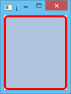
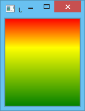
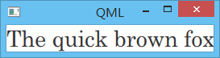
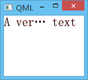
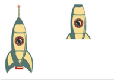

.. _qml_basic_element:

`78. QML 基本元素 <http://www.devbean.net/2014/01/qt-study-road-2-qml-basic-element/>`_
=======================================================================================

:作者: 豆子

:日期: 2013年01月09日

QML 基本元素可以分为可视元素和不可视元素两类。可视元素（例如前面提到过的Rectangle）具有几何坐标，会在屏幕上占据一块显示区域。不可视元素（例如Timer）通常提供一种功能，这些功能可以作用于可视元素。

本章我们将会集中介绍集中最基本的可视元素：Item、Rectangle、Text、Image和MouseArea。

Item是所有可视元素中最基本的一个。它是所有其它可视元素的父元素，可以说是所有其它可视元素都继承Item。Item本身没有任何绘制，它的作用是定义所有可视元素的通用属性：

========== ==============================
分组       属性
---------- ------------------------------
几何       x和y用于定义元素左上角的坐标，width和height则定义了元素的范围。z定义了元素上下的层叠关系。
布局       anchors（具有 left、right、top、bottom、vertical 和 horizontal center 等属性）用于定位元素相对于其它元素的margins的位置。
键盘处理   Key和KeyNavigation属性用于控制键盘；focus属性则用于启用键盘处理，也就是获取焦点。
变形       提供scale和rotate变形以及更一般的针对 x、y、z 坐标值变换以及transformOrigin点的transform属性列表。
可视化     opacity属性用于控制透明度；visible属性用于控制显示/隐藏元素；clip属性用于剪切元素；smooth属性用于增强渲染质量。
状态定义   提供一个由状态组成的列表states和当前状态state属性；同时还有一个transitions列表，用于设置状态切换时的动画效果。
========== ==============================

前面我们说过，Item定义了所有可视元素都具有的属性。所以在下面的内容中，我们会再次详细介绍这些属性。

除了定义通用属性，Item另外一个重要作用是作为其它可视元素的容器。从这一点来说，Item非常类似于 HTML 中 div 标签的作用。

Rectangle继承了Item，并在Item的基础之上增加了填充色属性、边框相关的属性。为了定义圆角矩形，Rectangle还有一个radius属性。下面的代码定义了一个宽 100 像素、高 150 像素，浅金属蓝填充，红色 4 像素的边框的矩形：

.. code-block:: javascript

    Rectangle {
        id: rect
        width: 100
        height: 150
        color: "lightsteelblue"
        border {
            color: "#FF0000"
            width: 4
        }
        radius: 8
    }

QML 中的颜色值可以使用颜色名字，也可以使用 # 十六进制的形式。这里的颜色名字同 SVG 颜色定义一致，具体可以参见 `这个网页 <http://www.w3.org/TR/css3-color/#svg-color>`_ 。

Rectangle除了color属性之外，还有一个gradient属性，用于定义使用渐变色填充。例如：

.. code-block:: javascript

    Rectangle {
        width: 100
        height: 150
        gradient: Gradient {
            GradientStop { position: 0.0; color: "red" }
            GradientStop { position: 0.33; color: "yellow" }
            GradientStop { position: 1.0; color: "green" }
        }
        border.color: "slategray"
    }

gradient要求一个Gradient对象。该对象需要一个GradientStop的列表。我们可以这样理解渐变：所谓渐变，就是我们指定在某个位置必须是某种颜色，这期间的过渡色则由计算而得。GradientStop对象就是用于这种指定，它需要两个属性：position和color。前者是一个 0.0 到 1.0 的浮点数，说明 y 轴方向的位置，例如元素的最顶部是 0.0，最底部是 1.0，介于最顶和最底之间的位置可以用这么一个浮点数表示，也就是一个比例；后者是这个位置的颜色值。例如上面的GradientStop { position: 0.33; color: "yellow" }说明在从上往下三分之一处是黄色。当前最新版本的 QML（Qt 5.2）只支持 y 轴方向的渐变，如果需要 x 轴方向的渐变，则需要执行旋转操作，我们会在后文说明。另外，当前版本 QML 也不支持角度渐变。如果你需要角度渐变，那么最好选择一张事先制作的图片。这段代码的执行结果如下：

需要注意的是，Rectangle必须同时指定（显式地或隐式地）宽和高，否则的话是不能在屏幕上面显示出来的。这通常是一个常见的错误。

如果需要显示文本，你需要使用Text元素。Text元素最重要的属性当然就是text属性。这个属性类型是string。Text元素会根据文本和字体计算自己的初始宽度和高度。字体则可以通过字体属性组设置（例如font.family、font.pixelSize等）。如果要设置文本颜色，只需要设置color属性。Text最简单的使用如下：

.. code-block:: javascript

    Text {
        text: "The quick brown fox"
        color: "#303030"
        font.family: "Century"
        font.pixelSize: 28
    }

运行结果：

Text元素中的文本可以使用horizontalAlignment和verticalAlignment属性指定对齐方式。为了进一步增强文本渲染，我们还可以使用style和styleColor两个属性。这两个属性允许我们指定文本的显示样式和这些样式的颜色。对于很长的文本，通常我们会选择在文本末尾使用 … ，此时我们需要使用elide属性。elide属性还允许你指定 … 的显示位置。如果不希望使用这种显示方式，我们还可以选择通过wrapMode属性指定换行模式。例如下面的代码：

.. code-block:: javascript

    Text {
        width: 160
        height: 120
        text: "A very very long text"
        elide: Text.ElideMiddle
        style: Text.Sunken
        styleColor: '#FF4444'
        verticalAlignment: Text.AlignTop
        font {
            pixelSize: 24
        }
    }

这里的Text元素的文本省略号位置这一行文本的中部；具有一个 #FF4444 颜色的样式 Sunken。

Text元素的作用是显示文本。它不会显示文本的任何背景，这是另外的元素需要完成的事情。

Image元素则用于显示图像。目前 QML 支持的图像格式有 PNG、JPG、GIF 和 BMP 等。除此之外，我们也可以直接给source属性一个 URL 来自动从网络加载图片，也可以通过fillMode属性设置改变大小的行为。例如下面代码片段：

.. code-block:: javascript

    Image {
        x: 12;
        y: 12
        // width: 48
        // height: 118
        source: "assets/rocket.png"
    }
     
    Image {
        x: 112;
        y: 12
        width: 48
        height: 118/2
        source: "assets/rocket.png"
        fillMode: Image.PreserveAspectCrop
        clip: true
    }

注意这里我们说的 URL，可以是本地路径（./images/home.png），也可以使网络路径（http://example.org/home.png）。这也是 QML 的一大特色：网络透明。如果还记得先前我们尝试做的那个天气预报程序，那时候为了从网络加载图片，我们费了很大的精力。但是在 QML 中，这都不是问题。如果一个 URL 是网络的，QML 会自动从这个地址加载对应的资源。

上面的代码中，我们使用了Image.PreserveAspectCrop，意思是等比例切割。此时，我们需要同时设置clip属性，避免所要渲染的对象超出元素范围。

最后一个我们要介绍的基本元素是MouseArea。顾名思义，这个元素用于用户交互。这是一个不可见的矩形区域，用于捕获鼠标事件。我们在前面的例子中已经见过这个元素。通常，我们会将这个元素与一个可视元素结合起来使用，以便这个可视元素能够与用户交互。例如：

.. code-block:: javascript

    Rectangle {
        id: rect1
        x: 12;
        y: 12
        width: 76;
        height: 96
        color: "lightsteelblue"
        MouseArea {
            /* ~~ */
        }
    }

MouseArea是 QtQuick 的重要组成部分，它将可视化展示与用户输入控制解耦。通过这种技术，你可以显示一个较小的元素，但是它有一个很大的可交互区域，以便在界面显示与用户交互之间找到一个平衡（如果在移动设备上，较小的区域非常不容易被用户成功点击。苹果公司要求界面的交互部分最少要有 40 像素以上，才能够很容易被手指点中）。
