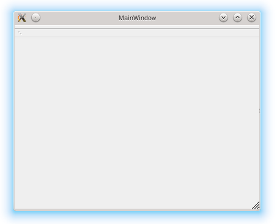
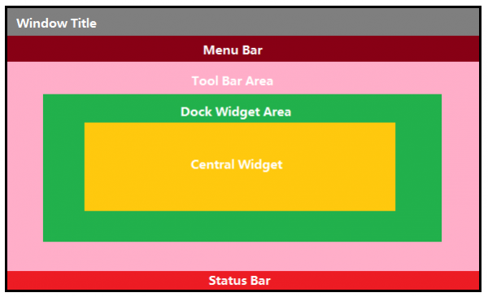

.. _mainwindow:

`7. MainWindow 简介 <http://www.devbean.net/2012/08/qt-study-road-2-mainwindow/>`_
==================================================================================

:作者: 豆子

:日期: 2012年08月29日

:ref:`前面一篇 <modules>` 大致介绍了 Qt 各个模块的相关内容，目的是对 Qt 框架有一个高屋建瓴般的了解。从现在开始，我们将开始尝试使用 Qt 开始新的历程。由于我们已经比较详细地介绍过信号槽的相关内容，因此我们可以用一个新的程序开始进一步的学习，同时对信号槽有一个比较深入的理解。

QMainWindow 是 Qt 框架带来的一个预定义好的主窗口类。所谓主窗口，就是一个普通意义上的应用程序（不是指游戏之类的那种）最顶层的窗口。比如你现在正在使用的浏览器，那么主窗口就是这个浏览器窗口。试着回想一下经典的主窗口，通常是由一个标题栏，一个菜单栏，若干工具栏和一个任务栏。在这些子组件之间则是我们的工作区。事实上，QMainWindow 正是这样的一种布局。

下面我们新建一个工程。还记得在新建工程的时候，Qt Creator 通常会帮助我们创建一个 MainWindow 吗？我们曾经为了介绍信号槽，将 main() 函数做了修改。现在我们直接使用 Qt Creator 生成的代码来编译运行一下：

.. code-block:: c++

	#include <QApplication>
	#include "mainwindow.h"
	 
	int main(int argc, char* argv[])
	{
	    QApplication app;
	 
	    MainWindow win;
	    win.show();
	 
	    return app.exec();
	}

在 openSUSE 上运行结果如下：

我们仔细看看这个窗口。虽然不太明显，但它实际上分成了几个部分：

主窗口的最上面是 Window Title，也就是标题栏，通常用于显示标题和控制按钮，比如最大化、最小化和关闭等。通常，各个图形界面框架都会使用操作系统本地代码来生成一个窗口。所以，你会看到在 KDE 上面，主窗口的标题栏是 KDE 样式的；在 Windows 平台上，标题栏是 Windows 风格的。如果你不喜欢本地样式，比如 QQ 这种，它其实是自己将标题栏绘制出来，这种技术称为 DirectUI，也就是无句柄绘制，这不在本文的讨论范畴。Window Title 下面是 Menu Bar，也就是菜单栏，用于显示菜单。窗口最底部是 Status Bar，称为状态栏。当我们鼠标滑过某些组件时，可以在状态栏显示某些信息，比如浏览器中，鼠标滑过带有链接的文字，你会在底部看到链接的实际 URL。

出去上面说的三个横向的栏，中间是以矩形区域表示。我们可以看出，最外层称为 Tool Bar Area，用于显示工具条区域。之所以是矩形表示，是因为，Qt 的主窗口支持多个工具条。你可以将工具条拖放到不同的位置，因此这里说是 Area。我们可以把几个工具条并排显示在这里，就像 Word2003 一样，也可以将其分别放置，类似 Photoshop。在工具条区域内部是 Dock Widget Area，这是停靠窗口的显示区域。所谓停靠窗口，就像 Photoshop 的工具箱一样，可以停靠在主窗口的四周，也可以浮动显示。主窗口最中间称为 Central Widget，就是我们程序的工作区。通常我们会将程序最主要的工作区域放置在这里，类似 Word 的稿纸或者 Photoshop 的画布等等。

对于一般的 Qt 应用程序，我们所需要做的，就是编写我们的主窗口代码，主要是向其中添加各种组件，比如菜单、工具栏等，当然，最重要的就是当中的工作区。当我们将这些都处理完毕之后，基本上程序的工具也可以很好地实现。

通常我们的程序主窗口会继承自 QMainWindow，以便获得 QMainWindow 提供的各种便利的函数。这也是 Qt Creator 生成的代码所做的。

由于 QMainWindow 这个类在 Qt 5 中并没有什么改变，因此上面的代码可以直接拿到 Qt 4 中进行编译。事实上，我们使用 Qt Creator 生成的代码也是可以直接在 Qt 4 中编译。只不过需要注意一点：Qt 4 中没有 widgets 模块，因此在 pro 文件中，我们通常需要这么来写：

.. code-block:: none

	QT += core gui
	greaterThan(QT_MAJOR_VERSION, 4): QT += widgets

	TARGET    = qtdemo
	TEMPLATE  = app

	SOURCES  += main.cpp \
	        mainwindow.cpp

	HEADERS  += mainwindow.h

简单解释一下 pro 文件。首先，我们定义了 QT，用于告诉编译器，需要使用哪些模块。这些模块都在前面章节中有过介绍。我们通常需要添加 core 和 gui。第二行，如果 Qt 的主版本号（QT_MAJOR_VERSION）大于 4，也就是 Qt 5，则需要另外添加 widgets（因为在 Qt 5 中，所有组件都是在 widgets 模块定义的）。TARGET 是生成的程序的名字。TEMPLATE 是生成 makefile 所使用的模板，比如 app 就是编译成一个可执行程序，而 lib 则是编译成一个链接库（默认是动态链接库）。SOURCES 和 HEADERS 顾名思义，就是项目所需要的源代码文件和头文件。现在，我们只需使用默认的 pro 文件即可。以后随着项目的不断增大，pro 文件通常会非常复杂。
