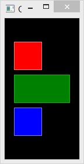
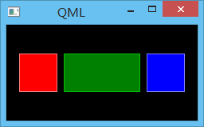
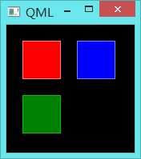
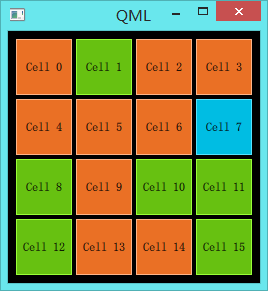

.. _positioner:

`80. 定位器 <http://www.devbean.net/2014/01/qt-study-road-2-positioner/>`_
==========================================================================

:作者: 豆子

:日期: 2014年01月29日

QML 提供了很多用于定位的元素。这些元素叫做定位器，都包含在 QtQuick 模块。这些定位器主要有 Row、Column、Grid和Flow等。

为了介绍定位器，我们先添加三个简单的组件用于演示：

首先是RedRectangle，

.. code-block:: javascript

    import QtQuick 2.0

    Rectangle {
        width: 48
        height: 48
        color: "red"
        border.color: Qt.lighter(color)
    }

然后是BlueRectangle，

.. code-block:: javascript

    import QtQuick 2.0

    Rectangle {
        width: 48
        height: 48
        color: "blue"
        border.color: Qt.lighter(color)
    }

最后是GreenRectangle，

.. code-block:: javascript

    import QtQuick 2.0

    Rectangle {
        width: 48
        height: 48
        color: "green"
        border.color: Qt.lighter(color)
    }

这三个组件都很简单，仅有的区别是颜色不同。这是一个 48×48 的矩形，分别是红、黄、蓝三种颜色。注意，我们把边框颜色设置为Qt.lighter(color)，也就是比填充色浅一些的颜色，默认是填充色的 50%。

Column将子元素按照加入的顺序从上到下，在同一列排列出来。spacing属性用于定义子元素之间的间隔：

.. code-block:: javascript

    import QtQuick 2.0

    Rectangle {
        id: root
        width: 120
        height: 240
        color: "black"

        Column {
            id: row
            anchors.centerIn: parent
            spacing: 8
            RedRectangle { }
            GreenRectangle { width: 96 }
            BlueRectangle { }
        }
    }

运行结果如下：

注意，我们按照红、绿、蓝的顺序加入了子组件，Column按照同样的顺序把它们添加进来。其中，我们独立设置了绿色矩形的宽度，这体现了我们后来设置的属性覆盖了组件定义时设置的默认值。anchors是另外一种布局方式，指定该组件与父组件的相对关系。我们会在后面的章节详细介绍这种布局。

与Column类似，Row将其子组件放置在一行的位置，既可以设置从左向右，也可以设置从右向左，这取决于layoutDirection属性。同样，它也有spacing属性，用于指定子组件之间的间隔：

.. code-block:: javascript

    import QtQuick 2.0

    Rectangle {
        id: root
        width: 240
        height: 120
        color: "black"

        Row {
            id: row
            anchors.centerIn: parent
            spacing: 8
            RedRectangle { }
            GreenRectangle { width: 96 }
            BlueRectangle { }
        }
    }

这段代码与前面的非常类似。我们可以运行下看看结果：

运行结果同前面的也非常类似。这里不再赘述。

Grid元素将其子元素排列为一个网格。它需要制定rows和columns属性，也就是行和列的数值。如果二者有一个不显式设置，则另外一个会根据子元素的数目计算出来。例如，如果我们设置为 3 行，一共放入 6 个元素，那么列数会自动计算为 2。flow和layoutDirection属性则用来控制添加到网格的元素的顺序。同样，Grid元素也有spacing属性。我们还是看一个简单的例子：

.. code-block:: javascript

    import QtQuick 2.0

    Rectangle {
        id: root
        width: 200
        height: 200
        color: "black"

        Grid {
            id: grid
            rows: 2
            anchors.centerIn: parent
            spacing: 8
            RedRectangle { }
            RedRectangle { }
            RedRectangle { }
            RedRectangle { }
            RedRectangle { }
        }
    }

同前面的代码类似。需要注意的是，我们仅设定了Grid的rows属性为 2，添加了 5 个子元素，那么，它的columns属性会自动计算为 3。运行结果也是类似的：

.. image:: imgs/80/qml-grid.png

最后一个定位器是Flow。顾名思义，它会将其子元素以流的形式显示出来。我们使用flow和layoutDirection两个属性来控制显示方式。它可以从左向右横向布局，也可以从上向下纵向布局，或者反之。初看起来，这种布局方式与Column和Row极其类似。不同之处在于，添加到Flow里面的元素，当Flow的宽度或高度不足时，这些元素会自动换行。因此，为了令Flow正确工作，我们需要指定其宽度或者高度。这种指定既可以是显式的，也可以依据父元素计算而得。来看下面的例子：

.. code-block:: javascript

    import QtQuick 2.0

    Rectangle {
        id: root
        width: 160
        height: 160
        color: "black"

        Flow {
            anchors.fill: parent
            anchors.margins: 20
            spacing: 20
            RedRectangle { }
            BlueRectangle { }
            GreenRectangle { }
        }
    }

运行结果是这样的：

注意，我们每个色块的边长都是 48px，整个主窗口的宽是 160px，Flow元素外边距 20px，因此Flow的宽度其实是 160px – 20px – 20px = 120px。Flow子元素间距为 20px，两个子元素色块所占据的宽度就已经是 48px + 20px + 48px = 116px，3 个则是 116px + 20px + 48px = 184px > 160px，因此，默认窗口大小下一行只能显示两个色块，第三个色块自动换行。当我们拖动改变窗口大小时，可以观察Flow元素是如何工作的。

最后，我们再来介绍一个经常结合定位器一起使用的元素：Repeater。Repeater非常像一个for循环，它能够遍历数据模型中的元素。下面来看代码：

.. code-block:: javascript

    import QtQuick 2.0

    Rectangle {
        id: root
        width: 252
        height: 252
        color: "black"
        property variant colorArray: ["#00bde3", "#67c111", "#ea7025"]

        Grid {
            anchors.fill: parent
            anchors.margins: 8
            spacing: 4
            Repeater {
                model: 16
                Rectangle {
                    width: 56; height: 56
                    property int colorIndex: Math.floor(Math.random()*3)
                    color: root.colorArray[colorIndex]
                    border.color: Qt.lighter(color)
                    Text {
                        anchors.centerIn: parent
                        color: "black"
                        text: "Cell " + index
                    }
                }
            }
        }
    }

结合运行结果来看代码：

这里，我们将Repeater同Grid一起使用，可以理解成，Repeater作为Grid的数据提供者。Repeater的model可以是任何能够接受的数据模型，并且只能重复基于Item的组件。我们可以将上面的代码理解为：重复生成 16 个如下定义的Rectangle元素。首先，我们定义了一个颜色数组colorArray。Repeater会按照model属性定义的个数循环生成其子元素。每一次循环，Repeater都会创建一个矩形作为自己的子元素。这个新生成的矩形的颜色按照Math.floor(Math.random()*3)的算法计算而得（因此，你在本地运行代码时很可能与这里的图片不一致）。这个算法会得到 0，1，2 三者之一，用于选择数组colorArray中预定义的颜色。由于 JavaScript 是 QtQuick 的核心部分，所以 JavaScript 标准函数都是可用的。

Repeater会为每一个子元素注入一个index属性，也就是当前的循环索引（例子中即 0、1 直到 15）。我们可以在子元素定义中直接使用这个属性，就像例子中给Text赋值那样。

注意，在Repeater时，我们可能需要注意性能问题。处理很大的数据模型，或者需要动态获取数据时，Repeater这种代码就非常吃力了，我们需要另外的实现。后面的章节中，我们会再来讨论这个问题。这里只需要了解，Repeater不适用于处理大量数据或者动态数据，仅适用于少量的静态数据的呈现。