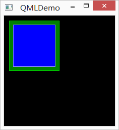
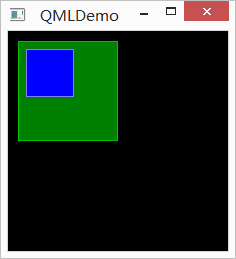
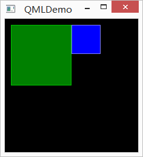
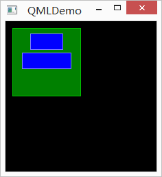
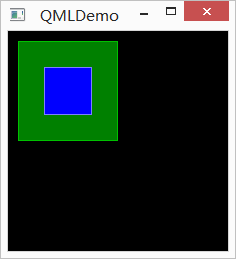
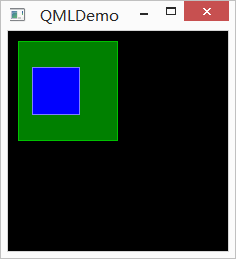

.. _qml_layout:

`81. 元素布局 <http://www.devbean.net/2014/02/qt-study-road-2-qml-layout/>`_
============================================================================

:作者: 豆子

:日期: 2014年02月17日

上一章我们介绍了 QML 中用于定位的几种元素，被称为定位器。除了定位器，QML 还提供了另外一种用于布局的机制。我们将这种机制成为锚点（anchor）。锚点允许我们灵活地设置两个元素的相对位置。它使两个元素之间形成一种类似于锚的关系，也就是两个元素之间形成一个固定点。锚点的行为类似于一种链接，它要比单纯地计算坐标改变更强。由于锚点描述的是相对位置，所以在使用锚点时，我们必须指定两个元素，声明其中一个元素相对于另外一个元素。锚点是Item元素的基本属性之一，因而适用于所有 QML 可视元素。

一个元素有 6 个主要的锚点的定位线，如下图所示：

.. image:: imgs/81/qml-anchors.png

这 6 个定位线分别是：top、bottom、left、right、horizontalCenter和verticalCenter。对于Text元素，还有一个baseline锚点。每一个锚点定位线都可以结合一个偏移的数值。其中，top、bottom、left和right称为外边框；horizontalCenter、verticalCenter和baseline称为偏移量。

下面，我们使用例子来说明这些锚点的使用。首先，我们需要重新定义一下上一章使用过的BlueRectangle组件：

.. code-block:: javascript

    import QtQuick 2.0

    Rectangle {
        width: 48
        height: 48
        color: "blue"
        border.color: Qt.lighter(color)

        MouseArea {
            anchors.fill: parent
            drag.target: parent
        }
    }

简单来说，我们在BlueRectangle最后增加了一个MouseArea组件。前面的章节中，我们简单使用了这个组件。顾名思义，这是一个用于处理鼠标事件的组件。之前我们使用了它处理鼠标点击事件。这里，我们使用了其拖动事件。anchors.fill: parent一行的含义马上就会解释；drag.target: parent则说明拖动目标是parent。我们的拖动对象是MouseArea的父组件，也就是BlueRectangle组件。

接下来看第一个例子：

代码如下：

.. code-block:: javascript

    import QtQuick 2.0

    Rectangle {
        id: root
        width: 220
        height: 220
        color: "black"

        GreenRectangle {
            x: 10
            y: 10
            width: 100
            height: 100
            BlueRectangle {
                width: 12
                anchors.fill: parent
                anchors.margins: 8
            }
        }
    }

在这个例子中，我们使用anchors.fill设置内部蓝色矩形的锚点为填充（fill），填充的目的对象是parent；填充边距是 8px。注意，尽管我们设置了蓝色矩形宽度为 12px，但是因为锚点的优先级要高于宽度属性设置，所以蓝色矩形的实际宽度是 100px – 8px – 8px = 84px。

第二个例子：

代码如下：

.. code-block:: javascript

    import QtQuick 2.0

    Rectangle {
        id: root
        width: 220
        height: 220
        color: "black"

        GreenRectangle {
            x: 10
            y: 10
            width: 100
            height: 100
            BlueRectangle {
                width: 48
                y: 8
                anchors.left: parent.left
                anchors.leftMargin: 8
            }
        }
    }

这次，我们使用anchors.left设置内部蓝色矩形的锚点为父组件的左边线（parent.left）；左边距是 8px。另外，我们可以试着拖动蓝色矩形，看它的移动方式。在我们拖动时，蓝色矩形只能沿着距离父组件左边 8px 的位置上下移动，这是由于我们设置了锚点的缘故。正如我们前面提到过的，锚点要比单纯地计算坐标改变的效果更强，更优先。

第三个例子：

代码如下：

.. code-block:: javascript

    import QtQuick 2.0

    Rectangle {
        id: root
        width: 220
        height: 220
        color: "black"

        GreenRectangle {
            x: 10
            y: 10
            width: 100
            height: 100
            BlueRectangle {
                width: 48
                anchors.left: parent.right
            }
        }
    }

这里，我们修改代码为anchors.left: parent.right，也就是将组件锚点的左边线设置为父组件的右边线。效果即如上图所示。当我们拖动组件时，依然只能上下移动。

下一个例子：

代码如下：

.. code-block:: javascript

    import QtQuick 2.0

    Rectangle {
        id: root
        width: 220
        height: 220
        color: "black"

        GreenRectangle {
            x: 10
            y: 10
            width: 100
            height: 100

            BlueRectangle {
                id: blue1
                width: 48; height: 24
                y: 8
                anchors.horizontalCenter: parent.horizontalCenter
            }
            BlueRectangle {
                id: blue2
                width: 72; height: 24
                anchors.top: blue1.bottom
                anchors.topMargin: 4
                anchors.horizontalCenter: blue1.horizontalCenter
            }
        }
    }

这算是一个稍微复杂的例子。这里有两个蓝色矩形：blue1和blue2。blue1的锚点水平中心线设置为父组件的水平中心；blue2的锚点上边线相对于blue1的底部，其中边距为 4px，另外，我们还增加了一个水平中线为blue1的水平中线。这样，blue1相对于父组件，blue2相对于blue1，这样便决定了三者之间的相对关系。当我们拖动蓝色矩形时可以发现，blue1和blue2的相对位置始终不变，因为我们已经明确指定了这种相对位置，而二者可以像一个整体似的同时上下移动（因为我们没有指定其中任何一个的上下边距与父组件的关系）。

另外一个例子：

代码如下：

.. code-block:: javascript

    import QtQuick 2.0

    Rectangle {
        id: root
        width: 220
        height: 220
        color: "black"

        GreenRectangle {
            x: 10
            y: 10
            width: 100
            height: 100

            BlueRectangle {
                width: 48
                anchors.centerIn: parent
            }
        }
    }

与第一个例子类似，我们使用的是anchors.centerIn: parent将蓝色矩形的中心固定在父组件的中心。由于我们已经指明是中心，所以也不能拖动这个蓝色矩形。

最后一个例子：

代码如下：

.. code-block:: javascript

    import QtQuick 2.0

    Rectangle {
        id: root
        width: 220
        height: 220
        color: "black"

        GreenRectangle {
            x: 10
            y: 10
            width: 100
            height: 100

            BlueRectangle {
                width: 48
                anchors.horizontalCenter: parent.horizontalCenter
                anchors.horizontalCenterOffset: -12
                anchors.verticalCenter: parent.verticalCenter
            }
        }
    }

上一个例子中，anchors.centerIn: parent可以看作等价于anchors.horizontalCenter: parent.horizontalCenter和anchors.verticalCenter: parent.verticalCenter。而这里，我们设置了anchors.horizontalCenterOffset为 -12，也就是向左偏移 12px。当然，我们也可以在anchors.centerIn: parent的基础上增加anchors.horizontalCenterOffset的值，二者是等价的。由于我们在这里指定的相对位置已经很明确，拖动也是无效的。

至此，我们简单介绍了 QML 中定位器和锚点的概念。看起来这些元素和机制都很简单，但是，通过有机地结合，足以灵活应对更复杂的场景。我们所要做的就是不断熟悉、深化对这些定位布局技术的理解。