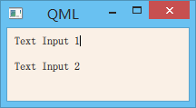
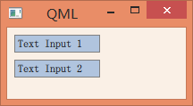

.. _qml_input_elements:

`82. 输入元素 <http://www.devbean.net/2014/03/qt-study-road-2-qml-input-elements/>`_
====================================================================================

:作者: 豆子

:日期: 2014年03月17日

前面的章节中，我们看到了作为输入元素的MouseArea，用于接收鼠标的输入。下面，我们再来介绍关于键盘输入的两个元素：TextInput和TextEdit。

TextInput是单行的文本输入框，支持验证器、输入掩码和显示模式等。

.. code-block:: javascript

    import QtQuick 2.0
     
    Rectangle {
        width: 200
        height: 80
        color: "linen"
     
        TextInput {
            id: input1
            x: 8; y: 8
            width: 96; height: 20
            focus: true
            text: "Text Input 1"
        }
     
        TextInput {
            id: input2
            x: 8; y: 36
            width: 96; height: 20
            text: "Text Input 2"
        }
    }

注意，我们这里放置了两个TextInput，用户可以通过点击输入框改变焦点。如果我们想支持键盘导航，可以添加KeyNavigation附加属性。

.. code-block:: javascript

    import QtQuick 2.0

    Rectangle {
        width: 200
        height: 80
        color: "linen"

        TextInput {
            id: input1
            x: 8; y: 8
            width: 96; height: 20
            focus: true
            text: "Text Input 1"
            KeyNavigation.tab: input2
        }

        TextInput {
            id: input2
            x: 8; y: 36
            width: 96; height: 20
            text: "Text Input 2"
            KeyNavigation.tab: input1
        }
    }

KeyNavigation是一个附加属性。当用户点击了指定的按键时，属性指定的组件就会获得焦点。附加属性类似于普通属性，但是又有所区别。普通的属性隶属于这个类型；附加属性一般用于修饰或补充目标类型。比如这里的KeyNavigation.tab并不是TextInput的普通属性，仅仅是用来说明TextInput的一种特征。附加属性的一般语法是类型.属性名，以此为例，类型就是KeyNavigation，属性名就是tab。

与QLineEdit不同，QML 的文本出入组件只有一个闪动的光标和用户输入的文本，没有边框等可视元素。因此，为了能够让用户意识到这是一个可输入元素，通常需要一些可视化修饰，比如绘制一个矩形框。当我们这么做的时候，创建一个完整的组件可能是更好的选择，只是要记得导出所需要的属性，以便外部使用。按照这种思路，我们创建一个组件：

.. code-block:: javascript

    // LineEdit.qml

    import QtQuick 2.0

    Rectangle {
        width: 96;
        height: input.height + 8
        color: "lightsteelblue"
        border.color: "gray"

        property alias text: input.text
        property alias input: input

        TextInput {
            id: input
            anchors.fill: parent
            anchors.margins: 4
            focus: true
        }
    }

为了让外界可以直接设置TextInput的text属性，我们给这个属性声明了一个别名。同时，为了让外界可以访问到内部的textInput，我们将这个子组件也暴露出来。不过，从封装的角度而言，将实现细节暴露出去并不是一个好的设计，这要看暴露出来这个子组件的影响究竟有多大。然而这些都是关于设计的问题，需要具体问题具体分析，这里不再赘述。

下面我们可以将前面的例子修改成我们新创建的LineEdit组件：

.. code-block:: javascript

    import QtQuick 2.0

    Rectangle {
        width: 200
        height: 80
        color: "linen"

        LineEdit {
            id: input1
            x: 8; y: 8
            width: 96; height: 20
            focus: true
            text: "Text Input 1"
            KeyNavigation.tab: input2
        }

        LineEdit {
            id: input2
            x: 8; y: 36
            width: 96; height: 20
            text: "Text Input 2"
            KeyNavigation.tab: input1
        }
    }

只要将 LineEdit.qml 与 main.qml 放在同一目录下，我们就不需要额外的操作，即可在 main.qml 中直接使用LineEdit。运行结果如下：

现在再来试试键盘导航。这次无论怎么按键盘，焦点始终不会到input2。虽然我们在组件中添加了focus: true，可是不起作用。原因是，焦点被inputText的父组件Rectangle获得，然而，Rectangle不会将焦点转发给inputText。为了解决这一问题，QML提供了另外一个组件FocusScope。

当FocusScope接收到焦点时，会将焦点转发给最后一个设置了focus:true的子对象。所以，我们可以使用FocusScope重写LineEdit组件：

.. code-block:: javascript

    // LineEdit.qml

    import QtQuick 2.0

    FocusScope {
        width: 96;
        height: input.height + 8
        color: "lightsteelblue"
        border.color: "gray"

        property alias text: input.text
        property alias input: input

        TextInput {
            id: input
            anchors.fill: parent
            anchors.margins: 4
            focus: true
        }
    }

这样修改过之后，我们就可以像之前的TextInput一样正常使用了。

TextEdit与TextInput非常类似，唯一区别是TextEdit是多行的文本编辑组件。与TextInput类似，TextEdit也没有一个可视化的显示，所以我们也需要自己绘制其显示区域。这些内容与前面代码几乎一样，这里不再赘述。

附件属性Keys类似于键盘事件，允许我们相应特定的按键按下事件。例如，我们可以利用方向键控制举行的位置，如下代码所示：

.. code-block:: javascript

    import QtQuick 2.0

    DarkSquare {
        width: 400; height: 200

        GreenSquare {
            id: square
            x: 8; y: 8
        }
        focus: true
        Keys.onLeftPressed: square.x -= 8
        Keys.onRightPressed: square.x += 8
        Keys.onUpPressed: square.y -= 8
        Keys.onDownPressed: square.y += 8
        Keys.onPressed: {
            switch(event.key) {
                case Qt.Key_Plus:
                    square.scale += 0.2
                    break;
                case Qt.Key_Minus:
                    square.scale -= 0.2
                    break;
            }
        }
    }
