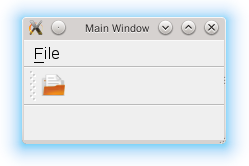

.. _action:

`8. 添加动作 <http://www.devbean.net/2012/08/qt-study-road-2-action/>`_
=======================================================================

:作者: 豆子

:日期: 2012年08月30日

本节，我们将在前面主窗口基础之上，添加菜单和工具栏等的动作。虽然 Qt Creator 已经帮我们实现了主窗口的框架代码，但是具体的功能，还是需要我们一行行添加。

Qt 使用 QAction 类作为动作。顾名思义，这个类就是代表了窗口的一个“动作”，这个动作可能显示在菜单，作为一个菜单项，当用户点击该菜单项，对用户的点击做出响应；也可能在工具栏，作为一个工具栏按钮，用户点击这个按钮就可以执行相应的操作。有一点值得注意：无论是出现在菜单栏还是工具栏，用户选择之后，所执行的动作应该都是一样的。因此，Qt 并没有专门的菜单项类，只是使用一个 QAction 类，抽象出公共的动作。当我们把 QAction 对象添加到菜单，就显示成一个菜单项，添加到工具栏，就显示成一个工具按钮。用户可以通过点击菜单项、点击工具栏按钮、点击快捷键来激活这个动作。

QAction 包含了图标、菜单文字、快捷键、状态栏文字、浮动帮助等信息。当把一个 QAction 对象添加到程序中时，Qt 自己选择使用哪个属性来显示，无需我们关心。同时，Qt 能够保证把 QAction 对象添加到不同的菜单、工具栏时，显示内容是同步的。也就是说，如果我们在菜单中修改了 QAction 的图标，那么在工具栏上面这个 QAction 所对应的按钮的图标也会同步修改。

下面我们来看看如何在 QMainWindow 中使用 QAction：

.. code-block:: c++

	// !!! Qt 5
	// ========== mainwindow.h
	#ifndef MAINWINDOW_H
	#define MAINWINDOW_H
	 
	#include <QMainWindow>
	 
	class MainWindow : public QMainWindow
	{
	    Q_OBJECT
	public:
	    MainWindow(QWidget *parent = 0);
	    ~MainWindow();
	 
	private:
	    void open();
	 
	    QAction *openAction;
	};
	 
	#endif // MAINWINDOW_H
	 
	// ========== mainwindow.cpp
	#include <QAction>
	#include <QMenuBar>
	#include <QMessageBox>
	#include <QStatusBar>
	#include <QToolBar>
	 
	#include "mainwindow.h"
	 
	MainWindow::MainWindow(QWidget *parent) :
	    QMainWindow(parent)
	{
	    setWindowTitle(tr("Main Window"));
	 
	    openAction = new QAction(QIcon(":/images/doc-open"), tr("&Open..."), this);
	    openAction->setShortcuts(QKeySequence::Open);
	    openAction->setStatusTip(tr("Open an existing file"));
	    connect(openAction, &QAction::triggered, this, &MainWindow::open);
	 
	    QMenu *file = menuBar()->addMenu(tr("&File"));
	    file->addAction(openAction);
	 
	    QToolBar *toolBar = addToolBar(tr("&File"));
	    toolBar->addAction(openAction);
	 
	    QStatusBar *statusBar = statusBar() ;
	    statusBar->addAction(openAction);
	}
	 
	MainWindow::~MainWindow()
	{
	}
	 
	void MainWindow::open()
	{
	    QMessageBox::information(this, tr("Information"), tr("Open"));
	}

上面的代码分别属于两个文件：mainwindow.h 和 mainwindow.cpp。为了让 MainWindow 运行起来，我们还需要修改 main() 函数如下：

.. code-block:: c++

	int main(int argc, char *argv[])
	{
	    QApplication app(argc, argv);
	 
	    MainWindow win;
	    win.show();
	 
	    return app.exec();
	}

当我们编辑好文件，点击运行，可以看到 MainWindow 的运行结果：

这是一个相对完整的程序。首先，我们在 MainWindow 类中添加了一个私有函数 open() 和一个私有变量 openAction。在 MainWindow 的构造函数中，第一行我们调用了 setWindowTitle()，设置主窗口的标题。注意我们的文本使用 tr() 函数，这是一个用于 Qt 国际化的函数。在后续章节中我们可以看到，我们可以使用 Qt 提供的国际化工具，将 tr() 函数的字符串提取出来，进行国际化。由于所需进行国际化的文本应该被大多数人认识，所以，tr() 函数里面一般会是英文文本。

然后，我们在堆上创建了 openAction 对象。在 QAction 构造函数，我们传入了一个图标、一个文本和 this 指针。我们将在后面的文章中解释 this 指针的含义。

图标我们使用了 QIcon，传入值是一个字符串，这个字符串对应于 Qt 资源文件中的一段路径。Qt 资源文件的后缀名是 qrc。如果我们使用 Qt Creator，我们可以在新建文件中看到 Qt 资源文件。Qt 资源文件其实是一个 XML 描述的文件，表示 Qt 应用程序所需要的各个资源。我们可以使用普通文本编辑器打开这个文件：

.. code-block:: xml

	<RCC>
	    <qresource prefix="/images">
	        <file alias="doc-open">document-open.png</file>
	    </qresource>
	</RCC>

我们会在后面的章节中详细介绍 Qt 资源文件（注意，资源文件需要在 pro 文件中使用 RESOURCES 引入。）。这里只需要了解，QIcon 的参数，以 : 开始，意味着从资源文件中查找资源。:/images/doc-open 就是找到了这里的 document-open.png 这个文件。*（我们使用的是 png 格式的图片，这是 Qt 内置支持的图片格式。其他格式的图片，比如 jpg、gif 则需要插件支持。这些插件实际已经随着 Qt 一同发布。）*

QAction 第二个参数中，文本值前面有一个 &，意味着这将成为一个快捷键。注意看截图中 File 的 F 有一个下划线。

下面一句，我们使用了 setShortcut() 函数，用于说明这个 QAction 的快捷键。Qt 的 QKeySequence 为我们定义了很多内置的快捷键，比如我们使用的 Open。你可以通过查阅 API 文档获得所有的快捷键列表。 这个与我们自己定义的有什么区别呢？简单来说，我们完全可以自己定义一个 tr(“Ctrl+O”) 来实现快捷键。原因在于，这是 Qt 跨平台性的体现。比如 PC 键盘和 Mac 键盘是不一样的，一些键在 PC 键盘上有，而 Mac 键盘上可能并不存在，或者反之。使用 QKeySequence 类来添加快捷键，会根据平台的不同来定义相应的快捷键。

setStatusTip() 则实现了当用户鼠标滑过这个 action 时，会在主窗口下方的状态栏显示相应的提示。

后面的 connect() 函数，将这个 QAction 的 triggered() 信号与 MainWindow 类的 open() 函数连接起来。当用户点击了这个 QAction 时，会自动触发 MainWindow 的 open() 函数。这是我们之前已经了解过的。

下面的 maneBar()、toolBar() 和 statusBar() 三个是 QMainWindow 的函数，用于创建并返回菜单栏、工具栏和状态栏。我们可以从代码清楚地看出，我们向菜单栏添加了一个 File 菜单，并且把这个 QAction 对象添加到这个菜单；同时新增加了一个 File 工具栏，也把 QAction 对象添加到了这个工具栏。我们可以看到，在菜单中，这个对象被显示成一个菜单项，在工具栏变成了一个按钮。至于状态栏，则是出现在窗口最下方，用于显示动作对象的提示信息的。

至于 open() 函数中的内容，我们会在后文介绍。这里可以运行一下，你会看到，触发这个动作，程序会弹出一个提示框。

下面是 Qt 4 版本的程序，具体非常类似，这里不再赘述。

.. code-block:: c++

	// !!! Qt 4
	// ========== mainwindow.h
	#ifndef MAINWINDOW_H
	#define MAINWINDOW_H
	 
	#include <QMainWindow>
	 
	class MainWindow : public QMainWindow
	{
	    Q_OBJECT
	public:
	    MainWindow(QWidget *parent = 0);
	    ~MainWindow();
	 
	private slots:
	    void open();
	 
	private:
	    QAction *openAction;
	};
	 
	#endif // MAINWINDOW_H
	 
	// ========== mainwindow.cpp
	#include <QAction>
	#include <QMenuBar>
	#include <QMessageBox>
	#include <QToolBar>
	 
	#include "mainwindow.h"
	 
	MainWindow::MainWindow(QWidget *parent) :
	    QMainWindow(parent)
	{
	    setWindowTitle(tr("Main Window"));
	 
	    openAction = new QAction(QIcon(":/images/doc-open"), tr("&Open..."), this);
	    openAction->setShortcuts(QKeySequence::Open);
	    openAction->setStatusTip(tr("Open an existing file"));
	    connect(openAction, SIGNAL(triggered()), this, SLOT(open()));
	 
	    QMenu *file = menuBar()->addMenu(tr("&File"));
	    file->addAction(openAction);
	 
	    QToolBar *toolBar = addToolBar(tr("&File"));
	    toolBar->addAction(openAction);
	}
	 
	MainWindow::~MainWindow()
	{
	}
	 
	void MainWindow::open()
	{
	    QMessageBox::information(this, tr("Information"), tr("Open"));
	}
