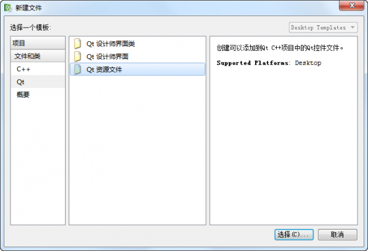
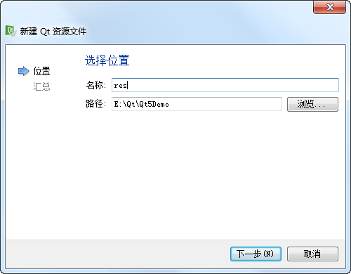
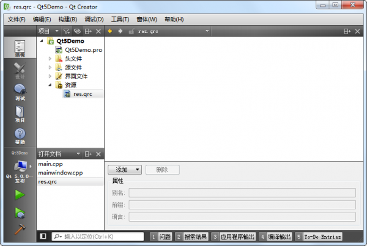
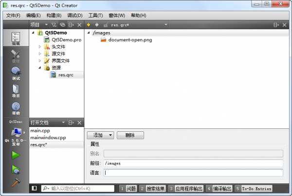
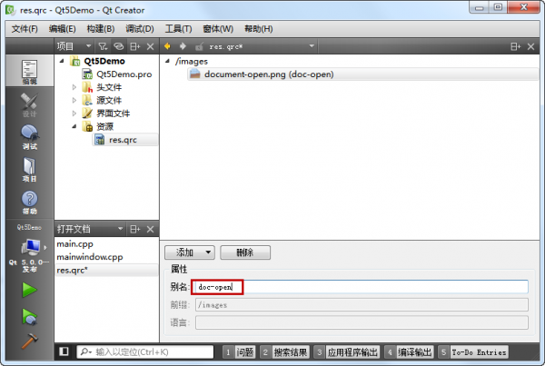
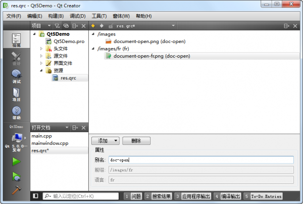

.. _resource_files:

`9. 资源文件 <http://www.devbean.net/2012/08/qt-study-road-2-resource-files/>`_
===============================================================================

:作者: 豆子

:日期: 2012年08月31日

上一章节中我们介绍了如何使用 QAction 添加动作。其中，我们使用 QIcon 加载了一张 png 图片。那时候我们使用的是 Qt 资源文件。现在我们来仔细了解下 Qt 的资源系统。

Qt 资源系统是一个跨平台的资源机制，用于将程序运行时所需要的资源以二进制的形式存储于可执行文件内部。如果你的程序需要加载特定的资源（图标、文本翻译等），那么，将其放置在资源文件中，就再也不需要担心这些文件的丢失。也就是说，如果你将资源以资源文件形式存储，它是会编译到可执行文件内部。

使用 Qt Creator 可以很方便地创建资源文件。我们可以在工程上点右键，选择“添加新文件…”，可以在 Qt 分类下找到“Qt 资源文件”：

点击“选择…”按钮，打开“新建 Qt 资源文件”对话框。在这里我们输入资源文件的名字和路径：

点击下一步，选择所需要的版本控制系统，然后直接选择完成。我们可以在 Qt Creator 的左侧文件列表中看到“资源文件”一项，也就是我们新创建的资源文件：

右侧的编辑区有个“添加”，我们首先需要添加前缀，比如我们将前缀取名为 images。然后选中这个前缀，继续点击添加文件，可以找到我们所需添加的文件。这里，我们选择 document-open.png 文件。当我们完成操作之后，Qt Creator 应该是这样子的：

接下来，我们还可以添加另外的前缀或者另外的文件。这取决于你的需要。当我们添加完成之后，我们可以像前面一章讲解的那样，通过使用 : 开头的路径来找到这个文件。比如，我们的前缀是 /images，文件是 document-open.png，那么就可以使用 :/images/document-open.png 找到这个文件。

这么做带来的一个问题是，如果以后我们要更改文件名，比如将 docuemnt-open.png 改成 docopen.png，那么，所有使用了这个名字的路径都需要修改。所以，更好的办法是，我们给这个文件去一个“别名”，以后就以这个别名来引用这个文件。具体做法是，选中这个文件，添加别名信息：

这样，我们可以直接使用 :/images/doc-open 引用到这个资源，无需关心图片的真实文件名。

如果仔细观察，还会看到资源编辑窗口最下方有一个“语言”。这个可以对资源进行国际化。比如我们新建一个前缀，将语言设置为 fr，再添加一个文件 document-open-fr.png：

我们可以使用 :/images/fr/doc-open 引用到 document-open-fr.png 这个文件。这个“语言”的作用是，如果 Qt 发现，本机的本地化信息是 fr 的话（QLocale::system().name() 返回 fr_FR），则使用 :/images/fr/doc-open 这个图片；如果不是，则默认使用 :/images/doc-open 这个。

如果我们使用文本编辑器打开 res.qrc 文件，就会看到一下内容：

.. code-block:: xml

	<RCC>
	    <qresource prefix="/images">
	        <file alias="doc-open">document-open.png</file>
	    </qresource>
	    <qresource prefix="/images/fr" lang="fr">
	        <file alias="doc-open">document-open-fr.png</file>
	    </qresource>
	</RCC>

我们可以对比一下，看看 Qt Creator 帮我们生成的是怎样的 qrc 文件。当我们编译工程之后，我们可以在构建目录中找到 qrc_res.cpp 文件，这就是 Qt 将我们的资源编译成了 C++ 代码。
